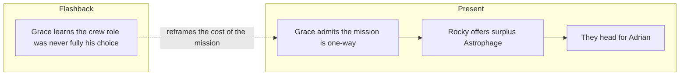

---

id: novel-ch-15

type: novel-chapter

chapter: 15

timeline: both

status: processed

source_mode: primary

quotes_pending: false

chunk_count: 2

source: "[[Weir 2021 - Project Hail Mary Novel]]"

tags:

  - phm

  - novel

  - chapter

up: "[[Project Hail Mary/Novel/Chapter Index|Chapter Index]]"

confidence: verified
freshness: stable

tier-coverage: [intuition, core, deep-dive, practice]

---

# PHM Novel - Chapter 15

← [[PHM Novel - Chapter 14]] | [[Project Hail Mary/Novel/Chapter Index|Chapter Index]] | [[PHM Novel - Chapter 16]] →

> **One-line summary** — Rocky's unexpected fuel surplus transforms Grace's one-way mission into a survivable one just as flashbacks expose how little choice Grace really had in joining it.

## 🎯 Intuition

**The Core Idea:** Hope arrives through friendship at the exact moment Grace's past autonomy is revealed to have been far smaller than he thought.

**Why It Matters:** The chapter is a huge pivot for the novel: survival is suddenly back on the table, which changes the emotional trajectory of the mission. It also intensifies the ethical unease around Stratt's decision-making and positions Adrian as the next scientific mystery the partnership must solve together.

## ⚙️ Core Mechanics

### Summary

The chapter opens with the Hail Mary running centrifuge gravity at 1 g — Rocky is experiencing Earth-standard weight for the first time. After a few days of Rocky completing his xenonite pressure-suit construction in the ship, Grace finally discloses that his mission is one-way: he does not have enough fuel to go home. Rocky's reaction is immediate: "No no no! I have Astrophage — I give you Astrophage!" Rocky has surplus fuel. Grace breaks down in tears of joy. The revelation that Rocky has been puzzled by his own surplus — he arrived in half the expected time with far more fuel remaining than his calculations predicted — is left as a mystery for Chapter 18. In the flashback strand, the final Hail Mary crew roster is confirmed: Commander Yáo, Engineer Ilyukhina, and Science Specialist DuBois are selected; DuBois discloses to Grace that he and Grace's backup-crew counterpart Annie Shapiro are in a relationship; Stratt explains her no-sexual-tension crew policy. DuBois also informs Grace — bluntly — that Grace's selection was driven by his rare coma-resistance genetic marker, which Stratt never disclosed directly. Back in the present, Rocky and Grace set course for Tau Ceti e (which Grace names "Adrian") eleven days out. Rocky reveals he has a mate at home; Eridians are hermaphrodites. The chapter ends with Rocky's private eating behaviour, revealed to Grace for the first time — he tears apart a stony exoskeleton food and drops the meat into a ventral abdominal opening.

### Characters Present

- **Ryland Grace** — discloses the one-way mission; breaks down at Rocky's fuel offer; learns his coma-resistance was undisclosed

- **Rocky** — offers surplus Astrophage fuel; reveals he has a mate; demonstrates private feeding behaviour

- **Commander Yáo** (flashback) — confirmed primary mission commander

- **Engineer Olesya Ilyukhina** (flashback) — confirmed primary engineer

- **Science Specialist Martin DuBois** (flashback) — confirmed primary science position; tells Grace about the coma-resistance marker; discloses his relationship with Shapiro

- **Annie Shapiro** (flashback) — confirmed backup science specialist

- **Eva Stratt** (flashback) — oversees final crew confirmation; withholds coma-marker information from Grace

### Key Quotes

> "I'm not going back. I'm going to die here." / "No no no! I give you Astrophage!" (p. 285–286)

> "You no die. Let's save planets!" (p. 286)

## 🔬 Deep Dive

### Science and Technology

- Rocky's Astrophage surplus: the mystery of why he has far more fuel than expected is teased here; resolved in Chapter 18 via relativistic time-dilation miscalculation — see [[Relativistic Travel and Time Dilation]].

- Centrifuge gravity at 1 g on the Hail Mary — Rocky experiencing Earth gravity for the first time — see [[Artificial Gravity and Induced Torpor]].

- Grace's coma-resistance marker as the undisclosed selection criterion — see [[Ryland Grace]].

- Tau Ceti e (Adrian): targeted as the site of anomalous Astrophage suppression; orbital-insertion burn 11 days out — see [[Taumoeba and the Biological Solution]].

- Eridian hermaphroditic reproduction: eggs laid near each other; one absorbs the other; hatches in ~42 Earth days (one Eridian year) — see [[Rocky and the Eridians]].

### Plot Connections

- Previous chapter: [[PHM Novel - Chapter 14]]

- Next chapter: [[PHM Novel - Chapter 16]]

- Rocky's fuel offer is one of the novel's major structural pivots — the story shifts from certain sacrifice to potential survival.

- The mystery of Rocky's surplus fuel (too much, arrived too fast) is the setup for the relativity revelation in Chapter 17.

- The coma-resistance marker disclosure (via DuBois) recontextualises why Grace survived the journey when his crewmates did not — see [[Ryland Grace]].

- "Adrian" (Tau Ceti e) as the investigation target sets up the predator-discovery arc of Chapters 16–19.

### Narrative Analysis

The present strand delivers one of the book's biggest emotional releases, then immediately seeds a new puzzle in Rocky's surplus fuel. The flashback undercuts that uplift with a bitter clarification about Grace's selection, keeping triumph and coercion in uneasy balance.

## 🏋️ Practice

### Discussion Questions

1. Why does Rocky's fuel offer feel like more than just a practical solution to Grace's return problem?

2. How does the chapter connect Grace's personal lack of informed consent to the broader sacrifices of the Hail Mary project?

3. Why is Rocky's unexplained fuel surplus a clue that points toward relativity rather than a simple calculation error?

### Analysis

- Analyze how the chapter juxtaposes Grace's emotional breakdown with DuBois's blunt explanation of the coma marker.

- Consider why Weir places intimate alien-biology details alongside one of the novel's biggest mission pivots.

### Creative Challenge

- **What if...** Rocky has no spare fuel to offer. How differently would Grace approach the Adrian investigation if he still believed survival was impossible?

## Chunk Candidates

> [!info] Primary-mode note

> Chapter verified directly from [[Weir 2021 - Project Hail Mary Novel]], pp. 283–299. Chunk extraction ready for next pass.

- [x] "Let's save planets!" — Rocky offering surplus Astrophage as the mission-pivot moment; Grace's tearful relief → [[Novel - Rocky s surplus Astrophage offer transforms the one-way sacrifice into a survivable mission|chunk-novel-013]]

- [ ] Grace's coma-resistance marker: disclosed by DuBois, not Stratt — informed consent violation under existential pressure

- [x] Adrian (Tau Ceti e) as first named investigation target for anomalous Astrophage suppression → [[Novel - Adrian is the first named investigation target for anomalous Astrophage suppression|chunk-novel-002]]

- [ ] Rocky's surplus fuel mystery: arrived in half the expected time — relativity explanation deferred to Chapter 18

- [ ] Eridian hermaphroditic reproduction and private eating behaviour — alien biology as social taboo

## References

- [[Weir 2021 - Project Hail Mary Novel]] — primary source, pp. 283–299

- [[PHM Chapter Summaries - Secondary Sources Registry]] — superseded secondary summary

- [[Project Hail Mary/Novel/Chapter Index|Chapter Index]]
