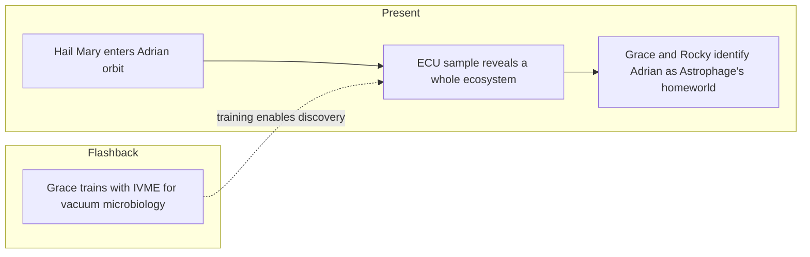

---

id: novel-ch-16

type: novel-chapter

chapter: 16

timeline: both

status: processed

source_mode: primary

quotes_pending: false

chunk_count: 3

source: "[[Weir 2021 - Project Hail Mary Novel]]"

tags:

  - phm

  - novel

  - chapter

up: "[[Project Hail Mary/Novel/Chapter Index|Chapter Index]]"

confidence: verified
freshness: stable

tier-coverage: [intuition, core, deep-dive, practice]

---

# PHM Novel - Chapter 16

← [[PHM Novel - Chapter 15]] | [[Project Hail Mary/Novel/Chapter Index|Chapter Index]] | [[PHM Novel - Chapter 17]] →

> **One-line summary** — In orbit around Adrian, Grace and Rocky discover a whole aerial ecosystem and realize they have found Astrophage's homeworld.

## 🎯 Intuition

**The Core Idea:** The problem changes from tracking a mysterious organism to understanding the ecology it evolved inside.

**Why It Matters:** This chapter reorients the novel from astrophysics and engineering toward biology and predation. Once Adrian becomes a living system rather than a passive source of Astrophage, the path to solving the stellar-dimming crisis becomes ecological instead of purely mechanical.

## ⚙️ Core Mechanics

### Summary

The Hail Mary successfully achieves orbit around Adrian. Its atmosphere — 91% carbon dioxide, 7% methane, 1% argon — is confirmed by spectrograph, and Grace activates the External Collection Unit to gather Astrophage samples from near the planet. The flashback strand follows Grace at NASA's Neutral Buoyancy Lab (NBL) training with IVME — "in vacuo microbiology equipment" — an elaborate set of tools designed for performing cell biology in vacuum and zero-g; instructor Forrester watches him fumble with sample vials at the bottom of the world's largest swimming pool. Grace later trains DuBois and Shapiro on Astrophage biology in Building 30. Back in the present, Rocky modifies a salvaged Eridian camera and screen into a portable sonar-imager that lets him see Adrian in real-time from his bulb, and Grace discovers with the Petrovascope that the Astrophage breeding layer around Adrian is extremely narrow: only 91.2 km altitude, less than 200 metres thick. When Grace retrieves the ECU sample and examines it under the microscope, the result is astonishing: the sample contains far more than Astrophage. Translucent cells, small bacteria-like organisms, amoeba-like creatures, thin things, fat things, spiral things — a whole ecology. Rocky and Grace reach the same conclusion simultaneously: Adrian is not just a planet that Astrophage happened to infect. It is the Astrophage homeworld — and with all life comes predation. The predator organism must be here.

### Characters Present

- **Ryland Grace** — performs orbital insertion; activates ECU; examines microscope sample; co-discovers the ecology

- **Rocky** — builds sonar camera imager; confirms Petrovascope data; jointly concludes Adrian is the homeworld

- **Forrester** (flashback) — supervises IVME training in the NBL

- **Martin DuBois** (flashback) — trained by Grace on Astrophage cellular biology

- **Annie Shapiro** (flashback) — also trained; disclosed her relationship with DuBois

### Key Quotes

> "The familiar black dots of Astrophage are all over the sample. But so are translucent cells, smaller bacteria-looking things, and larger amoeba-like things." (p. 315)

> "Adrian isn't just some planet that Astrophage infected. It's the Astrophage homeworld!" (p. 316)

## 🔬 Deep Dive

### Science and Technology

- Adrian atmospheric composition from spectrograph: 91% CO₂, 7% CH₄, 1% Ar — thick, opaque atmosphere; see [[Taumoeba and the Biological Solution]].

- ECU (External Collection Unit) retrieval and sample analysis — the primary instrument for the predator discovery.

- IVME (in vacuo microbiology equipment): specialised lab tooling for cell biology in vacuum and zero-g; designed for the Hail Mary's science mission — see [[Taumoeba and the Biological Solution]].

- Petrovascope analysis: Astrophage breeding altitude at 91.2 km, <200 m wide — narrower than expected, implying the predator habitat is in a thin atmospheric band — see [[Taumoeba and the Biological Solution]].

- Adrian as the Astrophage homeworld: the presence of diverse co-evolving life forms implies common genetic origin and ecological dynamics including predation — see [[Astrophage Life Cycle and Migration]].

> [!note] Naming note

> The predator organism observed under the microscope in this chapter is not yet formally named. This note treats the microscopy discovery as the first confirmed identification of candidate predator cells. See [[Taumoeba and the Biological Solution]] for the full scientific analysis after formal characterisation.

### Plot Connections

- Previous chapter: [[PHM Novel - Chapter 15]]

- Next chapter: [[PHM Novel - Chapter 17]]

- The homeworld discovery is the pivot from physics-and-chemistry framing to ecology framing — the fundamental scientific shift the novel has been building toward.

- Rocky's reasoning from population dynamics to predation (Eridians are familiar with Astrophage ecology) demonstrates the value of cross-species collaboration.

- The breeding-altitude data (91.2 km, <200 m) defines the engineering problem that motivates the xenonite chain sampler designed in Chapter 17.

- The IVME training flashback directly enables the lab analysis that produces the microscopy result in this chapter.

### Narrative Analysis

The chapter uses methodical observation to build a detective-story reveal: each measurement narrows the mystery until the microscope overturns the reader's assumptions. The flashback works like retroactive setup, proving that earlier training sequences were not digressions but essential groundwork for this scientific turn.

## 🏋️ Practice

### Discussion Questions

1. Why is the homeworld revelation such a fundamental shift in how Grace and Rocky understand the crisis?

2. How does this chapter redirect the larger novel from a physics puzzle toward a biological solution arc?

3. What do the narrow breeding-band measurements imply about where the predator organism can actually survive?

### Analysis

- Study how the chapter turns lab observation into narrative climax without needing combat or overt conflict.

- Consider Rocky's instant ecological reasoning. What does it reveal about the value of having a second intelligence with different assumptions?

### Creative Challenge

- **What if...** The ECU sample contains only Astrophage and nothing else. What alternative line of investigation would Grace and Rocky have to pursue next?

## Chunk Candidates

> [!info] Primary-mode note

> Chapter verified directly from [[Weir 2021 - Project Hail Mary Novel]], pp. 300–316. Chunk extraction ready for next pass.

- [x] "Adrian isn't just some planet that Astrophage infected. It's the Astrophage homeworld!" — pivotal reframing of the novel's scientific premise → [[Astrophage - Adrian is reframed as the Astrophage homeworld with a co-evolved ecology|chunk-astroph-007]]

- [x] ECU microscopy: translucent cells, bacteria-like, amoeba-like, spiral forms — an entire ecology co-evolving with Astrophage → [[Taumoeba - ECU microscopy reveals multiple life forms co-evolving with Astrophage at Adrian|chunk-taumo-004]]

- [x] Petrovascope: Astrophage breeding band at 91.2 km altitude, <200 m thick — defines the engineering target → [[Astrophage - Petrova-line breeding band at Adrian is 91.2 km altitude and less than 200 metres thick|chunk-astroph-008]]

- [ ] IVME as pre-mission preparation for unknown extraterrestrial biology — the forethought that makes the discovery possible

- [ ] Rocky's sonar camera: improvised instrument enabling real-time alien imaging — cross-species science tool

## References

- [[Weir 2021 - Project Hail Mary Novel]] — primary source, pp. 300–316

- [[PHM Chapter Summaries - Secondary Sources Registry]] — superseded secondary summary

- [[Project Hail Mary/Novel/Chapter Index|Chapter Index]]
