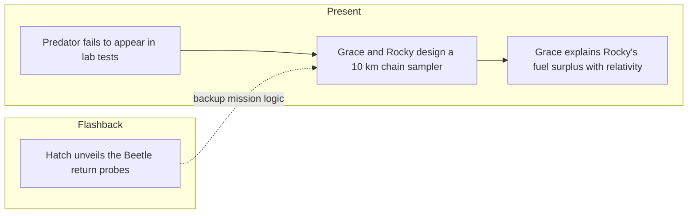

---

id: novel-ch-17

type: novel-chapter

chapter: 17

timeline: both

status: processed

source_mode: primary

quotes_pending: false

chunk_count: 3

source: "[[Weir 2021 - Project Hail Mary Novel]]"

tags:

  - phm

  - novel

  - chapter

up: "[[Project Hail Mary/Novel/Chapter Index|Chapter Index]]"

confidence: verified
freshness: stable

tier-coverage: [intuition, core, deep-dive, practice]

---

# PHM Novel - Chapter 17

← [[PHM Novel - Chapter 16]] | [[Project Hail Mary/Novel/Chapter Index|Chapter Index]] | [[PHM Novel - Chapter 18]] →

> **One-line summary** — When lab experiments fail, Grace and Rocky solve the problem with a giant xenonite sampler while relativity and the Beetles resolve parallel mission uncertainties.

## 🎯 Intuition

**The Core Idea:** Engineering becomes the bridge between incomplete theory and inaccessible evidence.

**Why It Matters:** The chapter shows the partnership at full strength: Rocky contributes materials expertise and alien context, Grace contributes orbital reasoning and relativistic insight. It also introduces the exact tool that makes the next major breakthrough possible while reinforcing that both Earth and Erid have critical blind spots.

## ⚙️ Core Mechanics

### Summary

The predator-existence experiment fails repeatedly: Astrophage in simulated Adrian atmosphere simply will not reproduce predator organisms under lab conditions. Rocky reasons that predators must live in the Petrova line itself — the breeding band at 91.2 km altitude — not in the upper atmosphere where the ECU collected. The challenge: the Hail Mary cannot descend safely, but the predator sample must come from 10 km below minimum safe orbit. Grace and Rocky design a solution: a 10-kilometre xenonite chain with a sample container at the end, deployed by tilting the ship to drag the chain through the breeding altitude while maintaining orbital velocity with the engines. Making 200,000 chain links by hand (melting down spare ship beds for aluminium molds) takes weeks of shared labour. During this period, Rocky explains Eridian Astrophage farming: on Erid, the oceans run at ~200 °C — warm enough for spontaneous Astrophage breeding. Eridians simply throw Astrophage into the ocean; no Sahara-scale infrastructure needed. The relativity mystery surfaces: Rocky describes his trip as confusing — he arrived in half the expected time with most of his fuel unspent. Grace realises this is a relativistic time-dilation effect Rocky's civilisation never discovered or needed. In the flashback strand, inventor Steve Hatch introduces the "Beetle" autonomous-return probe to Grace aboard the carrier: tiny vehicles that accelerate at 500 g to 0.93 c, experience ~20 months of ship time over 12+ Earth years, and will carry mission findings back to Earth. Hatch has named his prototype after Pete Best (the pre-Ringo Beatle), in keeping with a "Get Back" theme.

### Characters Present

- **Ryland Grace** — diagnoses Rocky's surplus as a relativity effect; designs chain-sampler geometry; co-produces chain links

- **Rocky** — explains Eridian Astrophage farming; discloses the arrival-time anomaly; does the bulk of xenonite chain construction

- **Steve Hatch** (flashback) — introduces the Beetle autonomous return-probe programme; explains the "Pete Best" naming

### Key Quotes

> "Much much much fuel remain. Much more than should have. No complain. But confuse." — Rocky on his surplus (p. 328)

> "I've got to make sure these beetles will be able to...'Get Back.'" / "'Get Back.' It's a song. It's by the Beatles." — Hatch (p. 334)

## 🔬 Deep Dive

### Science and Technology

- Xenonite chain sampler: 10 km long, 200,000 links, deployed by tilting ship at 60° while thrusting to maintain altitude — retrieval mechanism for organisms 10 km below minimum safe orbit — see [[Taumoeba and the Biological Solution]].

- Eridian Astrophage farming: 200 °C oceanic water at Erid enables passive breeding; no infrastructure equivalent to the Sahara blackpanels required — see [[Astrophage Life Cycle and Migration]].

- Rocky's relativistic miscalculation: Eridian science never developed time-dilation mathematics; Rocky over-calculated journey time and underspent fuel because he did not account for relativistic clock slowing — see [[Relativistic Travel and Time Dilation]].

- Beetle probes: autonomous return vehicles, 500 g acceleration to 0.93 c; 12+ Earth years / ~20 months ship-time transit; self-navigating to Earth on a broadcast signal — see [[The Hail Mary Drive]].

### Plot Connections

- Previous chapter: [[PHM Novel - Chapter 16]]

- Next chapter: [[PHM Novel - Chapter 18]]

- The xenonite chain sampler is the specific engineering invention that enables the Chapter 18 EVA and sample retrieval.

- Rocky's dilation revelation resolves the surplus-fuel mystery introduced in Chapter 15 and deepens the portrayal of Eridian knowledge limits.

- Eridian Astrophage farming reframes the organism as something controllable — an important conceptual precursor to the solution arc.

- The Beetle probe is the mechanism by which Tau Ceti findings could reach Earth without Grace surviving the return — mission insurance.

### Narrative Analysis

Much of the chapter is a shared-work montage, which makes the friendship feel earned through labor rather than just dialogue. The Beetle flashback mirrors the present engineering effort by showing that both timelines are obsessed with building one reliable path for information to survive catastrophe.

## 🏋️ Practice

### Discussion Questions

1. Why does the failure of the first predator experiments push the chapter toward engineering rather than despair?

2. How does the Beetle flashback connect to the novel's broader theme of building redundancy against extinction?

3. Why would a civilization capable of interstellar travel still miss relativistic time dilation in practical mission planning?

### Analysis

- Examine how weeks of repetitive construction change the texture of the Grace-Rocky relationship on the page.

- Compare the chain sampler and the Beetles as two kinds of bridge technologies: one reaches downward for data, the other carries data home.

### Creative Challenge

- **What if...** The xenonite chain proves impossible to manufacture. What riskier alternative sampling plan might Grace and Rocky attempt?

## Chunk Candidates

> [!info] Primary-mode note

> Chapter verified directly from [[Weir 2021 - Project Hail Mary Novel]], pp. 317–334. Chunk extraction ready for next pass.

- [ ] Xenonite chain sampler: 10 km, 200,000 links, tilted-ship deployment at 60° — engineering solution to the 10 km altitude gap *(intentional skip — the design and deployment logic is already fully covered by [[Engineering - Chain-deployment mechanics tilt the ship at 60 degrees to drag a 10km xenonite chain through the breeding band]] (sourced from Ch18 where execution is described); a separate Ch17 design-phase chunk was judged duplicative)*

- [x] Eridian Astrophage farming via 200 °C ocean water — scale contrast with Sahara blackpanel approach → [[Eridian - Oceanic Astrophage farming at 200C contrasts with Earth s Sahara blackpanel approach|chunk-erid-015]]

- [x] Relativistic time-dilation blindspot: Rocky's civilisation never discovered it; fuel surplus is the accidental result → [[Eridian - Relativistic time-dilation blindspot gives Rocky an accidental fuel surplus|chunk-erid-009]]

- [ ] "Much much much fuel remain... No complain. But confuse." — Rocky's key disclosure

- [x] Beetle probes: 500 g / 0.93 c autonomous return vehicles as mission-findings insurance → [[Engineering - Beetle probes are autonomous mission-insurance vehicles at 500g acceleration to 0.93c|chunk-eng-002]]

## References

- [[Weir 2021 - Project Hail Mary Novel]] — primary source, pp. 317–334

- [[PHM Chapter Summaries - Secondary Sources Registry]] — superseded secondary summary

- [[Project Hail Mary/Novel/Chapter Index|Chapter Index]]
