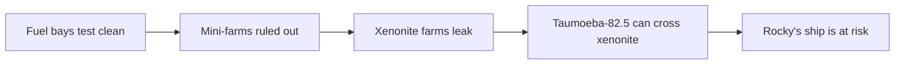

# PHM Novel - Chapter 27

← [[PHM Novel - Chapter 26]] | [[Chapter Index]] | [[PHM Novel - Chapter 28]] →

> **One-line summary** — Grace discovers that the evolved Taumoeba strain can pass through xenonite, which means Rocky's all-xenonite ship is in immediate danger.

## 🎯 Intuition
**The Core Idea:** The very evolutionary success that made Taumoeba-82.5 useful has also made it dangerous to Rocky.
**Why It Matters:** This chapter is the novel's classic late-stage twist: the solution itself creates a new problem. It transforms the mission from a return-home story into a moral choice about whether Grace will risk everything to save his friend.

## ⚙️ Core Mechanics
### Summary

Three days after the "Great Taumoeba Escape," all nine fuel bays have tested clean. Grace has cobbled together a Taumoeba alarm — an Astrophage slide exposed to open air with a light sensor that will beep when Taumoeba eat the slide and clear it. No beeping yet. The crisis appears contained, but the source is still unknown.

Grace systematically investigates. He rules out the mini-farms: sealed Eridian-steel capsules show no Taumoeba escape over several days of testing. He then tests the xenonite breeder farms: every single one is leaking. All ten farms show clear Astrophage slides in their surrounding bins within hours, confirming Taumoeba are passing through the xenonite walls.

The explanation requires Grace to reach an uncomfortable conclusion: Taumoeba-82.5 evolved the ability to penetrate xenonite as a side effect of the directed-evolution breeding program. During hundreds of generations in xenonite tanks under nitrogen bombardment, organisms that could hide within the molecular structure of xenonite — shielded from the nitrogen that couldn't navigate those structures the way a microbe can — had a survival advantage. Evolution doesn't optimize for one trait at a time. Taumoeba-82.5 is simultaneously nitrogen-resistant and xenonite-permeable. A confirmation experiment demonstrates this precisely: natural Taumoeba cannot pass through xenonite; Taumoeba-82.5 can. Neither strain can penetrate plastic, epoxy, glass, or metal.

Grace reassures himself: this is manageable. Metal containers work fine. He can rebuild the farms without xenonite. The strain still tolerates nitrogen and will still function on Venus and Threeworld. Then the horror hits: Rocky's Taumoeba-82.5 farms are aboard the Blip-A. His entire ship — hull, tanks, and bulkheads — is made of xenonite. There is nothing between Rocky's Taumoeba and his fuel. The chapter ends on that cliffhanger.

### Characters Present

- **Ryland Grace** — sole POV; investigates contamination source; discovers xenonite permeability; faces the implication for Rocky

### Key Quotes

> "So not only did they gain resistance to nitrogen, they figured out how to hide from nitrogen by sneaking into the xenonite itself!"
— Grace, p. 490

> "Rocky has the same strain of Taumoeba aboard his ship. There's nothing standing between his Taumoeba and his fuel."
— Grace, p. 491

## 🔬 Deep Dive
### Science and Technology

- Taumoeba-82.5 xenonite permeability: an unintended product of directed evolution. The xenonite molecular structure is a complex protein-and-chemical chain; Taumoeba can navigate through it directionally (stimulus-response), while nitrogen cannot — nitrogen moves stochastically and cannot "climb" molecular barriers. See [[Taumoeba and the Biological Solution]].
- The nitrogen-vs.-Taumoeba transport distinction: nitrogen is inert and moves by entropy; Taumoeba has sensory-response capability and moves directionally. This is why nitrogen cannot reach deep into xenonite even though Taumoeba can.
- The Taumoeba alarm design: simple, low-tech, and instrument-independent — exactly the redundant detection Grace should have built earlier.
- Discrimination between strains: only Taumoeba-82.5 penetrates xenonite; the original Adrian strain cannot. The property emerged specifically from xenonite-tank breeding, confirming the evolutionary origin.
- Implications for Rocky's ship: all critical Blip-A structures — fuel tanks and bulkheads — are xenonite. Rocky has Taumoeba-82.5 farms aboard. See [[Rocky and the Eridians]].

### Plot Connections

- The xenonite permeability discovery retroactively explains both the Chapter 25 BOCOA outbreak and the Chapter 26 nitrogen flood.
- This discovery is the inciting crisis of Chapter 28: Rocky is in mortal danger, and Grace must decide whether to turn back.
- The fact that Eridian-steel mini-farms are unaffected is narratively important: the Beetle delivery system remains safe.
- This chapter is the thematic inverse of Chapter 23: the same directed evolution that produced Earth's Astrophage solution has created a lethal threat to Rocky. See [[Taumoeba and the Biological Solution]].
- Grace's systematic analysis and clear reasoning under pressure contrast sharply with his amnesiac paralysis in the early chapters. See [[Ryland Grace]].

### Narrative Analysis
The chapter is built like a detective story: each eliminated possibility narrows the field until the actual answer becomes both surprising and inevitable. Weir also turns scientific explanation into emotional escalation, because every clarifying sentence makes Rocky's danger worse. The final line lands as a cliffhanger not because information is missing, but because the information is suddenly complete.

## 🏋️ Practice
### Discussion Questions
1. Why is the xenonite-permeability discovery such an effective reversal of the Chapter 23 breakthrough?
2. How does the chapter use methodical experimentation to build suspense rather than reduce it?
3. What does this reveal about the unintended consequences of directed evolution and selective pressure?

### Analysis
- Explore how the novel turns evolutionary logic into both solution and threat.
- Compare this chapter's scientific reveal to earlier chapters where knowledge reduced uncertainty rather than intensified it.

### Creative Challenge
- **What if...** Grace had never tested the xenonite breeder tanks before Rocky moved too far away to reach?

## Chunk Candidates

> [!info] Primary-mode note
> Chunk candidates below are drawn from direct EPUB reading (p. 482–491). Ready for extraction when chunking pass begins.

- [x] Xenonite permeability as unintended directed-evolution trait: the evolutionary mechanism → [[Taumoeba - Xenonite permeability is an unintended trait evolved during directed-evolution breeding in xenonite tanks|chunk-taumo-011]]
- [x] Taumoeba vs. nitrogen transport: directed stimulus-response vs. stochastic diffusion → [[Taumoeba - Nitrogen cannot penetrate xenonite because it moves stochastically while Taumoeba navigates directionally|chunk-taumo-013]]
- [ ] Taumoeba alarm design: low-tech, redundant biosafety monitoring
- [ ] Cliffhanger: Rocky's all-xenonite ship at risk from Taumoeba-82.5

## References

- [[Weir 2021 - Project Hail Mary Novel]] — primary source (p. 482–491)
- [[Chapter Index]]
- [[Taumoeba and the Biological Solution]]
- [[Ryland Grace]]
- [[Rocky and the Eridians]]