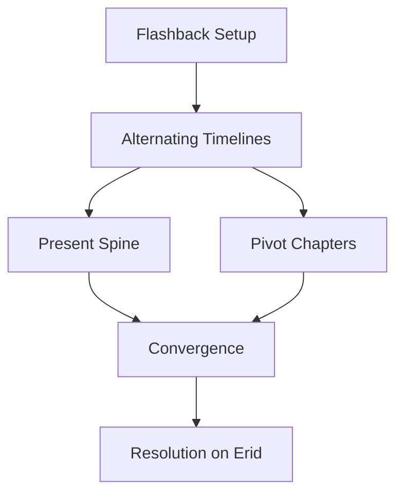

---
tags:
  - phm
  - novel
  - timeline
  - navigation
  - moc
up: "[[Chapter Index]]"
source_mode: primary-synthesis
confidence: verified
tier-coverage: [intuition, core, deep-dive, practice]
---
# PHM Timeline Map

> **One-line summary** — This page turns the novel’s dual-timeline structure into a readable navigation map of present-spine, flashback-spine, and convergence points.

## 🎯 Intuition
**The Core Idea:** This note is the master map for following *Project Hail Mary* either as a space-mission present timeline or as an Earth-crisis flashback timeline.
**Why It Matters:** The novel’s structure is intentionally braided, and that braid is part of how its mysteries, emotional reveals, and scientific deductions land. This map makes the architecture visible, so readers can trace chronology, pacing, and thematic convergence without flattening the book’s design.

## ⚙️ Core Mechanics
### Key Details
Navigation foundation for the chapter layer of *Project Hail Mary*. Use this note to orient yourself in the novel's dual-timeline structure before drilling into individual chapters or arc notes.

> [!info] Primary-synthesis note
> This note synthesizes the primary-mode chapter notes in [[Chapter Index]], all verified directly from [[Weir 2021 - Project Hail Mary Novel]]. Chapter boundary placements, beat assignments, and thematic groupings are based on EPUB-verified chapter content.

---

## How to Use This Map

The novel interleaves two timelines in most of its first half, then converges on the present timeline for the second half. To follow either strand:

1. **Follow the Present spine** to read Grace's experience aboard the Hail Mary in order — from waking with amnesia through first contact, collaboration, crisis, and final choice.
2. **Follow the Flashback spine** to read the Earth-side Astrophage crisis in chronological order — from the Petrova anomaly through Stratt's response and the mission's launch.
3. **Check the Mixed / Pivot chapter list** to find chapters where both timelines are active in roughly equal weight.
4. **Use the Arc Entry Points** to jump directly into a thematic through-line without tracking chapter order.

The `timeline` frontmatter field on each chapter note is set to `present`, `flashback`, or `both`, and can be used for Dataview filtering when that plugin is active.

---

## Present-Timeline Spine

These chapters carry the primary narrative: Grace waking alone aboard the Hail Mary, deducing his mission, making first contact with Rocky, and working through the Taumoeba problem.

| Chapter | Key Present-Timeline Beat |
|---|---|
| [[PHM Novel - Chapter 01\|Ch 01]] | Grace regains consciousness; amnesia framing established; Petrova email glimpsed in fragment |
| [[PHM Novel - Chapter 04\|Ch 04]] | First full ship exploration; identifies Astrophage drive |
| [[PHM Novel - Chapter 06\|Ch 06]] | Arrives at Tau Ceti; confirms Astrophage presence; relativistic time accounting |
| [[PHM Novel - Chapter 07\|Ch 07]] | Initiates mirrored-signal first-contact protocol; receives signals in return |
| [[PHM Novel - Chapter 08\|Ch 08]] | Physical model exchange; deduces alien ship originated at 40 Eridani |
| [[PHM Novel - Chapter 09\|Ch 09]] | Joint construction of shared docking tunnel; ammonia atmosphere detected |
| [[PHM Novel - Chapter 10\|Ch 10]] | Face-to-face contact; shared vocabulary begins; Grace coins the nickname "Rocky" |
| [[PHM Novel - Chapter 11\|Ch 11]] | Object exchange system; observes Rocky's passive sonar navigation |
| [[PHM Novel - Chapter 12\|Ch 12]] | Concentrated language-building session; shared vocabulary reaches working level |
| [[PHM Novel - Chapter 13\|Ch 13]] | Teaches Rocky radiation physics; explains Eridian crewmate deaths |
| [[PHM Novel - Chapter 14\|Ch 14]] | Eridian biology detail; radiation as evolutionary blind spot |
| [[PHM Novel - Chapter 15\|Ch 15]] | Rocky enters Hail Mary via xenonite pressure sphere; first shared laboratory space |
| [[PHM Novel - Chapter 16\|Ch 16]] | Rocky discloses surplus Astrophage fuel — Grace's return is now possible |
| [[PHM Novel - Chapter 17\|Ch 17]] | Adrian orbital data: Astrophage concentrations anomalously low; suppression inferred; chain sampler designed and fabricated |
| [[PHM Novel - Chapter 18\|Ch 18]] | Chain assembly complete; sample container built; EVA retrieval crisis; fuel-tank breach; Rocky rescues Grace |
| [[PHM Novel - Chapter 19\|Ch 19]] | Grace treats Rocky's oxygen burns; immediate emergency resolved |
| [[PHM Novel - Chapter 20\|Ch 20]] | Taumoeba observed and named; experiments begin; lights go out |
| [[PHM Novel - Chapter 21\|Ch 21]] | Taumoeba contamination of Astrophage fuel identified; shipwide blackout |
| [[PHM Novel - Chapter 22\|Ch 22]] | Venus/Threeworld Taumoeba tests fail; Beetle full-thrust transfer to Blip-A begins |
| [[PHM Novel - Chapter 23\|Ch 23]] | Nitrogen isolated as Taumoeba's lethal agent; directed-evolution breeding proposed |
| [[PHM Novel - Chapter 24\|Ch 24]] | Taumoeba-82.5 breeding succeeds; fuel bays replaced; farewell and departure |
| [[PHM Novel - Chapter 25\|Ch 25]] | Return-journey routine; Beetle mini-farm installed; second Taumoeba outbreak detected |
| [[PHM Novel - Chapter 26\|Ch 26]] | Nitrogen-flood gambit neutralizes escaped Taumoeba; crisis contained |
| [[PHM Novel - Chapter 27\|Ch 27]] | Taumoeba-82.5 penetrates xenonite; Eridian civilization threatened |
| [[PHM Novel - Chapter 28\|Ch 28]] | Beetle launch to Earth; Rocky's engine disappears; Grace turns back |
| [[PHM Novel - Chapter 29\|Ch 29]] | Grace finds Rocky — reunion after rescue |
| [[PHM Novel - Chapter 30\|Ch 30]] | Grace commits to the journey to Erid; accepts the cost |
| [[PHM Novel - Epilogue\|Epilogue]] | Years later: Grace is living on Erid; Eridians have received the Taumoeba solution |

---

## Flashback Spine

The flashback strand covers the Earth-side Astrophage crisis: discovery, escalation, Stratt's emergency authority, mission design, and the final recruitment of Grace. These beats appear embedded in "both"-tagged chapters; the chapter summaries identify which portion is flashback content.

| Chapter | Key Flashback Beat |
|---|---|
| [[PHM Novel - Chapter 01\|Ch 01]] | Petrova infrared anomaly email — the first signal of Astrophage |
| [[PHM Novel - Chapter 02\|Ch 02]] | Japanese solar probe data; Sun luminosity measurably declining |
| [[PHM Novel - Chapter 03\|Ch 03]] | Grace's background revealed; Stratt tracks him down and recruits him |
| [[PHM Novel - Chapter 04\|Ch 04]] | Early lab work; Astrophage begins to be characterized |
| [[PHM Novel - Chapter 05\|Ch 05]] | CO₂ affinity and Venus-cycle migration discovered; Tau Ceti anomaly noted as mission target |
| [[PHM Novel - Chapter 08\|Ch 08]] | Hail Mary drive engineering detail (flashback content; exact beat approximate — see chapter note) |
| [[PHM Novel - Chapter 13\|Ch 13]] | Mission radiation-shielding engineering detail — Earth-response context (flashback content approximate; see chapter note) |
| [[PHM Novel - Chapter 14\|Ch 14]] | Climate science flashback: Dr. Leclerc's projections on energy-budget collapse |
| [[PHM Novel - Chapter 21\|Ch 21]] | Original crew discusses one-way mission design; deaths as planned outcome |
| [[PHM Novel - Chapter 23\|Ch 23]] | Compulsion revealed: Stratt drafted Grace after Baikonur explosion decimated crew |
| [[PHM Novel - Chapter 26\|Ch 26]] | Stratt in a prison cell — glimpse of the personal cost of her emergency authority |

---

## Mixed / Pivot Chapters

These chapters carry substantial weight in both timelines and serve as structural pivots. Treating them as pure present-timeline or pure flashback loses important context.

| Chapter | Why It's a Pivot |
|---|---|
| [[PHM Novel - Chapter 01\|Ch 01]] | Establishes the dual structure; neither timeline is dominant yet |
| [[PHM Novel - Chapter 05\|Ch 05]] | Astrophage-as-fuel concept crystallizes in flashback; present-timeline Tau Ceti arrival prepares |
| [[PHM Novel - Chapter 11\|Ch 11]] | Language and sonar beats in present; early Eridian biology reveals in tandem |
| [[PHM Novel - Chapter 15\|Ch 15]] | Shared lab milestone in present; Rocky's biographical disclosures deepen character |
| [[PHM Novel - Chapter 21\|Ch 21]] | One-way mission ethics in flashback; present-timeline Taumoeba research momentum |
| [[PHM Novel - Chapter 23\|Ch 23]] | Full memory restoration in present; compulsion backstory lands in flashback — the novel's framing mystery resolves here |
| [[PHM Novel - Chapter 24\|Ch 24]] | Systematic science in present; character histories surfaced in flashback |
| [[PHM Novel - Chapter 26\|Ch 26]] | Beetle deployment and Stratt's imprisonment — the mission's Earth-side and space-side threads close simultaneously |

---

## Major Arc Entry Points

The following arc notes synthesize the chapter layer into thematic through-lines. Each arc note links back to the relevant chapter notes.

| Arc | What It Covers | Entry Note |
|---|---|---|
| Grace and Rocky relationship | First contact → trust → co-research → rescue → final choice | [[Arc - Grace and Rocky]] |
| Astrophage crisis escalation | Petrova anomaly → Stratt's response → mission buildout → coercive decisions | [[Arc - Astrophage Crisis Escalation]] |
| Xenolinguistics progression | Signal exchange → object vocabulary → working language → educational exchange | [[Arc - Xenolinguistics Progression]] |
| Taumoeba discovery | Suppression observed → sampling → characterization → nitrogen-resistant strain → xenonite threat | [[Arc - Taumoeba Discovery]] |

### Key Facts

| Fact | Detail |
|---|---|
| Structural purpose | Maps the novel’s present, flashback, and pivot chapters into separate navigable layers |
| Evidence base | Synthesizes verified primary-mode chapter notes rather than unverified summaries |
| Present coverage | Tracks Grace’s mission from awakening through life on Erid |
| Flashback coverage | Tracks the Astrophage crisis from anomaly detection through Stratt’s last consequences |
| Pivot logic | Identifies mixed chapters where both timelines matter simultaneously |
| Arc utility | Provides entry points into thematic and relational arc notes |

## 🔬 Deep Dive
### Scientific Accuracy
As a structural page, its “accuracy” lies in how faithfully it maps the verified chapter evidence. It succeeds by grounding timeline assignments in primary chapter synthesis and by flagging approximate beats when chapter placement is interpretive rather than absolute.

### Narrative Analysis
The map highlights how Weir uses alternating timelines to distribute exposition without stalling momentum. Present-time survival problems keep the story moving forward, while flashbacks gradually recontextualize Grace, Stratt, and the mission until both strands lock together.

### Connections

- [[Chapter Index]]
- [[Arc - Grace and Rocky]]
- [[Arc - Astrophage Crisis Escalation]]
- [[Arc - Xenolinguistics Progression]]
- [[Arc - Taumoeba Discovery]]
- [[Novel Ingestion Guide]]

## 🏋️ Practice
### Discussion Questions
1. Which chapters function most powerfully as pivots rather than as purely present or flashback chapters?
2. How does the delayed release of Grace’s past reshape your reading of the present-timeline chapters?
3. What real-world storytelling techniques use similar interleaved chronology to manage suspense and explanation?

### Analysis
- Compare the informational role of the flashback spine with the emotional role of the present spine.
- Examine how structural convergence amplifies both the scientific and moral stakes near the end of the novel.

### Creative Challenge
- **What if...** this map were rebuilt around emotional beats instead of chronology—what new spines or pivot chapters would appear?

## References

- [[Chapter Index]] — full chapter list with source-mode legend
- [[PHM Chapter Summaries - Secondary Sources Registry]] — secondary sources used for the chapter bootstrap
- [[Arc - Grace and Rocky]]
- [[Arc - Astrophage Crisis Escalation]]
- [[Arc - Xenolinguistics Progression]]
- [[Arc - Taumoeba Discovery]]
- [[Novel Ingestion Guide]] — upgrade path to primary-source processing
