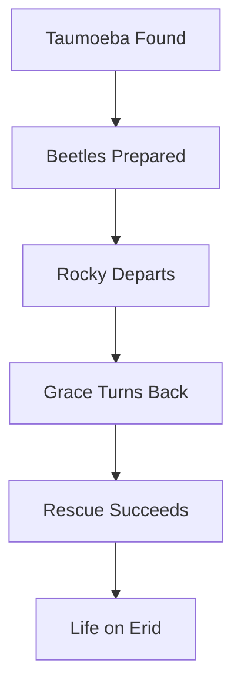

---
tags:
  - phm
  - resolution
  - taumoeba
  - novel
  - aftermath
up: "[[Project Hail Mary]]"
confidence: verified
freshness: stable
tier-coverage: [intuition, core, deep-dive, practice]
---
# Resolution and Aftermath

> **One-line summary** — The novel resolves its planet-scale crisis through a biologically grounded insight, then lands its emotional climax in Grace’s decision to choose Rocky over returning home.

## 🎯 Intuition
**The Core Idea:** This page explains how *Project Hail Mary* turns its ending from a giant physics problem into a joint biology-and-friendship solution.
**Why It Matters:** The ending is where Weir proves that the novel’s science arc, character arc, and thematic arc are all the same story. It also shows why the resolution feels earned: the final answer depends on Grace’s actual expertise and on the relationship he has built with Rocky.

## ⚙️ Core Mechanics
### Key Details
> [!warning] **SPOILER WARNING**
> This note covers the resolution arc and ending of *Project Hail Mary* in full. It discusses the novel's climax, the fate of major characters, and the final narrative choice. If you have not finished the novel and wish to avoid spoilers, stop here and return after reading.

This note analyzes the novel's resolution arc: how the Astrophage crisis is solved, what that solution costs, and what the aftermath looks like — both within the story and as a narrative and scientific assessment.

> **Note on sourcing:** All plot-specific claims are derived from primary-mode chapter notes verified directly from [[Weir 2021 - Project Hail Mary Novel]]. Supporting chunks are sourced from the chapter layer with precise page references.

## The Problem Reframed

The novel's central reframing is this: the Astrophage crisis, which the reader and Grace initially understand as a **physics problem** (how do we destroy or block an energy-dense organism at stellar scale?), is reframed by the Tau Ceti discovery as an **ecology problem** (what natural mechanism already controls this organism?).

This is a deliberate structural move by Weir. The physics-first framing establishes the stakes and the mission, but the biology-first resolution fits the protagonist: Grace is a biologist, not a physicist. The solution plays to his expertise in a way that feels narratively earned.

## The Discovery of Taumoeba

The novel depicts Grace discovering, in the Tau Ceti system, that Astrophage concentrations are lower than expected given the system's stellar output. The investigation leads him to identify a previously unknown organism — Taumoeba — living in conditions that should be impossible for biology, yet consuming Astrophage in measurable quantities.

Grace's characterization of Taumoeba is depicted as a process of real scientific method:
- Observation: Astrophage population is being suppressed.
- Hypothesis: A predator exists.
- Sample collection and analysis: Confirms Taumoeba's existence and basic properties.
- Controlled experiments: Tests host-specificity (does Taumoeba attack only Astrophage, or would it be an ecological danger in other contexts?).
- Assessment: Determines Taumoeba is a viable biological control agent.

See [[Taumoeba and the Biological Solution]] for the full scientific analysis and real-world anchors in predatory microbiology.

## Rocky's Role in the Solution

The novel depicts Rocky as an essential collaborator in the Taumoeba research arc. Rocky provides engineering capabilities Grace lacks (construction of containment and delivery mechanisms) while Grace provides the biological analysis Rocky cannot perform. The solution is explicitly a joint effort — neither protagonist could have reached it alone.

This is one of the novel's thematic throughlines: the two species' crises are identical, their expertise is complementary, and the solution requires both. See [[Rocky and the Eridians]] for Rocky's full profile.

## The Delivery Problem

Identifying Taumoeba is not sufficient — the organism must reach the Solar System and the target Astrophage populations. The novel depicts this as an engineering challenge: a mechanism to safely contain and transport Taumoeba, survive the journey, and disperse it effectively on arrival.

Rocky's engineering contribution is central here. The combined human-Eridian solution involves probe designs and deployment strategies that the novel works through in some technical detail — though, consistent with the KB's sourcing constraints, specific engineering parameters should not be cited from this note without novel ingestion confirming them.

## The Final Choice

The novel's emotional climax is Grace's final decision. He faces a choice between:
- **Returning to Earth**: The mission technically complete, he could ride the Hail Mary home (with the time-dilation consequences of years passing on Earth, and whatever personal and political aftermath awaits).
- **Remaining with Rocky**: Rocky's return journey requires help; remaining means Grace cannot go home.

The novel depicts Grace choosing to remain with Rocky and accompany him back to his home system. This choice reverses the novel's entire initial frame (the human mission, the Earth crisis) into something more personal — a friendship maintained at the cost of everything Grace might have returned to.

This ending is widely regarded as emotionally effective and tonally consistent with the novel's themes of individual sacrifice, scientific collaboration, and connection across difference.

## Scientific Assessment of the Resolution

| Element | Assessment | Notes |
|---|---|---|
| Biological control of pest populations | ✅ Grounded concept | Real ecological management strategy |
| Host-specific microbial predation | ✅ Grounded analog | *Bdellovibrio* and relatives ([[Taumoeba and the Biological Solution]]) |
| Taumoeba surviving stellar conditions | ❌ Impossible by known chemistry | Same barrier as Astrophage itself |
| Taumoeba's origin in Tau Ceti system | 🔶 Internally consistent | Plausible given the novel's ecological logic |
| Long-term stability of Taumoeba release | ❓ Uncertain/open question | Novel acknowledges this; ecology of introduced predators is complex |
| Probe delivery mechanism | 🔶 Extrapolated | Real spacecraft design principles, extreme environment application |

The resolution's strength is in its *logical structure*: if you grant Astrophage as given, the predator-prey ecology that follows is scientifically coherent. The weakness is thermodynamic — the same impossibilities that make Astrophage implausible also apply to Taumoeba.

## Narrative Assessment

The resolution succeeds on multiple levels:
- **Scientific authenticity**: Grace's method is a credible depiction of biological research under pressure.
- **Thematic resolution**: The individualist-vs-collective tension (Grace as reluctant solo hero) is resolved not by returning to society but by choosing a different kind of relationship.
- **Emotional resonance**: The Grace-Rocky friendship is the novel's heart, and the ending honors it.
- **Open-endedness**: The novel does not show Earth's recovery or the long-term fate of either civilization, which leaves room for imagination without requiring Weir to extrapolate further than the science supports.

### Key Facts

| Fact | Detail |
|---|---|
| Core reframing | The crisis shifts from a physics problem to an ecology problem |
| Biological solution | Taumoeba is discovered as a natural Astrophage predator |
| Joint effort | Grace supplies biology; Rocky supplies engineering |
| Delivery challenge | Solving the science is not enough; the cure must be transported and deployed |
| Emotional climax | Grace chooses Rocky and Erid over returning to Earth |
| Ending effect | The resolution binds scientific logic, sacrifice, and friendship into one outcome |

## 🔬 Deep Dive
### Scientific Accuracy
The ending is strongest where it models scientific reasoning: observation, hypothesis, experiment, and constrained deployment. Its major break from real science is not the method but the premise, because Taumoeba inherits the same impossible chemistry that Astrophage requires; within that single speculative allowance, however, the predator-prey solution is unusually coherent.

### Narrative Analysis
Weir engineers the climax so that technical success and moral choice arrive together. The solution to Earth’s problem does not end the story; instead, it clears the way for the real final decision, which is whether Grace remains defined by his original mission or by the relationship and responsibility he has built with Rocky.

### Connections

- The organism that solves the crisis: [[Taumoeba and the Biological Solution]]
- The Astrophage ecology context: [[Astrophage Life Cycle and Migration]]
- The Adrian ecology: [[The Adrian Ecology]]
- The protagonist: [[Ryland Grace]]
- His alien collaborator: [[Rocky]] (character) · [[Rocky and the Eridians]] (biology)
- The crew that didn't survive: [[The Hail Mary Crew - Yao and Ilyukhina]]
- What the mission was: [[The Hail Mary Drive]]
- The crisis being solved: [[Earth Energy Budget Under Threat]]
- Film treatment of the resolution: [[Novel vs Film Adaptation]]
- Thematic analysis: [[Themes and Motifs]]
- Full accuracy assessment: [[Science Accuracy Scorecard]]

## 🏋️ Practice
### Discussion Questions
1. Why does the novel’s ending work better because the solution is biological rather than purely physical?
2. How does Grace’s final decision transform the meaning of the mission after the technical problem is solved?
3. What real-world scientific or humanitarian efforts depend on the same mix of domain expertise and cross-disciplinary collaboration?

### Analysis
- Evaluate whether the ending’s emotional power depends more on Grace’s character growth or on Rocky’s presence as collaborator and friend.
- Consider how the unresolved long-term ecological consequences strengthen or weaken the ending.

### Creative Challenge
- **What if...** Grace had sent the solution home successfully but still returned to Earth instead of following Rocky—how would that change the novel’s thematic center?

## References

- [[Project Hail Mary/Sources/Sources Index#Weir 2021 Novel|Weir 2021 Novel]] — primary source for plot depictions (fictional)
- [[Project Hail Mary/Sources/Sources Index#Weir Interviews Taumoeba|Weir Interviews Taumoeba]] — author commentary on resolution design
- [[Project Hail Mary/Sources/Sources Index#Bdellovibrio Sockett 2009|Bdellovibrio Sockett 2009]] — biological control science anchor
- [[Project Hail Mary/Sources/Sources Index#Northeastern Accuracy Discussion|Northeastern Accuracy Discussion]] — public accuracy discussion including resolution

## Supporting Chunks

- [[Taumoeba - Fictional predator of Astrophage native to Tau Ceti system]]
- [[Taumoeba - Predatory bacteria demonstrate host-specific population suppression]]
- [[Taumoeba - Microbial predator-prey co-evolution can produce stable coexistence]]
- [[Characters - Grace amnesia functions as deferred exposition device]]
- [[Engineering - Autonomous Beetle deployment delivers Taumoeba-82.5 to Earth without requiring Grace's return]]
- [[Novel - Grace chooses to rescue Rocky instead of returning to Earth as the defining ethical act]]
- [[Taumoeba - Biochemical compatibility with Earth life makes it viable as human food for Grace's survival]]
- [[Novel - Sol's recovery to pre-Astrophage brightness confirms the Beetle delivery succeeded]]
- [[Novel - Grace teaching Eridian children transforms first contact into shared education as the end state]]
- [[Novel - You save me and you save Erid is the emotional payoff of Grace turning back for Rocky]] — Ch29: emotional climax
- [[Novel - Xenonite-threat briefing transmits the permeability warning that enables Erid s response]] — Ch30: information handoff that makes Erid's successful response possible
- [[Novel - Fist my bump formalises Grace s irrevocable commitment to accompany Rocky to Erid]] — Ch30: commitment formalization that bridges rescue to Epilogue
- [[Xenolinguistics - Organ-keyboard teaching scene marks xenolinguistics maturing to classroom instruction]] — Epilogue: mature communication system
- [[Eridian - Eridian heavy-metal ecology makes native food directly toxic to humans forcing dependence on Taumoeba]] — Ch30: the hard constraint that makes Taumoeba food the only viable survival path on Erid