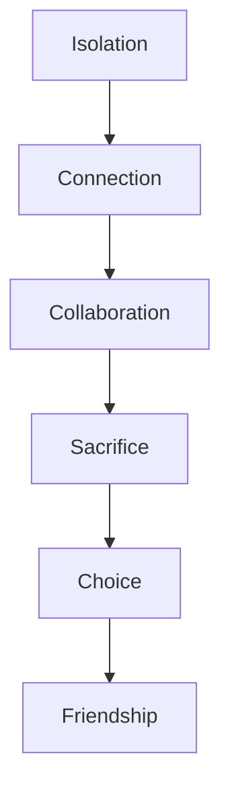

---
tags:
  - phm
  - novel
  - themes
  - analysis
up: "[[Project Hail Mary]]"
confidence: verified
tier-coverage: [intuition, core, deep-dive, practice]
---
# Themes and Motifs

> **One-line summary** — Beneath its problem-solving surface, *Project Hail Mary* is a novel about how isolation gives way to connection, and how connection gives meaning to sacrifice, competence, and choice.

## 🎯 Intuition
**The Core Idea:** This page identifies the major themes that emerge from the novel’s structure, characters, and ending.
**Why It Matters:** The science-fiction mechanics explain how events happen, but the themes explain why those events feel meaningful. Reading the novel through its motifs shows that Weir’s biggest achievement is not just technical plausibility, but building a story where friendship, expertise, and chosen responsibility become inseparable.

## ⚙️ Core Mechanics
### Key Details
This note identifies and analyzes the major thematic threads running through [[Project Hail Mary]]. These themes are not stated explicitly by the novel — they emerge from the narrative structure, character arcs, and resolution. See individual arc notes for chapter-level evidence.

## Isolation and Connection

The novel begins with absolute isolation: Grace wakes alone, amnesiac, in interstellar space with two dead crewmates. This isolation is not accidental — it is the structural precondition for everything that follows.

When Rocky arrives, the isolation does not simply end; it transforms. Grace moves from solitary problem-solving to collaborative inquiry, and the emotional relief is palpable. The novel argues, implicitly, that intelligence in isolation is insufficient — not because Grace is incompetent, but because the problem requires *complementary* expertise.

The theme extends beyond the two protagonists. Earth's crisis requires international cooperation (Stratt's global authority). The Eridian response also required a mission. The novel frames existential threats as problems that cannot be solved alone at any scale — individual, species, or civilizational.

## Science as Worldview

Grace is a scientist, and the novel treats scientific thinking not as a professional skill but as a way of being in the world. His response to every crisis is methodical: observe, hypothesize, test, revise. This is true whether the problem is identifying an alien organism or figuring out what Rocky is trying to say.

The novel's emotional investment in scientific process is genuine. Grace's excitement at discovery, his frustration at failed experiments, his care in distinguishing what he knows from what he infers — these are depicted as characterful and compelling, not dry. See [[Ryland Grace]] for his character arc and [[Weir's Hard SF Method]] for the author's approach.

The corollary theme: *the right expertise matters*. Grace is not a generalist hero. He is a biologist, and the solution to the Astrophage crisis is biological. The novel rewards specificity over versatility.

## Collaboration Across Radical Difference

The Grace-Rocky partnership is the novel's central argument that collaboration can transcend every barrier: different biology, different atmosphere, different sensory systems, different languages, different mathematical bases. The novel does not minimize these differences — it depicts them as real, persistent, and requiring constant engineering to manage — but it shows that genuine partnership is possible despite them.

This is not a metaphor handled subtly. The novel is explicit: the solution to the Astrophage crisis is *joint*. Neither Grace nor Rocky could reach it alone. The complementary asymmetry (biologist + engineer) is the mechanism that makes collaboration necessary rather than optional. See [[Arc - Grace and Rocky]].

## Sacrifice and Choice

The novel structures multiple sacrifice decisions:

- **Stratt's calculus.** She sacrifices individual rights, informed consent, and human lives for the mission. Her frame is utilitarian: the species survives or it doesn't. See [[Eva Stratt and the Ethics of Existential Response]].
- **The crew's sacrifice.** Yáo and Ilyukhina die in transit. Grace did not volunteer. The mission extracts sacrifice from people who did not consent. See [[The Hail Mary Crew - Yao and Ilyukhina]].
- **Rocky's oxygen rescue.** Rocky enters a lethal environment to save Grace. This is deliberate self-risk for the sake of a friend — not a species, not a mission, a *friend*.
- **Grace's final choice.** Grace chooses Rocky over Earth. He gives up his homeworld, his species, his identity as a human among humans. The novel frames this as the culmination of everything that came before: the friendship, the collaboration, the recognition that this relationship matters more than return.

The thematic arc of sacrifice moves from *coerced* (Stratt's conscription) to *chosen* (Grace's final decision). The novel's resolution validates the chosen sacrifice over the coerced one.

## Competence and Problem-Solving

*Project Hail Mary* belongs to a tradition of competence fiction — narratives where the pleasure is watching skilled people solve hard problems. Grace and Rocky are both depicted as highly competent in their domains, and the novel's pacing depends on the reader sharing the characters' satisfaction in incremental progress.

This theme is closely tied to the hard-SF method (see [[Weir's Hard SF Method]]): the problems are real enough (or consistent enough with the novel's one impossible assumption) that the solutions feel earned rather than arbitrary.

## Redemption and Purpose

Grace's arc is a quiet redemption story. He is a man who left academic research, became a high-school teacher, and was coerced into a mission he did not choose. Over the course of the novel, he recovers his expertise, discovers a purpose that exceeds anything he had on Earth, and ultimately commits to a life defined by his own choice rather than someone else's.

The Epilogue — Grace teaching Eridian children on a planet that is not his own — is the novel's vision of redemption: not returning to what was lost, but building something new from what was found. See [[Resolution and Aftermath]] and [[Novel - Grace teaching Eridian children transforms first contact into shared education as the end state]].

## Friendship as the Highest Value

The novel's ending is its thematic thesis statement. Grace does not choose duty (Earth), survival (the safe return), or glory (the hero's welcome). He chooses friendship. The novel argues — through 400 pages of earned relationship — that this is not sentimental but rational: the friendship with Rocky is the most meaningful thing Grace has found, and it deserves the sacrifice.

This theme is what makes the novel emotionally resonant beyond its science-fiction premise. The Astrophage crisis is the mechanism; the friendship is the meaning.

### Key Facts

| Fact | Detail |
|---|---|
| Opening condition | The novel begins in radical isolation and moves toward connection |
| Scientific ethic | Grace treats science as a worldview, not just a profession |
| Central partnership | Collaboration across radical difference is the book’s core relational argument |
| Sacrifice arc | The story contrasts coerced sacrifice with chosen sacrifice |
| Character payoff | Grace’s redemption comes through purpose, teaching, and freely chosen commitment |
| Final thesis | Friendship becomes the novel’s highest value and emotional endpoint |

## 🔬 Deep Dive
### Scientific Accuracy
Thematically, the novel’s science matters because it is tied to method, not just spectacle. Weir presents competence, hypothesis-testing, and domain expertise as emotionally legible behaviors, which is one reason the book’s themes feel integrated instead of pasted on after the fact.

### Narrative Analysis
The themes are distributed structurally: isolation dominates the opening, collaboration deepens in the middle, sacrifice sharpens during the crisis, and friendship becomes the interpretive key of the ending. That progression gives the novel a strong internal logic, where even the biggest emotional beats emerge from problem-solving scenes rather than from separate “theme” scenes.

### Connections

- Grace's character arc: [[Ryland Grace]]
- Rocky's character profile: [[Rocky]]
- The central relationship: [[Arc - Grace and Rocky]]
- Stratt's ethical framework: [[Eva Stratt and the Ethics of Existential Response]]
- The crew as sacrifice: [[The Hail Mary Crew - Yao and Ilyukhina]]
- The resolution: [[Resolution and Aftermath]]
- Hard-SF method context: [[Weir's Hard SF Method]]
- Film adaptation of themes: [[Novel vs Film Adaptation]]

## 🏋️ Practice
### Discussion Questions
1. Which theme feels most central to the novel: scientific competence, sacrifice, or friendship?
2. How does the Grace-Rocky relationship turn abstract themes like collaboration and difference into lived narrative experience?
3. What real-world crises best mirror the novel’s insistence that expertise and cooperation matter more than heroic individualism?

### Analysis
- Trace how the novel moves from coerced obligation to chosen purpose through Grace’s arc.
- Compare the thematic role of Stratt with the thematic role of Rocky: what values does each character foreground?

### Creative Challenge
- **What if...** the novel ended with Earth saved but Rocky absent—would the same themes still hold, or would the story mean something fundamentally different?

## References

- [[Sources Index#Weir 2021 Novel]] — primary source (fictional)
- [[Sources Index#Weir Interviews Taumoeba]] — author commentary on thematic intent

## Supporting Chunks

- [[Characters - Grace accepts certain death transforming obligation into personal commitment]] — Ch05: sacrifice and purpose
- [[Novel - Fist my bump formalises Grace s irrevocable commitment to accompany Rocky to Erid]] — Ch30: friendship-as-highest-value thesis enacted