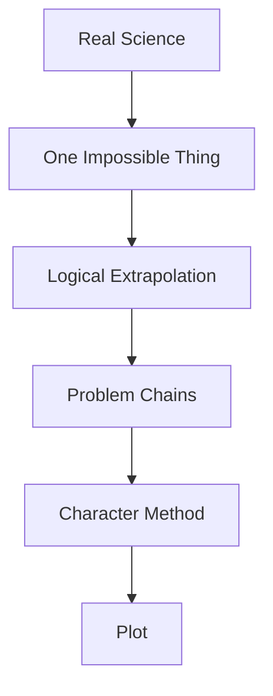

---
tags:
  - phm
  - novel
  - method
  - hard-sf
  - weir
up: "[[Project Hail Mary]]"
confidence: verified
freshness: stable
tier-coverage: [intuition, core, deep-dive, practice]
---
# Weir's Hard SF Method

> **One-line summary** — Weir builds *Project Hail Mary* by granting one impossible premise, then forcing every plot beat to obey the consequences of that premise with relentless scientific logic.

## 🎯 Intuition
**The Core Idea:** This page explains the storytelling method Andy Weir uses to make speculative science feel earned.
**Why It Matters:** Understanding this method clarifies why the novel’s science scenes are also its suspense scenes. It also shows why *Project Hail Mary* feels so convincing even when its central premise is impossible: the implausibility is concentrated, while the rest of the narrative is disciplined extrapolation.

## ⚙️ Core Mechanics
### Key Details
Andy Weir's approach to science fiction follows a distinctive method that shapes *Project Hail Mary* at every level — from premise design to plot structure to protagonist characterization. This note analyzes that method and how it operates in the novel.

## The One-Impossible-Assumption Framework

Weir's signature approach, visible in both *The Martian* and *Project Hail Mary*, is:

1. **Grant one impossible thing** — a single speculative premise that violates known physics or biology.
2. **Follow every consequence with real science** — treat the impossible thing as a given and work out the implications using first-principles physics, chemistry, biology, and engineering.
3. **Let the science generate the plot** — problems and solutions arise from the consequences of the premise, not from arbitrary plot events.

In *The Martian*, the impossible thing is a dust storm strong enough to strand Watney (Mars's thin atmosphere makes this implausible at the depicted scale). Everything after that — potato farming, water synthesis, rover modification — follows real science.

In *Project Hail Mary*, the impossible thing is **Astrophage**: an organism that stores energy at E=mc² density, survives stellar-photosphere temperatures, and migrates between stars via photon thrust. Everything that follows — the Petrova Line, the energy crisis, the Hail Mary drive, the Taumoeba predator-prey ecology — is either real science or a logical extrapolation from the Astrophage premise. See [[Science Accuracy Scorecard]] for the full grounded/extrapolated/impossible breakdown.

This method produces a specific reader experience: the feeling that the story *had* to go this way given the premise. Plot developments feel discovered rather than invented, which is the distinctive pleasure of hard SF.

## First-Principles Problem Solving

The novel's pacing depends on depicting problem-solving as a process rather than a result. Grace does not have eureka moments; he has hypothesis-test-revise cycles:

- Observe anomaly (Astrophage populations lower than expected at Tau Ceti).
- Form hypothesis (something is suppressing them).
- Design experiment (sample collection, microscopy).
- Test and iterate (Taumoeba identification, nitrogen lethality, directed evolution).
- Assess consequences (xenonite permeability, deployment logistics).

This mirrors real scientific method, and it is what makes the novel's exposition feel like adventure rather than lecture. The reader is not told answers; the reader watches answers being discovered. See [[Ryland Grace]] for how this method defines Grace as a character and [[Taumoeba and the Biological Solution]] for the most extended example.

## Amnesia as Co-Discovery Device

Grace's amnesia is not a gimmick — it is a structural tool that serves the hard-SF method. By giving the protagonist no memory of his mission, Weir forces the reader and Grace to discover the situation simultaneously. This accomplishes several things:

- **Deferred exposition.** The novel withholds its premise (Astrophage, the crisis, the mission) and reveals it piece by piece through flashbacks. The reader is never ahead of the protagonist.
- **Competence before context.** Grace demonstrates scientific thinking before the reader knows his background. His expertise is established behaviorally, not biographically.
- **Dual timeline as pacing device.** The interleaved flashback/present structure lets the novel alternate between action (present) and context (flashback), keeping both timelines in motion.

See [[Characters - Grace amnesia functions as deferred exposition device]] and [[Novel - French amnesia drug explains Grace's Chapter 1 memory loss as a deliberate DGSE protocol]] for the narrative and in-universe mechanisms.

## Relation to the Science Accuracy Scorecard

The [[Science Accuracy Scorecard]] is, in a sense, a map of Weir's method in action. The scorecard reveals a pattern:

- **Grounded claims** (✅) cluster around detection methods, real astronomy, energy budgets, extremophile biology, predator-prey ecology — everything downstream of the premise.
- **Impossible claims** (❌) cluster tightly around the premise itself: Astrophage energy storage, stellar-temperature survival, single-cell interstellar migration.
- **Extrapolated claims** (🔶) occupy the middle ground: the Hail Mary drive, torpor technology, Eridian biochemistry — real principles pushed beyond current knowledge but consistent with the premise.

This distribution is the fingerprint of the one-impossible-assumption method: a single concentration of impossibility, surrounded by a large zone of disciplined extrapolation and grounded science.

## Comparison with *The Martian*

| Feature | *The Martian* | *Project Hail Mary* |
|---|---|---|
| Impossible assumption | Dust storm severity | Astrophage (entire organism) |
| Science domains | Botany, chemistry, orbital mechanics | Biology, astrophysics, xenolinguistics, ecology |
| Protagonist expertise | Botanist-engineer | Biologist-teacher |
| Problem-solving structure | Sequential survival problems | Layered investigation + collaboration |
| Co-discovery device | Mission logs | Amnesia + dual timeline |
| Collaboration | Minimal (solo until rescue) | Central (Rocky as co-protagonist) |

*Project Hail Mary* is the more ambitious novel in scientific scope, and its method is correspondingly more complex: the impossible assumption has wider consequences, and the problem-solving requires two intelligences rather than one.

### Key Facts

| Fact | Detail |
|---|---|
| Core framework | Weir grants one impossible premise, then follows its consequences rigorously |
| Plot engine | Scientific problem-solving generates both exposition and suspense |
| Reader-positioning tool | Grace’s amnesia lets reader and protagonist discover the situation together |
| Accuracy pattern | The most impossible material clusters around Astrophage itself |
| Comparative scope | *Project Hail Mary* expands the method beyond *The Martian* into collaboration and xenoscience |
| Narrative effect | The plot feels discovered rather than arbitrarily imposed |

## 🔬 Deep Dive
### Scientific Accuracy
This page describes a method built around controlled scientific deviation. Its strength is that the novel’s least plausible claim is front-loaded into Astrophage, while everything downstream is pressured to behave consistently with known reasoning, real constraints, or carefully signposted extrapolation.

### Narrative Analysis
Weir’s craft move is to make process itself dramatic. Amnesia, dual timelines, and first-principles inference are not separate devices; they cooperate to ensure that explanation arrives as revelation, and that revelation arrives through action rather than static exposition.

### Connections

- The scorecard as method map: [[Science Accuracy Scorecard]]
- Grace as embodiment of the method: [[Ryland Grace]]
- The Taumoeba arc as extended example: [[Arc - Taumoeba Discovery]]
- The novel's themes: [[Themes and Motifs]]
- Science exposition in the film adaptation: [[Science Exposition on Screen]]
- Astrophage as the impossible assumption: [[Astrophage Biology]]
- The specific Astrophage impossibility: [[Astrophage Energy Physics]]

## 🏋️ Practice
### Discussion Questions
1. Why does concentrating implausibility in one premise make the rest of the novel feel more believable?
2. How does Grace’s amnesia strengthen Weir’s hard-SF method instead of weakening it?
3. What other science-fiction works use a similar “one impossible thing, then rigorous consequences” model?

### Analysis
- Compare how *The Martian* and *Project Hail Mary* deploy the same method for different kinds of narrative pleasure.
- Evaluate whether Weir’s method depends more on scientific consistency or on reader trust in the protagonist’s reasoning.

### Creative Challenge
- **What if...** Weir had added a second major impossible premise beyond Astrophage—how might that have weakened or transformed the novel’s hard-SF identity?

## References

- [[Project Hail Mary/Sources/Sources Index#Weir 2021 Novel|Weir 2021 Novel]] — primary source (fictional)
- [[Project Hail Mary/Sources/Sources Index#Weir Interviews Taumoeba|Weir Interviews Taumoeba]] — author interviews on method and design choices
- [[Project Hail Mary/Sources/Sources Index#Northeastern Accuracy Discussion|Northeastern Accuracy Discussion]] — public discussion of scientific accuracy

## Supporting Chunks

- [[Characters - Pendulum gravity calculation demonstrates empirical reasoning under cognitive impairment]] — Ch02: first-principles problem-solving demonstration
- [[Eridian - Grace deduces Rocky s blindness to visible light through systematic object-exchange experiments]] — Ch10: scientific method in action