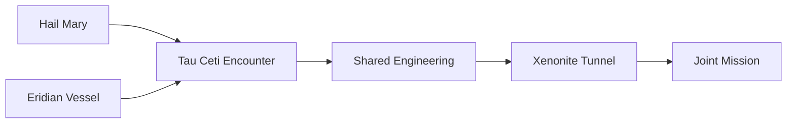

---
tags:
  - phm
  - propulsion
  - eridians
  - ship-design
  - engineering
up: "[[Project Hail Mary]]"
confidence: verified
tier-coverage: [intuition, core, deep-dive, practice]
---
# The Eridian Vessel

> **One-line summary** — Rocky's ship — unnamed in the novel — is the counterpart to the *Hail Mary*.

## 🎯 Intuition
**The Core Idea:** Rocky's ship — unnamed in the novel — is the counterpart to the *Hail Mary*.
**Why It Matters:** It appears at Tau Ceti before or around the same time as Grace, representing the Eridian civilization's parallel response to the Astrophage crisis. This note covers what its presence implies about Eridian engineering, and what remains genuinely unknown.

## ⚙️ Core Mechanics
> [!info] Evidence Mode
> Novel-specific claims about the Eridian vessel are drawn from primary-mode chapter notes verified against [[Weir 2021 - Project Hail Mary Novel]]. Engineering inferences not directly stated in the text are hedged accordingly.

### What Rocky's Ship Reveals About Eridian Engineering
The vessel's very existence implies a convergent engineering achievement: an independently developed interstellar propulsion system capable of reaching Tau Ceti from 40 Eridani (approximately 16.5 light-years away). The novel depicts the Eridian ship as also using Astrophage as propellant, implying:

1. **Independent Astrophage exploitation**: Eridians discovered Astrophage's energy density and developed a mechanism to harvest and direct its energy for propulsion, independently of humanity. This convergence is either a remarkable coincidence or a reflection that Astrophage's properties make photon-drive propulsion the obvious solution for any sufficiently advanced civilization that encounters it.
2. **Engineering under different constraints**: Eridian engineering developed under high-pressure, high-temperature conditions with ammonia chemistry, echolocation-based perception, and base-6 mathematics. The physical requirements of spaceflight are the same (delta-v, shielding, life support), but the engineering implementation reflects a radically different physical and cognitive starting point.
3. **Comparable mission profile**: Both ships converge on Tau Ceti to investigate the same crisis, suggesting Eridians identified the same target for the same reasons — the logical inference that Astrophage migrates to its origin system.

### Hull and Environment
The novel and chapter notes indicate Rocky's section of the eventual joined-ship configuration involves:
- **Extreme pressure environment**: Rocky's native atmosphere is at pressures far exceeding human engineering norms (the novel describes 29 atmospheres).
- **High temperature**: Rocky can work in what would be lethal heat for humans. The Eridian section must be maintained at temperatures consistent with ammonia-solvent biochemistry under high pressure.
- **Xenonite construction**: [[Xenonite - Eridian Structural Material|Xenonite]] is the key structural material, used for the pressure hull and tunnel interfaces. See the dedicated xenonite note for real-world analogs.
- **No visual interface**: No lighting, viewports, or visual displays would be expected — Rocky perceives through echolocation. The interior design reflects acoustic-primary cognitive architecture.

### Crew and Mission
Chapter notes indicate Rocky arrived at Tau Ceti with crewmates who subsequently died — a detail that directly parallels Grace's own situation (his crewmates also died during the journey). This is a deliberate structural mirror. Inferences from this:

- Eridian missions face the same attrition problem as human missions: the journey is dangerous, the crew is isolated, and survival is not guaranteed.
- Rocky's position as the sole survivor mirrors Grace's, creating the basis for genuine mutual empathy that transcends biological difference.
- The Eridian civilization sent a crewed mission rather than an automated probe, implying either that the engineering challenge required on-site intelligence, or that Eridian civilization values in-person scientific investigation.

### Comparison: Hail Mary vs. Eridian Vessel

| Feature | *Hail Mary* | Eridian Vessel |
|---|---|---|
| Propellant | Astrophage (confirmed) | Astrophage (strongly implied by convergence) |
| Drive type | Photon rocket (IR emission) | Probably photon-class (same physics) |
| Crew environment | Earth-normal pressure, ~20°C | High-pressure, high-temperature, ammonia |
| Primary structural material | Human metals/composites | Xenonite and analogs |
| Crew size (departed) | 3 (Grace survived alone) | Unknown; Rocky survived alone |
| Communication interface | Visual (screens, lights) | Acoustic (tonal output) |
| Navigation target | Tau Ceti | Tau Ceti |
| Mission objective | Identify and solve Astrophage crisis | Same (convergent) |
| Crew status at encounter | 1 survivor (Grace) | 1 survivor (Rocky) |

*Note: Eridian vessel technical details are inference from chapter evidence; human Hail Mary details are more directly documented.*

### Astrophage Convergence: What It Suggests
Both civilizations independently choosing Astrophage-powered propulsion would be remarkable. It implies:
- Astrophage's energy density is so far beyond any naturally occurring alternative that any civilization that discovers it would exploit it for propulsion.
- The photon-rocket solution to interstellar travel is not unique to human physics — it follows from the same thermodynamics regardless of who discovers it.
- OR the novel is using convergence as a deliberate narrative device: the two missions meeting implies they share not just a crisis but a solution space.

Secondary-mode sources do not clarify whether Weir explicitly confirms Eridian Astrophage propulsion or whether this is implied by the narrative. This is flagged as an inference with high plausibility but not directly stated.

### Explicit Unknowns
The following remain uncertain even with the primary chapter layer:
- Exact propulsion mechanism of the Eridian vessel
- Hull geometry and dimensions
- Whether Rocky's ship can be repaired or returned to Erid
- The fate of Rocky's crewmates (cause of death)
- Whether the Eridian civilization sent additional vessels

### Key Facts

| Fact | Detail |
|---|---|
| Mission parallel | Rocky's ship is an independent interstellar response to the same Astrophage crisis. |
| Environmental baseline | The Eridian vessel supports high pressure, high temperature, and ammonia-based life. |
| Structural material | [[Xenonite - Eridian Structural Material|Xenonite]] anchors the pressure hull and interfaces. |
| Crew mirror | Rocky surviving alone mirrors Grace's own survivor status. |
| Biggest uncertainty | The exact drive mechanism and overall ship geometry remain unknown. |
| Core inference | Astrophage-based propulsion is strongly implied, but still treated as an inference here. |

## 🔬 Deep Dive
### Scientific Accuracy
The note is careful about what the novel directly supports versus what is inferred from convergence with the *Hail Mary*. Confirmed elements — Rocky's survival, the extreme environment, and xenonite-based interfaces — are separated from softer claims like exact drive configuration or ship geometry. That hedging keeps the engineering discussion more defensible than a fully specified fan blueprint would be.

### Narrative Analysis
The Eridian vessel is a structural mirror for the *Hail Mary*: another desperate ship, another dead crew, another lone survivor. That symmetry is what makes the Grace–Rocky partnership feel like convergence rather than coincidence, and it turns alien engineering into a plot bridge instead of just worldbuilding texture.

### Connections
- Rocky's biology and requirements: [[Rocky and the Eridians]]
- Xenonite as the enabling structural material: [[Xenonite - Eridian Structural Material]]
- Hail Mary counterpart: [[Hail Mary Ship Design and Systems]]
- 40 Eridani as origin system: [[Tau Ceti and 40 Eridani]]
- Eridian civilization context: [[Eridian Civilization Profile]]
- Narrative context of the encounter: [[Arc - Grace and Rocky]]
- Resolution and aftermath: [[Resolution and Aftermath]]

## 🏋️ Practice
### Discussion Questions
1. Which inference about the Eridian vessel feels strongest, and which still feels too speculative?
2. How does the ship's environment reflect Eridian biology rather than just Eridian technology?
3. Why is the lone-survivor parallel between Grace and Rocky so important to the note's interpretation?

### Analysis
- Separate the vessel's directly supported features from the fan-inference layer and explain where the boundary sits.
- Compare the Eridian ship's implied design logic with the explicitly documented logic of the *Hail Mary*.

### Creative Challenge
- **What if...** the novel had revealed the Eridian vessel's exact drive geometry and mission architecture in full detail?

## References

- [[Sources Index#Weir 2021 Novel]] — primary novel source
- [[Sources Index#PHM Secondary Chapter Summaries Registry]] — original secondary-mode synthesis basis (now superseded by primary chapter layer)
- [[Sources Index#Chris West Ship Analysis]] — *Hail Mary* drive and propulsion analysis (human-side comparison only; Chris West did not analyze the Eridian vessel directly)

## Supporting Chunks

- [[Materials - Ultra-high-temperature ceramics maintain structural integrity above 3000°C]] — real melting-point and structural performance baseline; the real-science anchor for the claim that Xenonite-class materials can survive the Eridian vessel's thermal and pressure environment.
- [[Materials - UHTC oxide layers act as diffusion barriers that slow further degradation]] — real analog for xenonite's atmospheric-isolation function; directly relevant to how the hull maintains hard boundaries between the Eridian high-pressure environment and human sections.
- [[Materials - Porosity is the critical failure mode that undermines UHTC performance]] — maps to xenonite's Taumoeba-induced permeability crisis; the same porosity/pathway-opening failure mode that makes the late-novel xenonite threat structurally plausible.
- [[Eridian - Xenonite pressure sphere is a transit vehicle across incompatible atmospheres]]