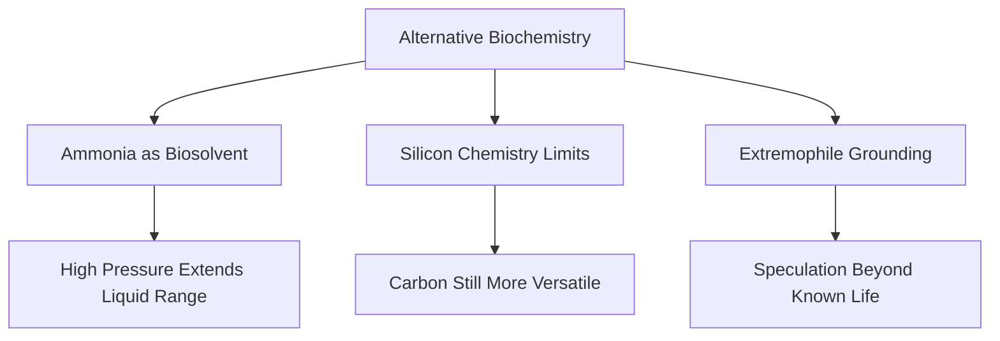

---
tags:
  - phm
  - xenobiology
  - biochemistry
  - ammonia
  - silicon
up: "[[Project Hail Mary]]"
confidence: verified
freshness: stable
tier-coverage: [intuition, core, deep-dive, practice]
---
# Alternative Biochemistry

> **One-line summary** — Rocky's biology imagines intelligent life built around hot, pressurized ammonia chemistry instead of Earth's water-based model.

## 🎯 Intuition
**The Core Idea:** Eridian life works as a speculative alternative-biochemistry thought experiment built on ammonia-rich, high-pressure, high-temperature conditions.
**Why It Matters:** This page explains why [[Rocky and the Eridians|Rocky's]] biology feels scientifically interesting rather than arbitrary. It also shows where the novel stays grounded in real chemistry and extremophile logic, and where it deliberately makes a large speculative leap.

## ⚙️ Core Mechanics
### Key Details

[[Rocky and the Eridians|Rocky's]] biology operates in conditions utterly unlike Earth's: high temperature, extreme pressure, and an ammonia-based solvent system. This note evaluates how realistic such biochemistry could be.

### Ammonia as a Biosolvent

Ammonia (NH₃) is the most frequently cited alternative to water as a biological solvent:

- **Liquid range at 1 atm**: −77°C to −33°C — far too cold for the Eridian environment.
- **Under pressure**: High pressure dramatically extends ammonia's liquid range. At hundreds of atmospheres, ammonia can remain liquid well above 100°C.
- **Chemical properties**: Ammonia dissolves many salts and organic compounds. It supports acid-base chemistry (NH₄⁺/NH₂⁻ analogous to H₃O⁺/OH⁻). It can in principle support complex molecular assembly.

**The stretch**: Complex biochemistry in hot, pressurized ammonia is speculative. No known organisms use ammonia as a primary solvent. The thermodynamic stability of large biomolecules in such conditions is undemonstrated. This is a plausible *thought experiment*, not an observed phenomenon.

### Silicon-Based Life

Rocky is sometimes described in discussions as potentially silicon-based. The reality:

- **Silicon can form chains and rings**, but Si–Si bonds are weaker than C–C bonds and highly reactive with oxygen and water.
- **Silicones** (Si–O–Si backbones) are more stable but less versatile than carbon frameworks.
- **At high temperatures**, some silicon chemistry becomes more favorable, but the diversity of carbon biochemistry remains unmatched.

Silicon is best understood as a **complement or trace element**, not a wholesale carbon replacement. The MDPI Life 2020 review concludes silicon is chemically inferior as a life-building backbone under most conditions, though exotic environments remain somewhat open.

### Extremophile Grounding

Real extremophiles demonstrate that life tolerates remarkable conditions:

| Organism Type | Extreme | Example |
|---|---|---|
| Thermophile | >80°C | *Pyrolobus fumarii* (113°C) |
| Piezophile | >100 MPa | Deep-trench barophiles |
| Halophile | Saturated salt | *Halobacterium salinarum* |
| Acidophile | pH < 1 | *Ferroplasma acidarmanus* |

However, all known extremophiles are **single-celled and water-based**. The leap to intelligent, multicellular, high-pressure ammonia life is enormous. Extremophiles validate that biochemistry is flexible; they do not validate Rocky.

### Key Facts

| Fact | Detail |
|---|---|
| Primary solvent concept | Eridian life is framed around ammonia rather than water |
| Environmental constraint | High pressure is required to keep ammonia liquid at Eridian-relevant temperatures |
| Chemistry status | Ammonia can support acid-base chemistry and molecular assembly in principle |
| Silicon role | Silicon is more plausible as a complement than a full replacement for carbon |
| Real grounding | Extremophiles prove biochemical flexibility, but all known examples remain water-based |
| Main speculative leap | Intelligent multicellular ammonia life at extreme heat and pressure is unobserved |

## 🔬 Deep Dive
### Scientific Accuracy

### Ammonia as a Biosolvent

Ammonia (NH₃) is the most frequently cited alternative to water as a biological solvent:

- **Liquid range at 1 atm**: −77°C to −33°C — far too cold for the Eridian environment.
- **Under pressure**: High pressure dramatically extends ammonia's liquid range. At hundreds of atmospheres, ammonia can remain liquid well above 100°C.
- **Chemical properties**: Ammonia dissolves many salts and organic compounds. It supports acid-base chemistry (NH₄⁺/NH₂⁻ analogous to H₃O⁺/OH⁻). It can in principle support complex molecular assembly.

**The stretch**: Complex biochemistry in hot, pressurized ammonia is speculative. No known organisms use ammonia as a primary solvent. The thermodynamic stability of large biomolecules in such conditions is undemonstrated. This is a plausible *thought experiment*, not an observed phenomenon.

### Silicon-Based Life

Rocky is sometimes described in discussions as potentially silicon-based. The reality:

- **Silicon can form chains and rings**, but Si–Si bonds are weaker than C–C bonds and highly reactive with oxygen and water.
- **Silicones** (Si–O–Si backbones) are more stable but less versatile than carbon frameworks.
- **At high temperatures**, some silicon chemistry becomes more favorable, but the diversity of carbon biochemistry remains unmatched.

Silicon is best understood as a **complement or trace element**, not a wholesale carbon replacement. The MDPI Life 2020 review concludes silicon is chemically inferior as a life-building backbone under most conditions, though exotic environments remain somewhat open.

### Extremophile Grounding

Real extremophiles demonstrate that life tolerates remarkable conditions:

| Organism Type | Extreme | Example |
|---|---|---|
| Thermophile | >80°C | *Pyrolobus fumarii* (113°C) |
| Piezophile | >100 MPa | Deep-trench barophiles |
| Halophile | Saturated salt | *Halobacterium salinarum* |
| Acidophile | pH < 1 | *Ferroplasma acidarmanus* |

However, all known extremophiles are **single-celled and water-based**. The leap to intelligent, multicellular, high-pressure ammonia life is enormous. Extremophiles validate that biochemistry is flexible; they do not validate Rocky.

### Narrative Analysis
Alternative biochemistry is one of the novel's biggest speculative moves, but it works because the page keeps the distinction between grounded chemistry and fictional extension explicit. That makes Rocky feel alien in a way that supports the story's first-contact stakes instead of reading like random invention.

### Connections

- Rocky's actual biology and behavior: [[Rocky and the Eridians]]
- Rocky's home star system: [[Tau Ceti and 40 Eridani]]
- Communication between radically different biologies: [[Xenolinguistics and First Contact]]
- Astrophage as another extreme organism: [[Astrophage Biology]]
- Accuracy overview: [[Science Accuracy Scorecard]]

## 🏋️ Practice
### Discussion Questions
1. Why does pressure matter so much for ammonia-based life in the Eridian environment?
2. Why is silicon usually treated as a weaker life-building backbone than carbon?
3. What do extremophiles validate here, and what do they still leave unsupported?

### Analysis
- Compare the page's strongest grounded claim with its most speculative claim.
- Explain why ammonia biochemistry works better here as a thought experiment than as a proven model of life.

### Creative Challenge
- **What if...** scientists discovered a single-celled ammonia-based extremophile—how would that change the confidence level of Rocky's biology?

## References

- [[Project Hail Mary/Sources/Sources Index#CUNY Alternative Biochemistry|CUNY Alternative Biochemistry]] — ammonia/methane biosolvent overview
- [[Project Hail Mary/Sources/Sources Index#MDPI Silicon 2020|MDPI Silicon 2020]] — silicon as a building block evaluation
- [[Project Hail Mary/Sources/Sources Index#Frontiers Extremophiles 2019|Frontiers Extremophiles 2019]] — extremophile diversity review

## Supporting Chunks

- [[Xenobiology - Ammonia is cosmically available in prebiotic environments]] — Bennu asteroid evidence for ammonia's cosmic abundance
- [[Eridian - Tape-measure melt is the first direct evidence of Rocky's extreme-temperature environment]] — Ch10: first physical proof of Rocky's extreme environment
- [[Eridian - Rocky's physiology includes ATP sacs, biological smelter, and carapace radiator vents]]
- [[Astrophage - Grace hypothesises Astrophage may be the universal ancestor of all DNA-based galactic life]]
- [[Eridian - Carapace radiator vents are a critical organ whose oxide coating is the lethal mechanism of oxygen exposure]]
- [[Xenobiology - Gravity-baseline theory proposes similar surface gravity produces convergent intelligence]] — Ch20: convergent evolution argument
- [[Eridian - Eridian heavy-metal ecology makes native food directly toxic to humans forcing dependence on Taumoeba]] — Ch30: heavy-metal saturation of Eridian ecology is biochemically incompatible with human physiology
