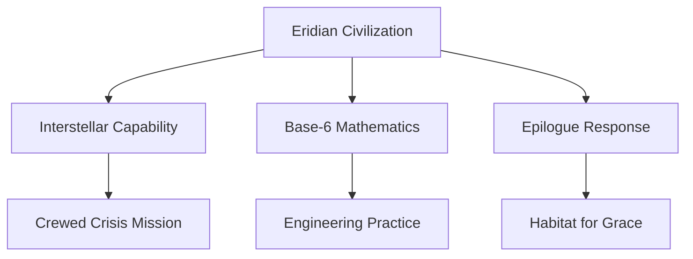

---
tags:
  - phm
  - xenobiology
  - eridians
  - civilization
up: "[[Project Hail Mary]]"
confidence: verified
tier-coverage: [intuition, core, deep-dive, practice]
---
# Eridian Civilization Profile

> **One-line summary** — This note maps what can be strongly inferred, cautiously inferred, and only speculated about Eridian civilization from Rocky, the mission, and the epilogue.

## 🎯 Intuition
**The Core Idea:** Eridian civilization is best understood through careful inference from observed technology, behavior, and crisis response rather than direct exposition.
**Why It Matters:** This page keeps the boundary between evidence and extrapolation visible, which is essential when citing civilization-level claims about a species the novel only shows indirectly. It also connects Rocky's individual actions to much larger civilizational capabilities and values.

## ⚙️ Core Mechanics
### Key Details

> [!info] Evidence Mode
> Novel claims about Eridian civilization are drawn from primary-mode chapter notes verified against [[Weir 2021 - Project Hail Mary Novel]]. This note is **inference-heavy**: Rocky's behavior and capabilities are the evidence base, not direct civilization-level exposition. The Inference Confidence Ladder below is the key navigational tool — check it before citing any claim. Chunk-backed real-science support lives in [[Xenonite - Eridian Structural Material]] (materials evidence) and [[Eridian Sensory Biology]] (sensory biology evidence); claims here are analysis built on top of those anchors.

This note synthesizes what can be cautiously inferred about Eridian civilization from Rocky's characterization, the novel's structure, and the epilogue. It deliberately avoids overconfident claims about government, population, or social structure where the evidence is absent.

### Technology Tier

**Strong inference**: Eridians are a spacefaring civilization capable of interstellar travel, independent Astrophage exploitation, and real-time communication across at least interplanetary distances. The engineering required to reach Tau Ceti from 40 Eridani (~16.5 ly) places them, at minimum, at a technological level comparable to humanity's projected near-future.

**Cautious inference**: Eridian technology follows a different developmental path from humanity's. Rocky is characterized as an *engineer*, not a theorist — suggesting Eridian culture may valorize practical application over basic science, or that Rocky's mission role is simply engineering rather than reflecting a cultural priority. The presence of xenonite as the go-to structural material implies materials science considerably more advanced than humanity's, possibly reflecting the engineering demands of surviving in an extreme-environment world.

**Speculative**: Eridian civilization almost certainly predates the Astrophage crisis by a very long time — enough to develop interstellar spaceflight from an industrial base. The specific duration is unknown.

### Base-6 Mathematics

Rocky uses a base-6 numbering system. This is one of the most directly observable civilization-level facts about Eridians:

- **Physical grounding**: Eridians have six primary manipulating appendages, making base-6 counting a natural anatomical product. On Earth, base-10 is standard because most humans have ten fingers; other counting systems (base-20 in some Mesoamerican cultures, base-12 in some ancient systems) reflect different counting practices.
- **Mathematical competence**: Rocky demonstrates fluency in the same mathematics as Grace — arithmetic, geometry, basic physics. The base is different; the structure is the same. This supports the novel's claim that mathematics is universal.
- **Engineering implications**: Base-6 is evenly divisible by 2, 3, and 6 — a slightly more fraction-friendly base than base-10, which is only evenly divisible by 2 and 5. For engineering calculations involving thirds or halves of quantities, base-6 is marginally more convenient. This is a minor practical advantage with no profound implication.

### Crisis Response and Mission Structure

Rocky's mission implies specific things about how Eridian civilization responds to existential threats:

- **They identified the Astrophage threat**: Either through equivalent astronomical observation (Petrova-line spectroscopy or equivalent), or through direct observation of stellar dimming in their own system.
- **They mounted a crewed interstellar response**: Rather than drones or probes, Eridians sent individuals to investigate the source system — a significant resource investment implying high urgency and confidence in their propulsion technology.
- **Rocky's crewmates died**: This mirrors the *Hail Mary* crew attrition. Whether Eridian society expected this outcome (suicide mission framing), prepared for it, or intended return is not clear from the text.
- **Rocky independently chose to return with Grace's solution**: The novel depicts Rocky making the decision to help implement Taumoeba on Erid rather than simply returning home. This implies individual agency in crisis decision-making — Eridian crew members are not mere instruments of a top-down directive.

### Epilogue Implications

The novel's epilogue describes a post-resolution state in which Grace is living on Erid years later in a purpose-built human habitat. Inferences from this:

- **Rapid civilizational response**: Eridians built a livable human habitat on their home world within a timeframe measured in years. This implies significant engineering capacity, motivation, and organizational ability.
- **Ongoing exchange**: The epilogue implies that Grace–Rocky contact evolved into civilizational contact — not just a diplomatic handshake but sustained scientific and cultural exchange.
- **Hospitality as value**: Building a habitat for one human is an enormous investment with no obvious material return. This is a choice, not a necessity, implying Eridian civilization places value on the relationship itself.
- **Rocky is the mechanism**: The entire civilizational relationship flows through Rocky's individual choice to save Grace rather than return directly. This makes the personal relationship the pivot of the macro-historical event.

### Key Facts

| Fact | Detail |
|---|---|
| Space capability | Eridians are clearly a spacefaring interstellar civilization |
| Number system | Rocky's civilization uses base-6 mathematics tied to anatomy |
| Crisis response | They mounted a crewed mission to investigate the Astrophage threat |
| Individual agency | Rocky's choices imply real discretion at the crew level |
| Epilogue evidence | Eridians later build Grace a human habitat on Erid |
| Main caution | Government, demographics, and social structure are not directly evidenced |

## 🔬 Deep Dive
### Scientific Accuracy

### Inference Confidence Ladder

| Claim | Category | Confidence |
|---|---|---|
| Spacefaring civilization, capable of interstellar travel | Direct statement | High |
| Independent Astrophage propulsion | Strong implication from convergence | High |
| Base-6 mathematics from six-limbed anatomy | Direct statement + clear reasoning | High |
| Rocky is an engineer, not a scientist | Direct statement | High |
| Individual crew agency (Rocky's choice) | Strong implication from narrative | High |
| Eridian civilization built Grace a habitat on Erid | Direct statement (epilogue) | High |
| Rocky's crewmates died en route | Direct statement | High |
| Materials science considerably more advanced than humanity's | Strong implication from xenonite | Medium |
| Eridian crisis response involves crewed missions | Strong implication | Medium |
| Eridians value the relationship for its own sake | Implication from habitat construction | Medium |
| Eridian engineering culture valorizes practical application | Speculative inference from Rocky's role | Low |
| Government structure, population size, social organization | No basis in available evidence | Do not claim |

### Narrative Analysis
The note works best when read as a disciplined exercise in inference instead of a lore dump. That framing preserves credibility while still showing how Rocky's mission, choices, and epilogue aftermath imply a civilization that is technically advanced, coordinated, and capable of genuine cross-species reciprocity.

### Connections

- Rocky's biology: [[Rocky and the Eridians]]
- Rocky as character: [[Rocky]]
- The structural material enabling coexistence: [[Xenonite - Eridian Structural Material]]
- The ship as engineering artifact: [[The Eridian Vessel]]
- Sensory biology underpinning Eridian cognition: [[Eridian Sensory Biology]]
- Language as civilization output: [[Xenolinguistics and First Contact]]
- The narrative arc: [[Arc - Grace and Rocky]]
- Resolution and aftermath: [[Resolution and Aftermath]]
- Accuracy overview: [[Science Accuracy Scorecard]]

## 🏋️ Practice
### Discussion Questions
1. Which claims about Eridian civilization are direct, and which are only inferential?
2. Why is Rocky's base-6 mathematics such a strong civilization-level data point?
3. What does the epilogue most strongly imply about Eridian capability and values?

### Analysis
- Identify the strongest high-confidence claim and the weakest low-confidence claim on the ladder.
- Explain how Rocky's individual choices support broader civilizational conclusions without fully proving them.

### Creative Challenge
- **What if...** the novel had included one direct scene on Erid—what major uncertainty on this page would shrink the most?

## References

- [[Sources Index#Weir 2021 Novel]] — primary novel source
- [[Sources Index#PHM Secondary Chapter Summaries Registry]] — original secondary-mode synthesis basis (now superseded by primary chapter layer)
- [[Sources Index#Linguistic Discovery Eridian]] — Eridian language design analysis

## Supporting Chunks

- [[Eridian - Left-handed threading marks a distinct Eridian engineering convention]] — Ch07: chirality as fingerprint of independent technological development
- [[Xenolinguistics - Clock synchronisation establishes the first shared scientific unit of time]] — Ch09: base-6 clock exchange; first quantitative inter-species calibration
- [[Eridian - Rocky's perfect recall contrasts with Grace's laptop dependence as a cognitive-architecture difference]] — Ch11: Eridian memory capacity vs human external-tool dependence
- [[Eridian - Eridian radiation blindness is a species-specific knowledge gap from extreme planetary shielding]] — Ch12: how environment shapes the limits of a civilisation's science
- [[Eridian - Goldilocks civilisation argument explains why technologically capable species meet at Tau Ceti]]
- [[Eridian - Relativistic time-dilation blindspot gives Rocky an accidental fuel surplus]]
- [[Eridian - The thrum is a distributed collective-cognition process mobilised planet-wide for Grace's survival]]
- [[Eridian - Rocky discloses forty-six years of solitary vigil at Tau Ceti]] — Ch14: forty-six years of accumulated knowledge
- [[Eridian - Oceanic Astrophage farming at 200C contrasts with Earth s Sahara blackpanel approach]] — Ch17: civilisational technology contrast
- [[Xenobiology - Gravity-baseline theory proposes similar surface gravity produces convergent intelligence]] — Ch20: convergent intelligence
