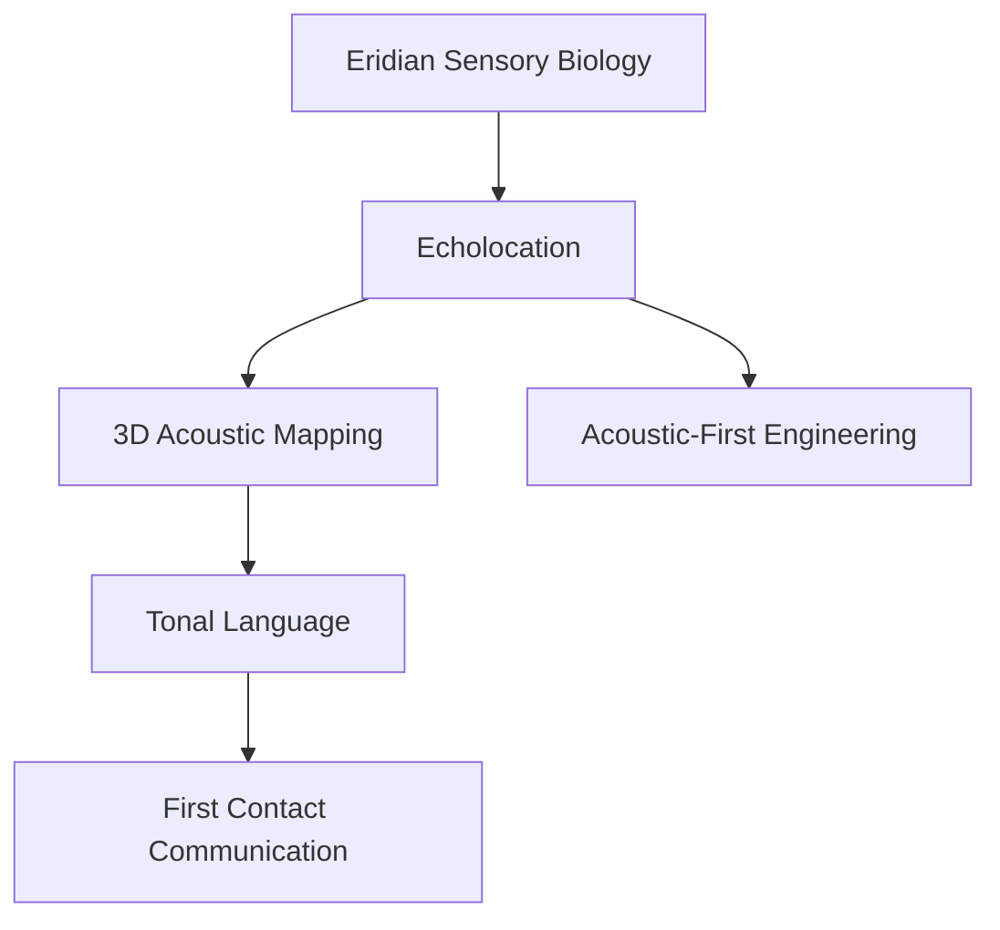

---
tags:
  - phm
  - xenobiology
  - eridians
  - sensory-biology
  - echolocation
  - biosonar
up: "[[Project Hail Mary]]"
confidence: verified
tier-coverage: [intuition, core, deep-dive, practice]
---
# Eridian Sensory Biology

> **One-line summary** — Eridian perception is built around echolocation, making sound their primary channel for sensing, thinking, and eventually communicating.

## 🎯 Intuition
**The Core Idea:** Rocky's species is designed as an acoustic-primary intelligence whose world model comes from active biosonar rather than vision.
**Why It Matters:** This single biological fact explains a huge amount about Eridian language, engineering, and first-contact difficulty. It also gives the alien design a strong real-science anchor because Earth already provides high-performance biosonar analogs.

## ⚙️ Core Mechanics
### Key Details

> [!info] Evidence Mode
> Sections on real biosonar are **grounded in scientific sources** (see Supporting Chunks). Sections on Rocky's specific behaviors and Eridian cognitive architecture synthesize primary-mode chapter notes verified against [[Weir 2021 - Project Hail Mary Novel]].

Rocky and the Eridians perceive the world primarily through **echolocation** — not vision. This is among the most consequential facts about Eridian biology: it shapes their language, their engineering, and the specific challenges of first contact with Grace. This note examines the real science of acoustic-primary perception and what it implies for an intelligent species.

### The Real Physics of Biosonar

Real-world echolocation is best understood in **odontocetes** (toothed whales and dolphins) — the most capable biosonar system in the animal kingdom. Key parameters:

- **Frequency**: Bottlenose dolphins produce clicks across 10–150 kHz, focused into a directional forward beam by the melon (a fatty acoustic lens in the forehead). Higher frequencies give better resolution but shorter range.
- **Information per click**: A single echo encodes target **range** (delay), **bearing** (beam directionality), **size** (echo amplitude), **shape** (echo waveform), and **material properties** (echo spectrum — hard vs. soft, dense vs. porous). This is genuinely multi-dimensional spatial sensing in a single pulse.
- **Spatial resolution**: Bottlenose dolphins can discriminate cylindrical targets differing by less than 0.5 mm in wall thickness at several meters' range.
- **Update rate**: During prey tracking at close range, click rates exceed 500 Hz — a spatial model refresh rate comparable to vertebrate vision in equivalent tasks.
- **Neural substrate**: The odontocete auditory brainstem shows hypertrophied nuclei dedicated to submillisecond timing discrimination. The brain allocates substantial processing real estate to acoustic spatial modeling.

This is not "hearing" in the passive sense — it is **active, directed, high-bandwidth spatial scanning**. See [[Biosonar - Cetacean echolocation builds fine-grained 3D spatial maps from pulse echoes]] and [[Biosonar - Acoustic sensing provides high-bandwidth environmental perception in dark or turbid environments]].

### Why Echolocation Is the Right Sense for Rocky's World

Rocky's home planet (orbiting 40 Eridani A, as the novel establishes) has:
- **High-pressure, opaque atmosphere**: Dense atmosphere scatters and absorbs light at wavelengths useful for vision. An optically opaque atmosphere makes eyes nearly useless.
- **High-pressure acoustic propagation**: Dense, high-pressure media propagate sound extremely well — faster speed, better impedance matching, longer range. A high-pressure atmosphere is acoustically *excellent*.
- **Complex physical environment**: Dense-atmosphere worlds can have rich acoustic textures: ground reflection, atmospheric layering, surface echoes. A species evolving in this environment would be under strong selection pressure for precise acoustic spatial perception.

Echolocation is not a fallback sense — in Rocky's implied environment, it would be the *dominant* sense for a well-adapted species.

### Acoustic-First Cognition: What It Might Enable

An intelligence that builds its world model through pulse-echo sequences rather than visual frames would differ from human cognition in ways that matter for engineering and communication:

**Potential advantages of acoustic-primary perception:**
- Inherent range measurement (sound delay is direct distance, unlike visual depth requiring stereo inference)
- Material property sensing (echo spectrum distinguishes material classes — relevant for an engineer)
- Perception through walls and containers in high-pressure media (acoustic transmission in dense media is better than in air)
- No dependence on ambient illumination — completely active, self-directed sensing

**Cognitive architecture differences:**
- Spatial representation likely range-centric rather than image-plane-centric
- Time is intrinsic to spatial encoding (range = delay), linking spatial perception directly to temporal processing
- "Looking at something" requires emitting a click and attending to the echo — perception is inherently active rather than passive
- Object recognition may proceed through echo signature matching rather than visual edge detection

**Engineering implications** (speculative inference):
- Eridian manufacturing quality control might rely heavily on acoustic inspection (real humans use ultrasound for this too)
- Eridian design aesthetics would reflect acoustic saliency rather than visual — surfaces designed for echo clarity rather than appearance
- Communication technology would be audio-first; no analog to visual writing unless encoded acoustically (tonal notation)

### Rocky's Behaviors Through This Lens

Chapter notes show Rocky:
- Communicates via tonal "chords" — simultaneous multi-frequency acoustic utterances that encode meaning in pitch combinations and intervals. This is exactly what an acoustic-first intelligence would evolve: a high-bandwidth acoustic channel that leverages the same multi-frequency processing used for spatial sensing.
- Can perceive the *Hail Mary*'s structure and Grace's position through echolocation alone — treating the ship as an acoustic environment.
- Has no comprehension of visual displays or light-based communication — not because of intelligence limitations, but because vision is genuinely outside the Eridian perceptual system.

These behaviors are **internally consistent** with real biosonar biology and with what acoustic-primary cognition would look like.

### Language as an Acoustic Engineering Product

The connection to [[Xenolinguistics and First Contact]] is direct: Eridian tonal language is not a coincidence. It is the output of acoustic-primary cognition applied to communication. The chord-based, simultaneous-channel structure of Eridian speech exploits the same multi-frequency processing that the Eridian auditory system uses for spatial mapping. From an evolutionary perspective, the communication system and the sensing system share a neural substrate — tonal language *is* acoustic perception directed at another individual.

This grounds one of the novel's most elegant design choices: Eridian language is not just acoustically delivered, it is acoustically *structured* in the same way the sensory world is processed.

### Key Facts

| Fact | Detail |
|---|---|
| Primary sense | Eridians perceive mainly through echolocation rather than vision |
| Real analog | Dolphin and other odontocete biosonar grounds the concept |
| Environmental fit | Dense, opaque high-pressure atmospheres strongly favor acoustic sensing |
| Cognitive implication | Spatial perception is likely range- and timing-centric |
| Language link | Chord-based Eridian speech fits an acoustic-primary intelligence |
| Story effect | Sensory mismatch makes first contact harder but more convincing |

## 🔬 Deep Dive
### Scientific Accuracy

### What's Grounded vs. Extrapolated vs. Fictional

| Claim | Status |
|---|---|
| Acoustic sensing fully capable as primary sense | ✅ Grounded (cetacean biosonar) |
| High-pressure environments favor acoustic over visual | ✅ Grounded (acoustic propagation physics) |
| Echolocation supports 3D spatial modeling with mm-resolution | ✅ Grounded (dolphin biosonar studies) |
| Acoustic-primary cognition possible in intelligent species | 🔶 Extrapolated (no non-human intelligent echolocators known) |
| Tonal chord language as acoustic-cognition output | 🔶 Extrapolated (plausible; no direct analog exists) |
| Rocky's specific in-story behaviors | Chapter-note synthesis, internally consistent | 🔶 |

### Narrative Analysis
This page shows why Rocky feels genuinely alien without feeling arbitrary: the sensory system drives downstream differences in cognition, language, and technology. By rooting that chain in real biosonar, the novel earns a lot of speculative freedom elsewhere.

### Connections

- Rocky's full biology profile: [[Rocky and the Eridians]]
- Language design grounded in this sensory system: [[Xenolinguistics and First Contact]]
- Engineering context: [[Eridian Civilization Profile]] and [[The Eridian Vessel]]
- Accuracy overview: [[Science Accuracy Scorecard]]

## 🏋️ Practice
### Discussion Questions
1. Why is echolocation more plausible than vision for Rocky's environment?
2. How does acoustic-primary sensing change the likely shape of Eridian cognition?
3. Why does the page connect sensory biology so directly to language?

### Analysis
- Trace the chain from atmospheric conditions to language structure.
- Identify which claim on the accuracy table is strongest and which remains most speculative.

### Creative Challenge
- **What if...** humans had to design a classroom entirely for an echolocating species—what would change first?

## References

- [[Sources Index#Cetacean Biosonar 2024]] — cetacean biosonar neural processing and information bandwidth
- [[Sources Index#Northeastern Accuracy Discussion]] — Eridian sensory design plausibility assessment

## Supporting Chunks

- [[Biosonar - Cetacean echolocation builds fine-grained 3D spatial maps from pulse echoes]] — real biosonar spatial resolution and information content
- [[Biosonar - Acoustic sensing provides high-bandwidth environmental perception in dark or turbid environments]] — real biosonar performance in vision-poor environments
- [[Xenolinguistics - Vibration language discovery is the pivotal first-contact communication breakthrough]] — Ch09: Rocky's wall-vibration language as acoustic-primary cognition in action
- [[Eridian - Rocky's perfect recall contrasts with Grace's laptop dependence as a cognitive-architecture difference]] — Ch11: possible link between acoustic-primary neural substrate and exceptional memory capacity
- [[Eridian - Eridian radiation blindness is a species-specific knowledge gap from extreme planetary shielding]] — Ch12: another consequence of Erid's sensory environment shaping knowledge limits
- [[Eridian - The thrum is a distributed collective-cognition process mobilised planet-wide for Grace's survival]]
- [[Eridian - Grace deduces Rocky s blindness to visible light through systematic object-exchange experiments]] — Ch10: blindness deduction