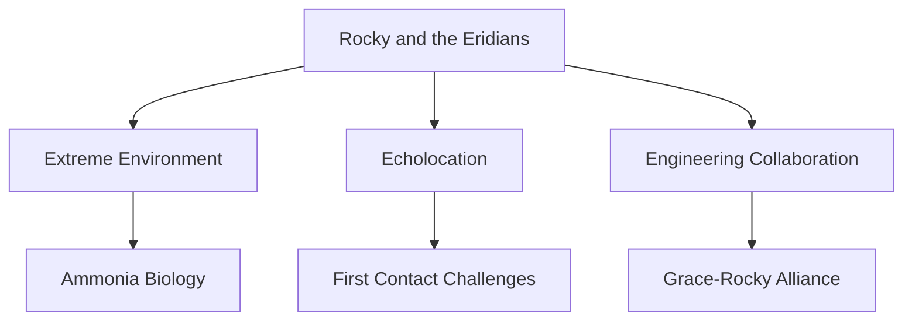

---
tags:
  - phm
  - xenobiology
  - rocky
  - eridians
  - first-contact
up: "[[Project Hail Mary]]"
confidence: verified
freshness: stable
tier-coverage: [intuition, core, deep-dive, practice]
---
# Rocky and the Eridians

> **One-line summary** — Rocky is a scientifically grounded alien design whose biology, environment, and friendship with Grace drive the novel's strongest first-contact material.

## 🎯 Intuition
**The Core Idea:** Rocky works because his species design links environment, body plan, senses, materials, and story role into one coherent system.
**Why It Matters:** This page is the hub for understanding Eridian biology at a species level while still connecting that biology to the novel's emotional arc. It also distinguishes what is scientifically grounded, what is a stretch, and why the design still succeeds.

## ⚙️ Core Mechanics
### Key Details

> [!info] Evidence Mode
> Biology and plausibility sections below are **grounded in real science**. The Narrative Arc section synthesizes primary-mode chapter notes verified against [[Weir 2021 - Project Hail Mary Novel]].

> [!tip] Character vs. Science
> This note covers Rocky's **biology, species design, and scientific plausibility**. For Rocky as a *character* — personality, friendship, engineering mindset, and the final-choice weight — see [[Rocky]].

Rocky is the Eridian engineer who becomes Ryland Grace's collaborator and friend in [[Project Hail Mary]]. This note covers what we know about Eridian biology, how it compares to real science, and why Rocky is one of science fiction's more thoughtfully designed aliens.

### Eridian Biology

Rocky's species evolved on a planet orbiting 40 Eridani A (see [[Tau Ceti and 40 Eridani]]). Key traits:

- **Environment**: High-pressure, high-temperature atmosphere (likely hundreds of atmospheres, hundreds of degrees).
- **Solvent**: Ammonia-based, not water-based. See [[Alternative Biochemistry]] for the chemistry.
- **Sensory system**: No vision (their world has an opaque atmosphere). Primary sense is **echolocation** — they perceive the world through sound.
- **Body plan**: Roughly spider-like with manipulating appendages. Exoskeletal rather than endoskeletal.
- **Material technology**: Eridians work with materials suited to their environment — metals and ceramics that would be impractical at Earth temperatures.

### What's Plausible

- **Echolocation as primary sense**: Multiple Earth species (bats, dolphins, some shrews) use echolocation as a primary navigation and hunting sense. Evolving this as a *dominant* sense in a vision-poor environment is entirely reasonable.
- **High-pressure tolerance**: Piezophilic organisms exist in Earth's deep ocean. The principle scales, even if the specific Eridian conditions are extreme.
- **Independent technological civilization**: If intelligence can arise on Earth, there's no physics-based reason it couldn't arise elsewhere under different conditions. The specifics are speculative but not absurd.

### What's a Stretch

- **Multicellular ammonia life**: As discussed in [[Alternative Biochemistry]], no ammonia-based organisms are known. Multicellular complexity in a non-water solvent is a major unsupported assumption.
- **Human-comparable intelligence**: Intelligence appears to be a rare evolutionary outcome even on Earth. Assuming it arises readily under alien conditions is optimistic.
- **Convergent engineering**: Rocky independently developed spaceflight, which implies a long chain of technological prerequisites. The novel hand-waves the history but keeps the engineering interactions internally consistent.

### Rocky as Alien Design

Rocky stands out in SF for several reasons:
1. **Sensory gap**: No shared visual channel forces creative communication (see [[Xenolinguistics and First Contact]]).
2. **Environmental incompatibility**: Grace and Rocky cannot share atmosphere — their environments are mutually lethal. This creates genuine engineering challenges, not just cultural ones.
3. **Complementary expertise**: Rocky is an engineer, not a scientist. The knowledge asymmetry drives collaboration rather than redundancy.

### Narrative Arc

Rocky's role in the novel unfolds in five stages. This profile note covers biology and character design; see [[Arc - Grace and Rocky]] for the full relational trajectory and [[Rocky]] for the dedicated character profile.

- **Initial detection / first contact** ([[PHM Novel - Chapter 06]] – [[PHM Novel - Chapter 09]]): Rocky's ship is detected at Tau Ceti. Signal exchange and physical model exchange establish that the two crews are responding to the same crisis. The docking tunnel brings them into proximity before any words have been exchanged.
- **Trust and language-building** ([[PHM Novel - Chapter 10]] – [[PHM Novel - Chapter 12]]): Face-to-face contact begins systematic vocabulary construction. Rocky's base-six mathematics, echolocative navigation, and ammonia biology become directly observable. A working shared language is achieved.
- **Collaboration and co-research** ([[PHM Novel - Chapter 13]] – [[PHM Novel - Chapter 22]]): The two scientists pursue the Taumoeba investigation together. Rocky's engineering capabilities and Grace's biological expertise are genuinely complementary. Rocky rescues Grace from the fuel-breach crisis; Grace treats Rocky's oxygen burns. The relationship becomes one of mutual dependence.
- **Separation and rescue** ([[PHM Novel - Chapter 27]] – [[PHM Novel - Chapter 30]]): Taumoeba-82.5's xenonite permeability threatens Eridian civilization (Ch 27). Rocky departs. Grace turns back (Ch 28). The reunion with Rocky (Ch 29) is Grace's final choice.
- **Erid / epilogue aftermath** ([[PHM Novel - Epilogue]]): Grace is living on Erid years later, physically changed, in a purpose-built habitat. The communication and collaboration that began in a docking tunnel has grown into civilizational exchange.

### Key Facts

| Fact | Detail |
|---|---|
| Habitat | Eridians evolved in a hot, high-pressure environment around 40 Eridani A |
| Solvent system | Their biology is ammonia-based rather than water-based |
| Main sense | They rely on echolocation instead of vision |
| Engineering fit | Their materials and tools suit extreme temperatures and pressures |
| Story function | Rocky's species design creates real first-contact and survival challenges |
| Biggest leap | Intelligent multicellular ammonia life remains speculative |

## 🔬 Deep Dive
### Scientific Accuracy

### What's Plausible

- **Echolocation as primary sense**: Multiple Earth species (bats, dolphins, some shrews) use echolocation as a primary navigation and hunting sense. Evolving this as a *dominant* sense in a vision-poor environment is entirely reasonable.
- **High-pressure tolerance**: Piezophilic organisms exist in Earth's deep ocean. The principle scales, even if the specific Eridian conditions are extreme.
- **Independent technological civilization**: If intelligence can arise on Earth, there's no physics-based reason it couldn't arise elsewhere under different conditions. The specifics are speculative but not absurd.

### What's a Stretch

- **Multicellular ammonia life**: As discussed in [[Alternative Biochemistry]], no ammonia-based organisms are known. Multicellular complexity in a non-water solvent is a major unsupported assumption.
- **Human-comparable intelligence**: Intelligence appears to be a rare evolutionary outcome even on Earth. Assuming it arises readily under alien conditions is optimistic.
- **Convergent engineering**: Rocky independently developed spaceflight, which implies a long chain of technological prerequisites. The novel hand-waves the history but keeps the engineering interactions internally consistent.

### Narrative Analysis
This page succeeds because Rocky is both a species concept and a relationship catalyst. The biology is strange enough to feel non-human, but it always cashes out into concrete problems—atmosphere, language, tools, rescue—which makes the friendship arc stronger rather than softer.

### Connections

- Rocky as character: [[Rocky]]
- Biochemistry details: [[Alternative Biochemistry]]
- Communication method: [[Xenolinguistics and First Contact]]
- Sensory biology depth: [[Eridian Sensory Biology]]
- Civilization-level synthesis: [[Eridian Civilization Profile]]
- Xenonite — the structural material making coexistence possible: [[Xenonite - Eridian Structural Material]]
- Rocky's ship as counterpart to the Hail Mary: [[The Eridian Vessel]]
- Home star system: [[Tau Ceti and 40 Eridani]]
- Shared crisis: [[Astrophage Biology]] threatens both species
- The biological solution: [[Taumoeba and the Biological Solution]]
- The Adrian ecology: [[The Adrian Ecology]]
- The Taumoeba discovery arc and its cost to Erid: [[Arc - Taumoeba Discovery]]
- Resolution and aftermath: [[Resolution and Aftermath]]
- Narrative arc: [[Arc - Grace and Rocky]]
- Film portrayal: [[Rocky on Screen]]
- Accuracy overview: [[Science Accuracy Scorecard]]

## 🏋️ Practice
### Discussion Questions
1. Which Eridian trait most strongly shapes the first-contact process with Grace?
2. What makes Rocky feel scientifically grounded even when parts of his biology are speculative?
3. Why does environmental incompatibility matter so much to the story?

### Analysis
- Separate the page's biological claims into grounded, stretched, and purely narrative functions.
- Explain why Rocky's being an engineer matters as much as his being alien.

### Creative Challenge
- **What if...** Rocky had been visually oriented instead of echolocating—how would that change the friendship and first-contact arc?

## References

- [[Project Hail Mary/Sources/Sources Index#Frontiers Extremophiles 2019|Frontiers Extremophiles 2019]] — extremophile diversity
- [[Project Hail Mary/Sources/Sources Index#CUNY Alternative Biochemistry|CUNY Alternative Biochemistry]] — alternative solvent systems
- [[Project Hail Mary/Sources/Sources Index#Northeastern Accuracy Discussion|Northeastern Accuracy Discussion]] — plausibility assessment
- [[Project Hail Mary/Sources/Sources Index#Linguistic Discovery Eridian|Linguistic Discovery Eridian]] — language design analysis

## Supporting Chunks

- [[Eridian - Left-handed threading marks a distinct Eridian engineering convention]] — Ch07: independent engineering path evidenced by opposite chirality
- [[Eridian - Tape-measure melt is the first direct evidence of Rocky's extreme-temperature environment]] — Ch10: first physical proof of environmental temperature
- [[Eridian - Rocky's perfect recall contrasts with Grace's laptop dependence as a cognitive-architecture difference]] — Ch11: Eridian cognitive architecture contrast
- [[Novel - Rocky's crew-loss disclosure converts first contact into shared grief]] — Ch11: tonal grief marker; crew-loss as emotional pivot
- [[Eridian - Eridian radiation blindness is a species-specific knowledge gap from extreme planetary shielding]] — Ch12: Erid's shielding environment and resulting knowledge gap
- [[Xenolinguistics - Orrery-model exchange communicates stellar origin without shared language]] — Ch07: orrery exchange is the first cross-species information channel Rocky participates in
- [[Xenolinguistics - Vibration language discovery is the pivotal first-contact communication breakthrough]] — Ch09: Rocky's wall-vibration method is the breakthrough that makes all subsequent communication possible
- [[Biosonar - Acoustic sensing provides high-bandwidth environmental perception in dark or turbid environments]] — Real cetacean biosonar confirms acoustic sensing supports high-bandwidth spatial perception, grounding Rocky's vision-poor sensory biology
- [[Eridian - Rocky's physiology includes ATP sacs, biological smelter, and carapace radiator vents]]
- [[Eridian - Goldilocks civilisation argument explains why technologically capable species meet at Tau Ceti]]
- [[Eridian - Xenonite pressure sphere is a transit vehicle across incompatible atmospheres]]
- [[Eridian - Relativistic time-dilation blindspot gives Rocky an accidental fuel surplus]]
- [[Novel - Rocky enters Grace's oxygen atmosphere to save him accepting lethal exposure]]
- [[Eridian - Carapace radiator vents are a critical organ whose oxide coating is the lethal mechanism of oxygen exposure]]
- [[Eridian - The thrum is a distributed collective-cognition process mobilised planet-wide for Grace's survival]] — Epilogue: planet-wide thrum for Grace's nutritional survival
- [[Eridian - Grace deduces Rocky s blindness to visible light through systematic object-exchange experiments]] — Ch10: sensory characterisation
- [[Eridian - Rocky learns his crewmates died of radiation sickness completing the workshop-shielding mystery]] — Ch13: crew-death resolution
- [[Eridian - Rocky discloses forty-six years of solitary vigil at Tau Ceti]] — Ch14: isolation context
- [[Eridian - Oceanic Astrophage farming at 200C contrasts with Earth s Sahara blackpanel approach]] — Ch17: civilisational contrast
- [[Novel - Rocky s surplus Astrophage offer transforms the one-way sacrifice into a survivable mission]] — Ch15: fuel offer
- [[Xenobiology - Gravity-baseline theory proposes similar surface gravity produces convergent intelligence]] — Ch20: intelligence convergence
- [[Novel - You save me and you save Erid is the emotional payoff of Grace turning back for Rocky]] — Ch29: reunion
- [[Engineering - Improvised Petrovascope search repurposes attitude thrusters as rotating Petrova-band illumination]] — Ch28: rescue technique
- [[Novel - Xenonite-threat briefing transmits the permeability warning that enables Erid s response]] — Ch30: information handoff that enables Erid's response
- [[Eridian - Eridian heavy-metal ecology makes native food directly toxic to humans forcing dependence on Taumoeba]] — Ch30: heavy-metal ecology explains why Grace cannot eat native Eridian food
