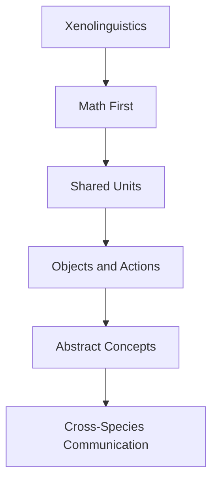

---
tags:
  - phm
  - xenobiology
  - linguistics
  - communication
  - seti
up: "[[Project Hail Mary]]"
confidence: verified
tier-coverage: [intuition, core, deep-dive, practice]
---
# Xenolinguistics and First Contact

> **One-line summary** — Grace and Rocky's language-building succeeds because the novel starts with math, physical referents, and tonal perception instead of magical instant translation.

## 🎯 Intuition
**The Core Idea:** First contact works here because communication is built gradually from shared structure rather than assumed shared culture.
**Why It Matters:** This page captures one of the novel's smartest sequences: two beings with radically different bodies and senses still manage to bootstrap meaning. It also shows why the process feels more rigorous and satisfying than most science-fiction first-contact shortcuts.

## ⚙️ Core Mechanics
### Key Details

One of [[Project Hail Mary]]'s strongest sequences is the painstaking process by which Ryland Grace and [[Rocky and the Eridians|Rocky]] learn to communicate. This note evaluates the realism and cleverness of that process.

### The Communication Challenge

Grace and Rocky share no biology, no sensory overlap (Rocky has no vision; Grace has no echolocation), and no cultural context. They must build a shared language from scratch. This is a genuine first-contact problem, and the novel treats it with more rigor than most SF.

### Math as Universal Language

Grace begins with mathematics: tapping prime numbers, demonstrating arithmetic, establishing a shared numerical system. This mirrors real **SETI/METI thinking**:

- **Lincos** (Hans Freudenthal, 1960): A constructed language designed for cosmic communication, starting with natural numbers and logical operators.
- **Pioneer/Voyager plaques**: Used mathematical and physical constants as common reference points.
- The assumption is that any technological civilization must understand basic mathematics, making it the lowest-common-denominator starting point.

This approach is **well-grounded** in real communication theory.

### Rocky's Tonal Language

Eridian is a **chord-based tonal language**: Rocky produces simultaneous tones, and meaning is encoded in pitch combinations, intervals, and rhythmic patterns. Key design features:

- **Simultaneous channels**: Unlike human speech (largely sequential phonemes), Eridian can encode multiple dimensions of meaning in a single utterance.
- **Musical structure**: The language has more in common with musical chords than with human phonology.
- **No visual component**: No writing, no gesture—purely acoustic.

This is among the novel's **most plausible** alien features. A species that perceives the world through sound would naturally evolve sound-based communication with higher bandwidth than sequential speech. Real-world parallels include tonal languages (Mandarin, Yoruba), whale song, and bird dialects—all demonstrating that acoustic complexity can encode rich meaning.

### The Language-Building Process

The novel depicts a gradual process:

1. **Numbers and math** — establishing shared logic
2. **Physical referents** — pointing to objects, establishing nouns
3. **Actions and verbs** — demonstrating cause and effect
4. **Abstract concepts** — building up from concrete to abstract

This sequence is consistent with how real linguists approach undocumented languages (monolingual fieldwork methods) and with how SETI researchers have theorized first-contact communication would proceed.

> [!tip] Standout Detail
> Grace eventually learns to "hear" Eridian emotional states through tonal quality—an elegant parallel to how humans read prosody and tone of voice for emotional content.

### What's Simplified

- **Speed**: Real language acquisition from zero shared context would likely take much longer than depicted.
- **Complexity ceiling**: The novel has Grace and Rocky discussing sophisticated engineering concepts within weeks/months. Real cross-linguistic bootstrapping for technical vocabulary is extremely slow.
- **Ambiguity**: Natural languages are rife with ambiguity; Eridian seems remarkably unambiguous, which is convenient but unrealistic.

### Key Facts

| Fact | Detail |
|---|---|
| Starting point | Grace begins with mathematics as the first shared bridge |
| Language type | Eridian is chord-based, tonal, and acoustic-only |
| Build order | Communication progresses from numbers to objects to actions to abstraction |
| Strong realism point | The process resembles SETI logic and monolingual fieldwork |
| Main simplification | Technical fluency arrives faster than it likely would in reality |
| Emotional payoff | Shared language becomes the basis for trust and friendship |

## 🔬 Deep Dive
### Scientific Accuracy

### Math as Universal Language

Grace begins with mathematics: tapping prime numbers, demonstrating arithmetic, establishing a shared numerical system. This mirrors real **SETI/METI thinking**:

- **Lincos** (Hans Freudenthal, 1960): A constructed language designed for cosmic communication, starting with natural numbers and logical operators.
- **Pioneer/Voyager plaques**: Used mathematical and physical constants as common reference points.
- The assumption is that any technological civilization must understand basic mathematics, making it the lowest-common-denominator starting point.

This approach is **well-grounded** in real communication theory.

### Rocky's Tonal Language

Eridian is a **chord-based tonal language**: Rocky produces simultaneous tones, and meaning is encoded in pitch combinations, intervals, and rhythmic patterns. Key design features:

- **Simultaneous channels**: Unlike human speech (largely sequential phonemes), Eridian can encode multiple dimensions of meaning in a single utterance.
- **Musical structure**: The language has more in common with musical chords than with human phonology.
- **No visual component**: No writing, no gesture—purely acoustic.

This is among the novel's **most plausible** alien features. A species that perceives the world through sound would naturally evolve sound-based communication with higher bandwidth than sequential speech. Real-world parallels include tonal languages (Mandarin, Yoruba), whale song, and bird dialects—all demonstrating that acoustic complexity can encode rich meaning.

### The Language-Building Process

The novel depicts a gradual process:

1. **Numbers and math** — establishing shared logic
2. **Physical referents** — pointing to objects, establishing nouns
3. **Actions and verbs** — demonstrating cause and effect
4. **Abstract concepts** — building up from concrete to abstract

This sequence is consistent with how real linguists approach undocumented languages (monolingual fieldwork methods) and with how SETI researchers have theorized first-contact communication would proceed.

### What's Simplified

- **Speed**: Real language acquisition from zero shared context would likely take much longer than depicted.
- **Complexity ceiling**: The novel has Grace and Rocky discussing sophisticated engineering concepts within weeks/months. Real cross-linguistic bootstrapping for technical vocabulary is extremely slow.
- **Ambiguity**: Natural languages are rife with ambiguity; Eridian seems remarkably unambiguous, which is convenient but unrealistic.

### Narrative Analysis
The sequence is compelling because each breakthrough feels earned: signal, number, object, concept, trust. The language plot is not just technically interesting; it is the mechanism by which the novel turns radical difference into cooperation.

### Connections

- Rocky's biology and sensory system: [[Rocky and the Eridians]]
- Rocky's character profile: [[Rocky]]
- Sensory biology grounding this language: [[Eridian Sensory Biology]]
- The underlying biochemistry: [[Alternative Biochemistry]]
- How the film handles this process: [[Novel vs Film Adaptation]]
- Rocky on screen (related challenge): [[Rocky on Screen]]
- Accuracy overview: [[Science Accuracy Scorecard]]

## 🏋️ Practice
### Discussion Questions
1. Why is mathematics the safest starting point for first contact?
2. What makes Eridian tonal language feel more plausible than a generic alien language?
3. Which part of the depicted language-learning process is most simplified?

### Analysis
- Compare the novel's language-building sequence to real monolingual fieldwork logic.
- Explain how sensory mismatch shapes both the challenge and the solution.

### Creative Challenge
- **What if...** Grace and Rocky had shared visual perception but not mathematics—would communication become easier or harder?

## References

- [[Sources Index#Linguistic Discovery Eridian]] — academic analysis of Eridian language design
- [[Sources Index#Northeastern Accuracy Discussion]] — communication plausibility

## Supporting Chunks

- [[Xenolinguistics - Alien signals can be treated as cryptanalysis problems]] — NSA framework for decoding unknown signals
- [[Xenolinguistics - Mathematics is the safest first bridge in alien communication]] — Why math-first bootstrapping is the consensus approach
- [[Xenolinguistics - Orrery-model exchange communicates stellar origin without shared language]] — Ch07: physical-reality exchange before any shared language
- [[Xenolinguistics - Vibration language discovery is the pivotal first-contact communication breakthrough]] — Ch09: Rocky speaks through the wall; the language breakthrough
- [[Xenolinguistics - Clock synchronisation establishes the first shared scientific unit of time]] — Ch09: first inter-species quantitative calibration
- [[Xenolinguistics - Jazz-hands and balled fist are minimal cross-species yes-no primitives]] — Ch11: error-correction foundation for vocabulary construction
- [[Eridian - Xenonite docking tunnel is an engineered neutral zone between incompatible atmospheres]] — Ch08: the tunnel provides the physical structure that makes first contact possible
- [[Eridian - Tape-measure melt is the first direct evidence of Rocky's extreme-temperature environment]] — Ch10: first physical evidence exchange through the mini-airlock
- [[Biosonar - Cetacean echolocation builds fine-grained 3D spatial maps from pulse echoes]] — Real echolocation science grounding the acoustic-primary sensory system that underlies Rocky's language design
- [[Novel - Grace teaching Eridian children transforms first contact into shared education as the end state]]
- [[Xenolinguistics - Mirrored Petrova-signal exchange applies mathematical universality as first-contact basis]] — Ch06: first communication
- [[Xenolinguistics - Astrophage on me star confirms both crews share the same existential mission]] — Ch11: shared-mission confirmation
- [[Xenolinguistics - Organ-keyboard teaching scene marks xenolinguistics maturing to classroom instruction]] — Epilogue: mature language system
