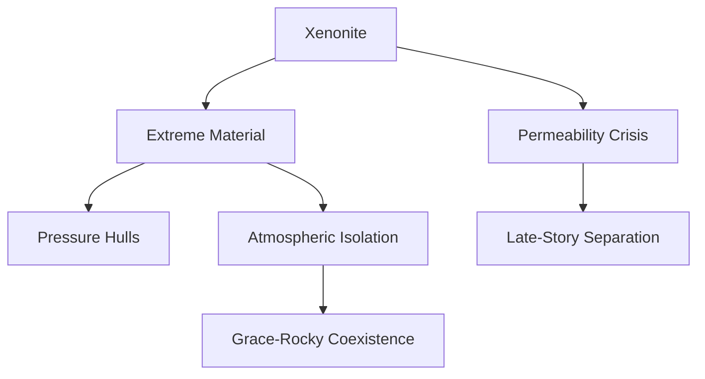

---
tags:
  - phm
  - xenobiology
  - materials
  - eridians
  - xenonite
up: "[[Project Hail Mary]]"
confidence: verified
tier-coverage: [intuition, core, deep-dive, practice]
---
# Xenonite — Eridian Structural Material

> **One-line summary** — Xenonite is the extreme-environment structural material that makes Grace–Rocky coexistence possible and later becomes the source of the novel's late-stage crisis.

## 🎯 Intuition
**The Core Idea:** Xenonite functions as the bridge material between incompatible worlds: heat-resistant, pressure-resistant, and crucial for atmospheric separation.
**Why It Matters:** This page explains both the engineering role xenonite plays in the story and the real-materials analogs that make it feel plausible. It also shows why the Taumoeba permeability problem matters narratively, not just technically.

## ⚙️ Core Mechanics
### Key Details

> [!info] Evidence Mode
> Novel-specific claims about xenonite's properties and behavior are drawn from primary-mode chapter notes verified against [[Weir 2021 - Project Hail Mary Novel]]. See [[Novel Ingestion Guide]] for source-mode policy. Real-science sections (UHTC analogs) are grounded in the sources linked below. Novel-derived claims are explicitly hedged throughout.

Xenonite is the structural material used by Eridians throughout *Project Hail Mary*. It is referenced across multiple notes in this KB (see [[Rocky and the Eridians]], [[Hail Mary Ship Design and Systems]], [[Arc - Taumoeba Discovery]]) without a dedicated home. This note provides that anchor.

### What the Novel Depicts

Chapter notes indicate xenonite serves several structural roles in the story:

- **Rocky's vessel hull**: The Eridian ship is presumably fabricated from xenonite or xenonite-composite materials, enabling the vessel to survive the high-pressure, high-temperature environment its crew inhabits.
- **Hail Mary modifications**: When Rocky joins the mission, xenonite is used to build a pressure hull separating the Eridian-environment section from the human section, and to construct connecting tunnels that maintain atmospheric isolation between the two incompatible environments.
- **Permeability crisis**: Chapter notes indicate that Taumoeba-82.5 (the Tau Ceti–optimized Taumoeba strain) causes xenonite to become permeable — a catastrophic failure mode that would allow the Eridian atmosphere to breach into the human sections, or vice versa. This xenonite permeability threat drives the novel's late crisis and separation.

The key functional requirements the novel assigns to xenonite are:
1. Structural integrity at extreme pressure differentials (hundreds of atmospheres)
2. Permeability control — maintaining hard atmospheric boundaries between incompatible chemistries
3. Workability — Rocky constructs with it actively during the mission, implying it can be fabricated in field conditions

### Real-World Analogs: Ultra-High-Temperature Ceramics

No real material is "xenonite," but the functional category xenonite occupies — a structural material combining extreme thermal/pressure resistance with tight permeability control — maps onto **ultra-high-temperature ceramics (UHTCs)** and advanced refractory composites.

| Property | Real UHTC Class | Xenonite (novel inference) |
|---|---|---|
| Melting point | HfC: ~3958°C; TaC: ~3985°C | Unspecified; extreme |
| Structural use | Hypersonic leading edges, nozzles | Pressure hulls, tunnels |
| Permeability control | Oxide diffusion barriers (HfO₂, ZrO₂) | Atmospheric isolation barriers |
| Failure mode | Porosity, phase transformation, oxide volatilization | Taumoeba-induced permeability |
| Fabrication | Hot pressing, sintering (industrial) | In-field construction by Rocky *(extrapolated — see below)* |

The real-science parallel is strongest for the diffusion-barrier function: real UHTCs form oxide surface layers that retard gas diffusion into the bulk material, exactly analogous to xenonite's atmospheric isolation role. The Taumoeba permeability crisis maps plausibly onto the UHTC failure mode of selective barrier compromise — where a process (biological rather than thermal) opens microscale pathways through an otherwise impermeable structure.

### What Seems Grounded

- The concept of a high-melting-point structural ceramic with diffusion-barrier properties is well-grounded in real materials science.
- The idea that permeability is a designable material property that could selectively fail is grounded — this is exactly the failure mode studied in aerospace UHTC applications.
- The use of a single advanced material for multiple structural roles (hull, tunnel, barrier) is plausible for a civilization that developed differently from humanity's metal-first engineering path.

### What Is Extrapolated

- The specific performance values (exact pressure, temperature, permeability limits) are fictional extrapolations beyond any real material.
- In-field fabrication by a single engineer without industrial infrastructure is extrapolated — real UHTC fabrication requires industrial hot-pressing or sintering equipment.
- The interaction between a biological organism (Taumoeba) and a ceramic's permeability is highly speculative: real ceramics are not susceptible to biological attack in the way xenonite apparently is. The novel is essentially depicting a biological organism that catalyzes a phase-stability or porosity-generation failure.

### What Remains Fictional

- The specific chemistry of xenonite is not disclosed in the novel; all real-world analogs are analogies, not identifications.
- The response of xenonite to Astrophage-ecology biochemical attack has no real-world precedent.

### Why Xenonite Matters to the Story

Xenonite is not merely a technical detail — it is a structural necessity for the novel's central relationship. Without xenonite, Grace and Rocky cannot coexist on the same ship. The material is what makes the collaboration physically possible, and its threatened failure is what forces the novel's climactic choice. From a storytelling perspective, xenonite functions as the material embodiment of the bridge between incompatible civilizations: something strong enough to hold them together, but not invulnerable.

### Key Facts

| Fact | Detail |
|---|---|
| Story role | Xenonite enables shared structures between human and Eridian environments |
| Real analog | Its best real parallel is ultra-high-temperature ceramics |
| Key property | Atmospheric isolation matters as much as heat resistance |
| Failure mode | Taumoeba-82.5 causes a permeability crisis |
| Grounded area | Diffusion-barrier logic and ceramic failure analogs are plausible |
| Fictional area | Exact chemistry and biological attack mechanism remain invented |

## 🔬 Deep Dive
### Scientific Accuracy

### Real-World Analogs: Ultra-High-Temperature Ceramics

No real material is "xenonite," but the functional category xenonite occupies — a structural material combining extreme thermal/pressure resistance with tight permeability control — maps onto **ultra-high-temperature ceramics (UHTCs)** and advanced refractory composites.

| Property | Real UHTC Class | Xenonite (novel inference) |
|---|---|---|
| Melting point | HfC: ~3958°C; TaC: ~3985°C | Unspecified; extreme |
| Structural use | Hypersonic leading edges, nozzles | Pressure hulls, tunnels |
| Permeability control | Oxide diffusion barriers (HfO₂, ZrO₂) | Atmospheric isolation barriers |
| Failure mode | Porosity, phase transformation, oxide volatilization | Taumoeba-induced permeability |
| Fabrication | Hot pressing, sintering (industrial) | In-field construction by Rocky *(extrapolated — see below)* |

The real-science parallel is strongest for the diffusion-barrier function: real UHTCs form oxide surface layers that retard gas diffusion into the bulk material, exactly analogous to xenonite's atmospheric isolation role. The Taumoeba permeability crisis maps plausibly onto the UHTC failure mode of selective barrier compromise — where a process (biological rather than thermal) opens microscale pathways through an otherwise impermeable structure.

### What Seems Grounded

- The concept of a high-melting-point structural ceramic with diffusion-barrier properties is well-grounded in real materials science.
- The idea that permeability is a designable material property that could selectively fail is grounded — this is exactly the failure mode studied in aerospace UHTC applications.
- The use of a single advanced material for multiple structural roles (hull, tunnel, barrier) is plausible for a civilization that developed differently from humanity's metal-first engineering path.

### What Is Extrapolated

- The specific performance values (exact pressure, temperature, permeability limits) are fictional extrapolations beyond any real material.
- In-field fabrication by a single engineer without industrial infrastructure is extrapolated — real UHTC fabrication requires industrial hot-pressing or sintering equipment.
- The interaction between a biological organism (Taumoeba) and a ceramic's permeability is highly speculative: real ceramics are not susceptible to biological attack in the way xenonite apparently is. The novel is essentially depicting a biological organism that catalyzes a phase-stability or porosity-generation failure.

### What Remains Fictional

- The specific chemistry of xenonite is not disclosed in the novel; all real-world analogs are analogies, not identifications.
- The response of xenonite to Astrophage-ecology biochemical attack has no real-world precedent.

### Narrative Analysis
Xenonite matters because it converts an abstract coexistence problem into a concrete engineering dependency. The same material that makes collaboration possible also becomes the point of catastrophic vulnerability, so the page ties materials science directly to plot structure.

### Connections

- Rocky's biology requiring this environment: [[Rocky and the Eridians]]
- Ship modifications using xenonite: [[Hail Mary Ship Design and Systems]]
- The Eridian vessel's construction: [[The Eridian Vessel]]
- The permeability crisis narrative arc: [[Arc - Taumoeba Discovery]]
- Eridian engineering culture context: [[Eridian Civilization Profile]]
- Accuracy overview: [[Science Accuracy Scorecard]]

## 🏋️ Practice
### Discussion Questions
1. Why is permeability control as important as strength or melting point for xenonite?
2. What real materials class gives xenonite its strongest scientific grounding?
3. Why does the Taumoeba-82.5 interaction remain the most speculative part of the page?

### Analysis
- Compare xenonite's grounded material traits with its fictional biological failure mode.
- Explain why xenonite is a story-enabling material, not just a background detail.

### Creative Challenge
- **What if...** xenonite had never become permeable—how would that change the novel's final crisis?

## References

- [[Sources Index#NASA NTRS UHTC]] — ultra-high-temperature ceramics properties and aerospace applications
- [[Sources Index#Northeastern Accuracy Discussion]] — xenonite plausibility in overall accuracy assessment

## Supporting Chunks

- [[Materials - Ultra-high-temperature ceramics maintain structural integrity above 3000°C]] — real melting-point and structural performance baseline
- [[Materials - UHTC oxide layers act as diffusion barriers that slow further degradation]] — real analog for xenonite's permeability-barrier function
- [[Materials - Porosity is the critical failure mode that undermines UHTC performance]] — maps to Taumoeba-82.5 permeability crisis
- [[Eridian - Xenonite docking tunnel is an engineered neutral zone between incompatible atmospheres]] — Ch08: the tunnel as engineering artefact enabling the entire Grace-Rocky collaboration
- [[Eridian - Xenonite pressure sphere is a transit vehicle across incompatible atmospheres]]
- [[Engineering - Chain-deployment mechanics tilt the ship at 60 degrees to drag a 10km xenonite chain through the breeding band]]
- [[Taumoeba - Xenonite permeability is an unintended trait evolved during directed-evolution breeding in xenonite tanks]]
- [[Taumoeba - Nitrogen cannot penetrate xenonite because it moves stochastically while Taumoeba navigates directionally]] — Ch27: transport mechanism distinction