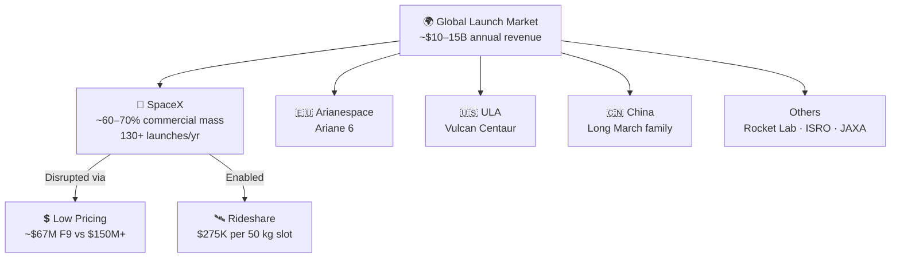

# Commercial Launch Market

> **SpaceX dominates the commercial launch market by pairing lower prices with high launch cadence, reshaping how customers buy access to orbit.**

## 🎯 Intuition
**The Core Idea:** SpaceX turned launch from a scarce, premium service into a more price-competitive transportation market.
**Analogy:** Like the airline industry before deregulation — SpaceX played Southwest Airlines, slashing prices and winning market share.
**Why It Matters:** SpaceX's market dominance has commoditized launch services in a way that was unthinkable two decades ago. Lower prices have enabled entirely new business models, including mega-constellations, on-demand rideshare for startups, and frequent technology demonstration missions. However, this dominance also raises questions about market concentration, because a major fleet-grounding event could ripple across the satellite industry.

---

## ⚙️ Core Mechanics

### Key Details / Specifications

| Year | SpaceX Launches | Global Orbital Launches | Approx. SpaceX Share (by count) |
|---|---|---|---|
| 2017 | 18 | ~91 | ~20% |
| 2018 | 21 | ~114 | ~18% |
| 2019 | 13 | ~102 | ~13% |
| 2020 | 26 | ~114 | ~23% |
| 2021 | 31 | ~146 | ~21% |
| 2022 | 61 | ~186 | ~33% |
| 2023 | 98 | ~212 | ~46% |
| 2024 | 130+ | ~260+ | ~50% |

### Key Facts
- SpaceX captured ~60-70% of global commercial launch mass to orbit by 2023-2024.
- Falcon 9 list price is approximately $67M; competitive vehicles typically cost $100M+.
- SES was the first major GEO operator to fly on a reused Falcon 9 booster (SES-10, 2017).
- Iridium NEXT launched 75 satellites across 8 dedicated Falcon 9 missions from 2017-2019.
- Transporter rideshare missions start at roughly $275K for a 50 kg payload slot.
- SpaceX completed 98 orbital launches in 2023, more than any other provider worldwide.
- The global launch services market is estimated at roughly $10-15B annually.
- OneWeb transitioned to Falcon 9 after losing access to Russian Soyuz in 2022.

---

## 🔬 Deep Dive
### Business Details
Before SpaceX's emergence, the commercial launch market was dominated by a small set of government-backed providers such as Arianespace, ILS/Proton, and United Launch Alliance. Prices were high, schedules were inflexible, and customers had little bargaining power. Falcon 9 entered that environment with a much lower list price and steadily pulled commercial demand toward SpaceX.

Major commercial customers included SES, which helped validate reused boosters for mainstream operators, Iridium with its eight-mission NEXT deployment campaign, Eutelsat, and OneWeb after the loss of Soyuz access in 2022. SpaceX also built out the rideshare market through the Transporter program, giving small satellite customers much cheaper access to orbit, though with less schedule flexibility and less precise orbital customization than dedicated missions.

The model became self-reinforcing as launch cadence rose. More launches improved reliability statistics, reduced customer wait times, and spread fixed costs over more missions, which in turn made Falcon 9 even harder for rivals to match on price and responsiveness.

### Challenges and Risks
- Market concentration creates systemic risk if Falcon 9 faces a grounding event.
- Competitors are actively trying to restore pricing and capacity competition.
- Rideshare customers trade lower prices for less control over schedule and orbital specifics.
- SpaceX's launch lead is partly reinforced by its own Starlink demand, which may be difficult for pure-play competitors to replicate.

### Comparison / Context

| Concept | Distinction |
|---|---|
| Dedicated vs. rideshare launch | Dedicated missions serve one customer; rideshare stacks many payloads on one rocket at lower per-unit cost. |
| GTO vs. LEO market | Geostationary transfer orbit missions are heavier and higher-energy, so they usually command premium pricing versus low Earth orbit launches. |
| Launch mass vs. launch count | SpaceX leads in both, but its mass share is even higher because Falcon 9 carries heavier payloads per mission. |
| Commercial vs. institutional launches | Commercial launches are bought by private customers; institutional launches are government or military missions under contract. |
| List price vs. negotiated price | The published Falcon 9 price is a ceiling; actual contract pricing varies by orbit, reuse, and customer volume. |

Competitors such as Arianespace, Blue Origin, Rocket Lab, ULA, and Chinese launch providers all operate in the same broad market, but as of 2024 SpaceX's combination of cost, cadence, and operational maturity remains the benchmark the rest of the industry is chasing.

---

## 🏋️ Practice
### Discussion Questions
1. Why did lower launch prices matter so much for satellite operators and new space startups?
2. How does a rideshare-first model differ strategically from dedicated launch services?
3. What could change in the market if a competitor matches Falcon 9 on both price and cadence?

### Analysis Scenarios
1. If Falcon 9 were grounded for six months, how would commercial satellite operators rebalance demand across the remaining global launch providers?
2. A smallsat startup can choose between a cheap rideshare slot and a more expensive dedicated launcher. How should it evaluate that trade-off?

### Challenge
- Design a strategy for a rival launch provider trying to win commercial market share without matching SpaceX's full launch cadence.
