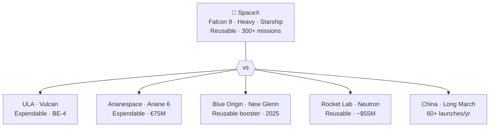

# Competition Landscape

> **SpaceX leads a launch industry field of legacy incumbents, startups, and state-backed rivals by combining reusability, cadence, and aggressive pricing better than anyone else.**

## 🎯 Intuition
**The Core Idea:** SpaceX changed the rules of competition in launch by making low cost and reusability the baseline rather than the exception.
**Analogy:** Like a Formula 1 grid — SpaceX leads the race while everyone else redesigns their cars to catch up.
**Why It Matters:** The competition landscape determines whether launch remains concentrated around one dominant provider or evolves into a healthier multi-provider market. For satellite operators, more viable launchers mean better pricing, more schedule redundancy, and less single-provider risk. For governments, competitive pressure matters because sovereign access to space is both an economic and strategic priority.

---

## ⚙️ Core Mechanics

### Key Details / Specifications

| Vehicle | Operator | LEO Payload | Reusable? | First Orbital Flight | Est. Price |
|---|---|---|---|---|---|
| Falcon 9 | SpaceX | ~22,800 kg | Yes (booster) | 2010 | ~$67M |
| Falcon Heavy | SpaceX | ~63,800 kg | Yes (boosters) | 2018 | ~$97M |
| Starship | SpaceX | ~100,000 kg+ | Yes (full stack) | 2025 (orbital) | TBD |
| Vulcan Centaur | ULA | ~27,200 kg | No | 2024 | ~$110M+ |
| Ariane 6 (A64) | Arianespace | ~21,650 kg | No | 2024 | ~€75M |
| New Glenn | Blue Origin | ~45,000 kg | Yes (booster) | 2025 | ~$70-100M (est.) |
| Neutron | Rocket Lab | ~13,000 kg | Yes (booster) | TBD (~2026) | ~$55M |
| Long March 5 | CASC (China) | ~25,000 kg | No | 2016 | N/A (state-funded) |
| H3 | JAXA (Japan) | ~6,500 kg | No | 2024 | ~$50M |
| Electron | Rocket Lab | ~300 kg | Partial (recovery) | 2018 | ~$7.5M |

### Key Facts
- ULA's Vulcan Centaur completed its inaugural flight in January 2024 and uses Blue Origin BE-4 engines.
- Ariane 6 first flew in July 2024 after multiple delays; it remains expendable and is priced above Falcon 9.
- Blue Origin's New Glenn is a heavy-lift partially reusable vehicle whose maiden flight occurred in 2025.
- Rocket Lab's Neutron is a medium-lift reusable vehicle under development and targets roughly $55M per launch.
- China completed 60+ orbital launches in 2023, second only to the United States in total launch count.
- Russia's commercial launch market has sharply contracted after 2022 due to sanctions and geopolitical isolation.
- SpaceX's flight-proven track record of 300+ Falcon 9 missions creates a major credibility barrier for new entrants.
- No competitor currently matches SpaceX's full combination of reuse, price, and launch cadence.

---

## 🔬 Deep Dive
### Business Details
When SpaceX entered the industry, the field was dominated by established launch providers backed by governments or quasi-monopoly arrangements. ULA controlled U.S. national security launches, Arianespace served Europe with Ariane, Russia supplied lower-cost Proton and Soyuz flights, and China largely served its domestic market. SpaceX disrupted all of them by delivering a reusable Falcon 9 with steadily improving reliability at much lower cost.

Rivals have responded with different strategies. ULA introduced Vulcan Centaur to improve cost discipline, but it remains expendable. Arianespace transitioned to Ariane 6 after long delays, but it also remains expendable and pricier than Falcon 9. Blue Origin's New Glenn is the closest conceptual match in heavy reusable launch, while Rocket Lab is moving upmarket from Electron to the reusable Neutron.

China may be the strongest long-term challenger because it combines state support, growing launch cadence, and a widening mix of commercial and government-backed firms. Across the industry, the common pattern is clear: SpaceX forced everyone else to treat reuse, cost compression, and higher operational tempo as mandatory competitive goals.

### Challenges and Risks
- Many rivals still depend on expendable architectures that are structurally disadvantaged on cost.
- New reusable entrants face long timelines and high capital requirements before proving reliability.
- State-backed competitors can absorb losses longer than purely commercial firms.
- A durable multi-provider market may take years to emerge, leaving customers exposed to concentration risk in the interim.

### Comparison / Context

| Concept | Distinction |
|---|---|
| Government-backed vs. commercial competitors | ULA, Arianespace, and CASC benefit from state support, while SpaceX and Rocket Lab compete more directly on commercial performance. |
| Reusable vs. expendable vehicles | SpaceX, Blue Origin, and Rocket Lab pursue reuse; Ariane 6 and Vulcan Centaur remain expendable. |
| Heavy-lift vs. medium-lift vs. smallsat | Starship and New Glenn target very large payloads; Falcon 9 and Neutron serve medium-lift demand; Electron focuses on small satellites. |
| Domestic vs. export market | Chinese vehicles mainly serve domestic payloads, while Western launchers pursue the broader export market where regulations permit. |
| Incumbent vs. new entrant | ULA and Arianespace are legacy providers adapting under pressure; Rocket Lab and other venture-backed firms are building from newer economic assumptions. |

SpaceX's strongest advantage is not just one rocket but a system-level combination of reuse, mature operations, customer trust, and internal demand from Starlink. That makes the competitive gap wider than a simple per-launch price comparison suggests.

---

## 🏋️ Practice
### Discussion Questions
1. Why is reusability such a powerful competitive lever in launch economics?
2. How do the strategic positions of ULA, Arianespace, Blue Origin, Rocket Lab, and China differ from one another?
3. Which type of competitor is most likely to challenge SpaceX over the next five years, and why?

### Analysis Scenarios
1. If New Glenn reaches reliable operations quickly, how might that change customer bargaining power in the commercial market?
2. If China succeeds in pairing reuse with high launch cadence, how would that alter the global competitive landscape for Western providers?

### Challenge
- Build a go-to-market strategy for a launch startup entering a market where the leader already has lower prices, more reliability data, and higher cadence.
