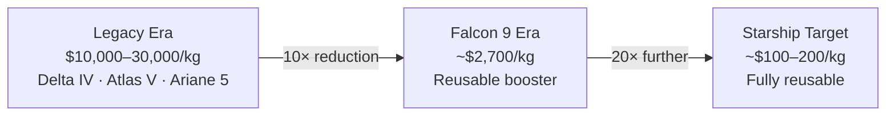

# Cost Revolution in Spaceflight

> **SpaceX cut the cost of getting payloads to orbit by roughly an order of magnitude, turning reusable launch into the biggest economic shift in modern spaceflight.**

## 🎯 Intuition
**The Core Idea:** Reusable rockets and high launch cadence dramatically lowered the cost per kilogram to orbit.
**Analogy:** Like the transition from mainframes to PCs — what cost millions now costs thousands, unlocking new use cases.
**Why It Matters:** The cost revolution has redrawn the economics of everything that depends on access to space. Satellite operators can now build constellations of many smaller spacecraft instead of relying only on a few expensive ones, and governments can afford more frequent science and technology missions. If costs keep falling, entirely new markets such as in-space manufacturing, debris removal, and broader commercial human spaceflight become much more viable.

---

## ⚙️ Core Mechanics

### Key Details / Specifications

| Vehicle | Operator | Cost/Mission (approx.) | LEO Capacity | Cost/kg (approx.) |
|---|---|---|---|---|
| Falcon 9 (reusable) | SpaceX | ~$67M | ~15,600 kg | ~$2,700 |
| Falcon Heavy (reusable) | SpaceX | ~$97M | ~45,000 kg | ~$2,200 |
| Delta IV Heavy | ULA | ~$350M | ~28,790 kg | ~$12,200 |
| Atlas V 551 | ULA | ~$150M | ~18,850 kg | ~$8,000 |
| Ariane 5 | Arianespace | ~$180M | ~21,000 kg | ~$8,600 |
| Electron | Rocket Lab | ~$7.5M | ~300 kg | ~$25,000 |
| Starship (target) | SpaceX | ~$10-20M | ~100,000 kg+ | ~$100-200 |

### Key Facts
- Falcon 9 list price is about $67M for up to ~22,800 kg to LEO expendable or ~15,600 kg in reusable mode.
- Delta IV Heavy's list price exceeded roughly $350M for about 28,790 kg to LEO.
- Falcon 9 reusable-mode cost to LEO is about $2,700 per kilogram at list price.
- A reflown Falcon 9 booster is estimated to have a marginal cost of roughly $15-20M.
- SpaceX vertically integrates major systems including engines, avionics, fairings, and structures.
- Booster B1058 had flown 23+ times as of 2024.
- Starship targets further cost reduction that could potentially reach roughly $10-50/kg at full reusability and scale.
- High launch cadence helps spread SpaceX's fixed costs across many more missions.

---

## 🔬 Deep Dive
### Business Details
Before SpaceX, U.S. launch prices to low Earth orbit were commonly in the $10,000-30,000 per kilogram range. Delta IV Heavy, Atlas V, and other legacy vehicles were powerful but expensive, and the industry largely accepted those economics as normal. Falcon 9 changed that by combining lower list prices with a reusable operating model that materially reduced effective cost per mission.

Four structural drivers explain the shift. First, SpaceX vertically integrates production, so it avoids multiple layers of subcontractor markup. Second, first-stage reuse spreads manufacturing cost over many flights instead of one. Third, high launch cadence lowers per-flight overhead by distributing factory, workforce, and infrastructure costs more broadly. Fourth, iterative engineering and manufacturing let SpaceX improve processes continuously instead of freezing the design for long periods.

These economics matter beyond launch itself. Starlink becomes much more feasible when the launcher is internally available at far below legacy prices. Small science payloads can ride as secondary payloads. The satellite business more broadly can move toward smaller, cheaper, more frequently refreshed spacecraft rather than a few extremely expensive assets.

### Challenges and Risks
- Reusability only creates full economic value if refurbishment remains fast and cheap.
- List price and true marginal cost are different, so public pricing alone can understate SpaceX's advantage.
- Some missions still require expendable performance or specialized constraints that reduce cost savings.
- Starship's most ambitious cost targets remain goals rather than fully proven operating economics.

### Comparison / Context

| Concept | Distinction |
|---|---|
| List price vs. marginal cost | List price is what outside customers pay; marginal cost reflects SpaceX's incremental internal expense on a reflown mission. |
| Expendable vs. reusable capacity | Falcon 9 carries more mass expendably, but reusable missions reserve propellant for booster recovery. |
| Cost per kg vs. cost per mission | Cost per kilogram normalizes efficiency across vehicles, while mission price is the contract number the customer pays. |
| Fixed vs. variable launch costs | Fixed costs include factories, labor, and infrastructure; variable costs include propellant, refurbishment, and range fees. |
| Vertical integration vs. prime contractor model | SpaceX builds many components itself, while traditional aerospace primes rely on layered subcontractor networks. |

The broader context is that lower launch costs do not just make old missions cheaper; they create new categories of missions that were previously uneconomic. That is why the shift is best understood as a market-expanding cost revolution, not just a pricing discount.

---

## 🏋️ Practice
### Discussion Questions
1. Which of SpaceX's cost advantages is hardest for a competitor to copy quickly?
2. How is cost per kilogram different from the price a customer actually experiences when buying a launch?
3. What new business models become practical if Starship reaches its long-term cost targets?

### Analysis Scenarios
1. If Falcon 9 refurbishment costs doubled unexpectedly, how would that affect SpaceX's pricing power and strategic position?
2. A national space agency must choose between fewer dedicated missions on a legacy rocket or more frequent rideshare missions on Falcon 9. How should it frame that decision?

### Challenge
- Develop a business case for a startup whose product only works if launch costs stay below a specific threshold per kilogram.

## References
- [[SpaceX/Sources/Sources Index|SpaceX Sources Index]]
