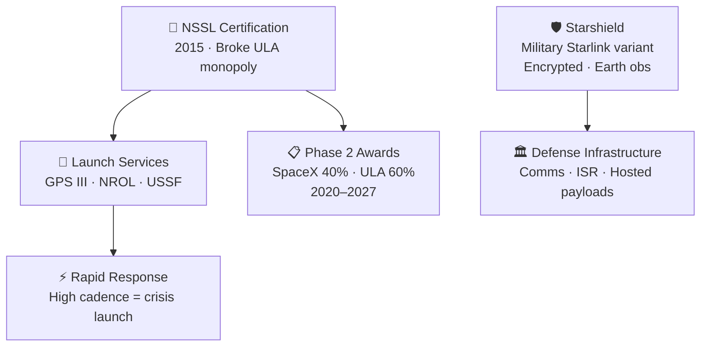

# Defense and National Security Contracts

> **SpaceX became a trusted U.S. national security space partner by winning launch certification, flying sensitive missions, and extending into defense services through Starshield.**

## 🎯 Intuition
**The Core Idea:** SpaceX moved from outsider to core defense supplier by proving it could meet the military's highest launch and security standards.
**Analogy:** Like earning a top-secret security clearance — once trusted, SpaceX became essential to national defense.
**Why It Matters:** National security launches are among the most valuable and strategically sensitive missions in the U.S. space portfolio. SpaceX's entry broke a long-standing monopoly, lowered costs, and increased competitive pressure on other providers. Starshield pushes the company beyond launch into communications, sensing, and defense infrastructure, which could make SpaceX a central military space contractor.

---

## ⚙️ Core Mechanics

### Key Details / Specifications

| Date | Mission | Vehicle | Customer | Notes |
|---|---|---|---|---|
| Dec 2018 | GPS III SV01 | Falcon 9 | USSF | First SpaceX GPS III launch |
| Jun 2020 | GPS III SV03 | Falcon 9 | USSF | Continued GPS constellation deployment |
| Dec 2020 | NROL-108 | Falcon 9 | NRO | Classified intelligence payload |
| Apr 2021 | NROL-76 follow-on | Falcon 9 | NRO | Classified mission |
| Jun 2021 | GPS III SV05 | Falcon 9 | USSF | Fifth GPS III satellite |
| Jan 2023 | USSF-67 | Falcon Heavy | USSF | First Falcon Heavy NSSL mission |
| Dec 2023 | USSF-52 | Falcon Heavy | USSF | GEO national security payload |
| 2024 | Multiple NROL | Falcon 9 / Heavy | NRO | Classified NRO missions |

### Key Facts
- SpaceX achieved NSSL certification for Falcon 9 in 2015 after years of legal and technical effort.
- Under Phase 2 NSSL for 2020-2027, SpaceX received about 40% of missions while ULA received about 60%.
- The first GPS III launch on SpaceX occurred in December 2018.
- Multiple classified NROL missions have flown on Falcon 9 and Falcon Heavy.
- Starshield was announced in late 2022 as a government and military variant of Starlink with enhanced security.
- Starshield supports secure communications, Earth observation support, and hosted payloads.
- ITAR restricts export of SpaceX rocket and satellite technologies.
- SpaceX's high launch cadence gives the Department of Defense a rapid-response launch option.

---

## 🔬 Deep Dive
### Business Details
SpaceX had to fight its way into the national security launch market. For years, ULA effectively held the position alone through the EELV program. SpaceX challenged that structure through litigation, lobbying, and technical qualification, eventually winning certification in 2015 and opening the door to compete for missions from the NRO, U.S. Space Force, and other defense agencies.

The company then proved its credibility by executing missions such as GPS III launches and classified NROL flights. Under Phase 2 of NSSL, the U.S. government deliberately split awards between ULA and SpaceX to preserve assured access through two providers. That gave SpaceX a major share of high-value, strategically sensitive launch work while confirming it had become a trusted operational provider, not just a disruptive bidder.

SpaceX's role broadened further with Starshield, announced in late 2022. Starshield adapts Starlink's industrial base and constellation model for secure government communications, Earth-observation support, and hosted military payloads. Together, launch services plus Starshield give SpaceX an increasingly deep role in U.S. defense space architecture.

### Challenges and Risks
- Defense customers require extreme mission assurance, security compliance, and operational reliability.
- Heavy dependence on a small number of providers still creates strategic concentration risk.
- ITAR and other regulatory controls limit how broadly SpaceX can commercialize defense-adjacent technologies.
- Political scrutiny is likely to increase as a private company gains more influence over military space capabilities.

### Comparison / Context

| Concept | Distinction |
|---|---|
| NSSL vs. EELV | NSSL replaced EELV as the program name, but both focus on assured U.S. national security access to space. |
| Phase 1 vs. Phase 2 NSSL | Phase 1 emphasized development agreements; Phase 2 covers operational launch mission awards. |
| Starlink vs. Starshield | Starlink serves commercial broadband users; Starshield is tailored for government and military missions with stronger security and customization. |
| Classified vs. unclassified missions | NROL missions carry classified intelligence payloads, while GPS and some USSF missions are publicly identified. |
| ITAR vs. EAR | ITAR governs defense articles such as rockets and military systems; EAR covers many dual-use commercial technologies. |

The Ukraine war highlighted the strategic value of commercial satellite constellations, accelerating interest in platforms like Starshield. That broader context helps explain why SpaceX is now relevant not just as a launcher, but as a defense space infrastructure provider.

---

## 🏋️ Practice
### Discussion Questions
1. Why was certification more strategically important than simply offering a cheaper rocket to the Pentagon?
2. How is Starshield different from Starlink in both business model and strategic role?
3. What happens to the defense launch market if SpaceX's share keeps growing relative to other providers?

### Analysis Scenarios
1. If a national security launch failure grounded Falcon 9 for an extended period, how would the U.S. government manage assured access to space?
2. A defense agency must decide whether to buy a bespoke satellite system or use a Starshield-based commercial platform. What trade-offs should shape that decision?

### Challenge
- Propose a procurement strategy that balances lower cost from SpaceX with the government's need to avoid overdependence on any single launch and satellite provider.

## References

- [[SpaceX/Sources/Sources Index]]
- [[SpaceX/SpaceX Book Reading Spine]]
- [[SpaceX/SpaceX]]
