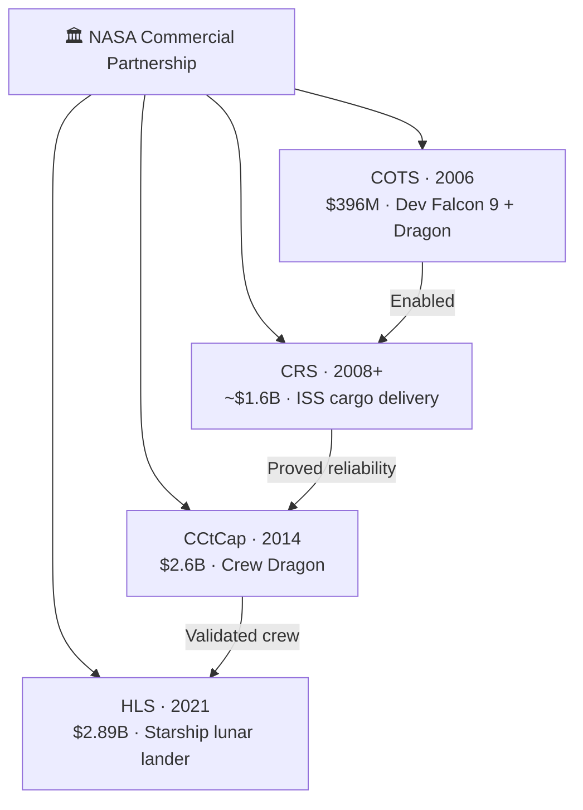

# NASA Contracts and Partnerships

> **NASA's fixed-price partnership model gave SpaceX the money, credibility, and flight opportunities that helped turn it from a fragile startup into a durable space company.**

## 🎯 Intuition
**The Core Idea:** NASA acted as the anchor customer that helped finance and validate SpaceX's early capabilities.
**Analogy:** Like a startup's first enterprise customer — NASA's anchor contracts de-risked SpaceX's entire business.
**Why It Matters:** NASA's partnership with SpaceX showed that government agencies can build commercial capacity without owning every vehicle themselves. Fixed-price contracts gave NASA more leverage over cost while giving SpaceX room to retain intellectual property and scale commercially. For SpaceX, those contracts created the revenue base and credibility needed to survive its early years and invest in the capabilities that later powered its broader expansion.

---

## ⚙️ Core Mechanics

### Key Details / Specifications

| Program | Year Awarded | Contract Value | Scope | Status |
|---|---|---|---|---|
| COTS | 2006 | $396M | Develop Falcon 9 + Dragon cargo | Completed |
| CRS-1 | 2008 | ~$1.6B | 12 ISS cargo missions | Completed |
| CRS-2 | 2016 | ~$3.5B (shared) | Extended ISS cargo delivery | Active |
| CCtCap | 2014 | $2.6B | Develop + certify Crew Dragon | Active (operational) |
| HLS Option A | 2021 | $2.89B | Starship lunar lander (Artemis) | In development |
| CLPS (indirect) | Various | Various | Launches for CLPS lunar landers | Ongoing |

### Key Facts
- COTS in 2006 provided $396M in milestone payments to develop Falcon 9 and Dragon.
- CRS-1 in 2008 was worth about $1.6B for 12 operational ISS cargo missions.
- CRS-2 extended cargo services for additional ISS resupply missions.
- CCtCap in 2014 awarded SpaceX $2.6B to develop and certify Crew Dragon.
- HLS Option A in 2021 awarded $2.89B to develop a Starship-based lunar lander for Artemis III.
- NASA's fixed-price milestone model let SpaceX retain IP while sharing development risk.
- Crew Dragon's first operational crew mission, Crew-1, launched in November 2020.
- NASA contracts provided a major revenue and credibility foundation for SpaceX's commercial growth.

---

## 🔬 Deep Dive
### Business Details
NASA's relationship with SpaceX began with COTS in 2006, which gave the company milestone-based funding to develop Falcon 9 and Dragon for ISS cargo delivery. Unlike traditional cost-plus contracting, COTS used a fixed-price, pay-for-performance structure. That meant SpaceX had to execute efficiently, but it also kept ownership of the resulting technology and could later commercialize what it built.

That development phase turned into operational business through CRS cargo contracts and then into human spaceflight through CCDev and CCtCap. By the time Crew Dragon began operational astronaut flights in 2020, NASA had helped validate not just a spacecraft, but the broader idea that a private company could build and operate critical space transportation services at scale.

NASA's influence continued with Human Landing System work under Artemis, where SpaceX was selected to develop a Starship-derived lunar lander. Across COTS, CRS, crew transportation, and HLS, NASA did more than buy missions. It reduced uncertainty, provided demand, and helped fund the capabilities that later supported reusability, production scale, and other commercial businesses inside SpaceX.

### Challenges and Risks
- Fixed-price contracts shift more execution risk onto the contractor, which can strain a company during development setbacks.
- NASA remains a demanding customer with strict safety, mission assurance, and schedule requirements.
- Some programs, especially HLS, require SpaceX to prove technologies far beyond its already operational systems.
- Heavy reliance on government anchor contracts early on can create concentration risk before commercial markets fully mature.

### Comparison / Context

| Concept | Distinction |
|---|---|
| COTS vs. CRS | COTS funded development of vehicles; CRS pays for operational cargo delivery missions. |
| CRS-1 vs. CRS-2 | CRS-1 covered early ISS resupply with Dragon 1; CRS-2 extends services using newer cargo capabilities. |
| CCDev vs. CCtCap | CCDev funded earlier development milestones; CCtCap covered full certification and operational crew transport capability. |
| Cost-plus vs. fixed-price | Cost-plus reimburses contractor costs plus fee, while fixed-price pays for deliverables regardless of the contractor's internal cost. |
| HLS Option A vs. Option B | Option A made SpaceX the initial lunar lander provider; Option B later added a second provider to reduce dependency. |

NASA's approach with SpaceX became an influential procurement model across civil space, because it suggested the government could stimulate a competitive commercial ecosystem instead of permanently owning the entire transportation stack itself.

---

## 🏋️ Practice
### Discussion Questions
1. Why were NASA's early fixed-price contracts more valuable to SpaceX than a one-time launch purchase would have been?
2. How did the progression from COTS to CRS to crewed missions deepen the NASA-SpaceX relationship?
3. What does the HLS award suggest about NASA's confidence in SpaceX's future capabilities?

### Analysis Scenarios
1. If NASA had used only traditional cost-plus contracting, how might SpaceX's growth trajectory have changed?
2. A government agency wants to replicate NASA's success with commercial partnerships in another sector. Which parts of the SpaceX model are most transferable, and which are unique to space?

### Challenge
- Design an anchor-customer contract structure for an emerging space company that balances public accountability with enough upside for the company to innovate aggressively.

---

*See also:* [[Commercial Crew Development]], [[Cargo Dragon]], [[Human Landing System]], [[SpaceX Funding and Valuation]]
