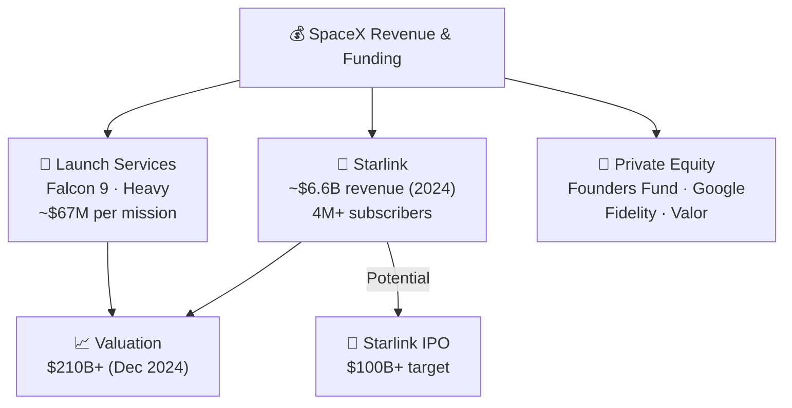

# SpaceX Funding and Valuation

> **SpaceX grew from Elon Musk's personal funding into a $210B+ private company by turning technical milestones and Starlink growth into ever-larger investor confidence.**

## 🎯 Intuition
**The Core Idea:** SpaceX's valuation rose because investors increasingly believed its rockets and Starlink network could generate durable, large-scale cash flows.
**Analogy:** Like a tech unicorn built on rocket fuel — growing from $100M personal bet to $210B+ private valuation.
**Why It Matters:** SpaceX's funding history shows that private capital can sustain a deeply capital-intensive space company outside the traditional cost-plus government model. Its rising valuation reflects confidence in both reusable launch and satellite broadband, two bets many investors once viewed as unrealistic. A future Starlink IPO could become a benchmark event for how markets value large-scale space infrastructure businesses.

---

## ⚙️ Core Mechanics

### Key Details / Specifications

| Year | Round / Event | Amount Raised | Post-Money Valuation |
|---|---|---|---|
| 2002-2006 | Musk personal funding | ~$100M | N/A |
| 2008 | Series C (Founders Fund et al.) | ~$20M | ~$500M |
| 2012 | Series F | ~$30M | ~$1B |
| 2015 | Google & Fidelity round | ~$1B | ~$12B |
| 2019 | Series J+ | ~$1.3B | ~$33B |
| 2021 | Multiple rounds | ~$2B+ | ~$74B |
| 2023 | Tender offer / secondary | — | ~$137B |
| 2024 | Tender offer / secondary | — | ~$210B+ |

### Key Facts
- Elon Musk invested about $100M of personal funds from 2002-2008 to keep SpaceX alive.
- Founders Fund, DFJ, and Valor Equity Partners were among the earliest institutional backers.
- Google and Fidelity invested about $1B in January 2015 at roughly a $12B valuation.
- SpaceX's valuation exceeded $100B for the first time in a late-2021 secondary transaction.
- By December 2024, SpaceX's valuation was above $210B in a tender offer.
- Starlink revenue reportedly exceeded $6B annualized by mid-2024.
- SpaceX has never gone public and its shares remain largely confined to private markets.
- Elon Musk has said a standalone Starlink IPO is possible once revenue becomes more predictable.

---

## 🔬 Deep Dive
### Business Details
SpaceX began with Elon Musk's own money rather than a large government-backed balance sheet. That personal funding carried the company through the first Falcon 1 launch attempts, including three failures before the fourth flight succeeded in 2008. The timing mattered: success was followed closely by a NASA contract that helped the company avoid collapse and transition into a more durable business.

After survival came institutional validation. Early investors such as Founders Fund, DFJ, and Valor backed the company as Falcon development improved. Later rounds rose sharply in size and valuation as SpaceX hit major milestones including Falcon 9 reuse, Crew Dragon operations, and rapid Starlink subscriber growth. By 2024, SpaceX was no longer valued primarily as a launch company; it was increasingly valued as a combined launch-and-connectivity platform with significant recurring revenue potential.

Revenue now comes from two main engines: launch services and Starlink. Launch provides credibility, cash flow, and strategic positioning, but Starlink increasingly appears to be the bigger long-term valuation driver because broadband subscriptions can scale more like a technology platform than a project-based aerospace contractor. That is why a future Starlink IPO continues to attract attention.

### Challenges and Risks
- Private-market valuations can move faster than underlying cash generation and may be hard to test without a public listing.
- Starlink is increasingly central to the equity story, so operational or regulatory setbacks there could affect valuation sharply.
- Capital-intensive businesses still require continued execution; large valuation gains do not eliminate funding needs.
- Secondary-market pricing provides liquidity, but it can also create expectations that are hard to sustain if growth slows.

### Comparison / Context

| Concept | Distinction |
|---|---|
| Primary vs. secondary shares | Primary rounds bring new cash into SpaceX; secondary sales let existing holders sell to new investors. |
| Pre-money vs. post-money valuation | Post-money includes the new investment; pre-money is the implied value before the round closes. |
| Launch revenue vs. Starlink revenue | Launch was the earlier core business, but Starlink now appears to generate more of the company's revenue. |
| IPO vs. direct listing | An IPO issues and sells shares to the public, while a direct listing mainly enables trading of existing shares. |
| Valuation vs. enterprise value | Equity valuation reflects shareholder value, while enterprise value would adjust for debt and cash. |

SpaceX is unusual because it combines aerospace manufacturing, launch services, satellite operations, and telecom-style recurring revenue in a single private company. That mixed profile helps explain why investors often compare it to both a defense contractor and a high-growth tech platform.

---

## 🏋️ Practice
### Discussion Questions
1. Why did investors value SpaceX more aggressively after Starlink began scaling?
2. How is a tender-offer valuation different from the value implied by a traditional IPO?
3. Which matters more to SpaceX's long-term valuation story: launch leadership or broadband revenue growth?

### Analysis Scenarios
1. If Starlink growth stalled while launch demand remained strong, how might that change SpaceX's valuation multiple?
2. An investor is deciding whether SpaceX should stay private longer or separate Starlink into a public company. What factors should shape that recommendation?

### Challenge
- Build an investment thesis for SpaceX that explains whether its valuation should be benchmarked primarily against aerospace firms, telecom companies, or software-like platform businesses.

---

*See also:* [[NASA Contracts and Partnerships]], [[Starlink Business Model]], [[Cost Revolution in Spaceflight]], [[Competition Landscape]]

## References

- [[SpaceX/Sources/Sources Index]]
- [[SpaceX/SpaceX Book Reading Spine]]
- [[SpaceX/SpaceX]]
