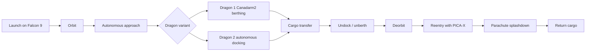

# Cargo Dragon

> **SpaceX's Cargo Dragon family became NASA's primary commercial ISS resupply system while preserving the rare ability to bring large amounts of cargo back to Earth.**

## 🎯 Intuition
**The Core Idea:** Cargo Dragon replaced much of the Space Shuttle's cargo-delivery role with a privately developed spacecraft that can both deliver supplies to the ISS and return important cargo safely to Earth.

**Analogy:** Think of Dragon as a space taxi truck: it not only drops off supplies at orbiting "stations," but also brings valuable packages back home instead of throwing them away.

**Why It Matters:** The program proved NASA could rely on commercial providers for routine station logistics after Shuttle retirement. It also preserved a uniquely valuable capability: controlled reentry and ocean splashdown that returns science experiments, failed hardware, and crew items intact. Those operational and technical lessons fed directly into later Crew Dragon development.

## ⚙️ Core Mechanics
### Key Specifications
- **Dragon 1** flew 20 operational CRS missions for NASA from October 2012 through March 2020.
- **Dragon 2 cargo** began CRS-2 missions with **CRS-21 in December 2020**.
- **Pressurized cargo capacity**: ~3,300 kg up (**Dragon 1**) / ~3,307 kg up (**Dragon 2 cargo**).
- **Unpressurized trunk payload**: up to ~3,130 kg of external cargo and experiments.
- **Downmass**: Dragon 2 can return ~3,300 kg of pressurized cargo to Earth.
- **Autonomous docking**: Dragon 2 docks directly to **IDA** ports; Dragon 1 required **Canadarm2** berthing.
- **Reuse**: Dragon 2 cargo capsules are reflown across multiple CRS-2 missions.

### Key Facts
The Cargo Dragon program grew from NASA's **Commercial Orbital Transportation Services (COTS)** initiative, which aimed to replace the retired Space Shuttle's cargo role with privately developed spacecraft. SpaceX's **Dragon 1** became the **first privately built spacecraft to berth with the ISS** on **May 25, 2012** during the **COTS 2+** demonstration mission. NASA then awarded SpaceX the **Commercial Resupply Services (CRS-1)** contract, and Dragon 1 flew **20 CRS missions between 2012 and 2020**, carrying pressurized cargo inside the capsule and unpressurized payloads in the trunk.

For the **CRS-2** era, SpaceX introduced **Dragon 2 cargo**, formally assigned to missions beginning with **CRS-21**. Its most important operational upgrade was **autonomous docking** using NASA's **International Docking Adapter (IDA)**, which removed the need for station crews to use **Canadarm2** to grapple and berth the spacecraft. Dragon 2 cargo also provides roughly **20% more pressurized volume** than Dragon 1 and retains an upgraded trunk for external experiments and hardware.

A defining capability across both Dragon generations is substantial **downmass**. Unlike **Cygnus**, **HTV**, and **Progress**, which are expendable and burn up on reentry, Dragon can bring significant payloads back to Earth. That makes it especially important for returning research samples, failed components for engineering analysis, and crew belongings. Dragon 2 cargo capsules are also designed for **reuse across multiple missions**, reducing per-flight costs.

### Mermaid Diagram

## 🔬 Deep Dive
### Design / Engineering Details
Dragon's operational significance comes from combining multiple roles in one spacecraft architecture. The capsule carries **pressurized cargo**, while the trunk handles **unpressurized external payloads** such as experiments and station hardware. Dragon 1 originally relied on ISS robotic capture and berthing, which consumed crew and robotics time. Dragon 2's direct docking to an **IDA** simplified operations and reduced that burden. The use of **PICA-X** thermal protection and parachute-assisted ocean recovery preserves returned cargo that would otherwise be lost on destructive reentry vehicles.

### Comparison

| Feature | Dragon 1 | Dragon 2 Cargo | Cygnus | HTV (Kounotori) |
|---|---|---|---|---|
| ISS attachment | Berthing (Canadarm2) | Autonomous docking (IDA) | Berthing (Canadarm2) | Berthing (Canadarm2) |
| Downmass capability | ~2,500 kg | ~3,300 kg | None (destructive reentry) | None (destructive reentry) |
| Pressurized upmass | ~3,300 kg | ~3,307 kg | ~3,500 kg | ~5,200 kg |
| Reusability | Partial (capsule reflown) | Yes (capsule reflown multiple times) | No | No |
| Service period | 2012–2020 | 2020–present | 2014–present | 2009–2020 |
| Launch vehicle | Falcon 9 | Falcon 9 | Antares / Falcon 9 | H-IIB |

## 🏋️ Practice
### Warm-Up — 3 Conceptual Questions
1. Why was Dragon especially important after the Space Shuttle retired?
2. What operational difference separates Dragon 1 from Dragon 2 cargo at the ISS?
3. Why is downmass more valuable than simple cargo delivery?

### Core Analysis — 2 "What If" Scenarios
1. What changes in station operations if Dragon 2 also required Canadarm2 berthing instead of autonomous docking?
2. What would ISS research logistics lose if Dragon could not return cargo intact after reentry?

### Challenge
Explain why Cargo Dragon is not just "another cargo spacecraft" by comparing its docking method, reuse, and return-to-Earth capability with at least two other ISS cargo vehicles.

## References
→ [[Sources Index]]
