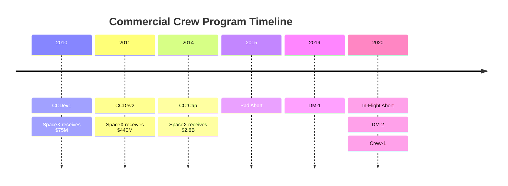

# Commercial Crew Development

> **NASA's Commercial Crew effort funded private crew spacecraft to end US dependence on Soyuz and restore American astronaut launches to the ISS.**

## 🎯 Intuition
**The Core Idea:** Commercial Crew used phased, fixed-price partnerships to help companies like SpaceX build and certify human-rated spacecraft for ISS transport.

**Analogy:** Instead of NASA owning every part of the airline, it paid companies to develop safe passenger service and then buy rides once the system worked.

**Why It Matters:** After the Space Shuttle retired in **July 2011**, the United States lost independent crew launch capability and had to buy Soyuz seats from Russia. Those seats rose from about **$21 million in 2008** to **over $90 million by 2020**. Commercial Crew was NASA's answer: restore domestic access, reduce strategic dependence, and shift procurement toward commercial service partnerships.

## ⚙️ Core Mechanics
### Key Specifications
- **CCDev1 (2010)**: SpaceX awarded **$75 million** for Dragon crew concept development.
- **CCDev2 (2011)**: SpaceX awarded **$440 million** for Dragon 2 detailed design.
- **CCtCap (September 2014)**: SpaceX awarded **$2.6 billion**; Boeing awarded **$4.2 billion**.
- **Soyuz gap**: **2011–2020**, roughly **9 years** of US dependence on Russian crew transport.
- **DM-1 (March 2, 2019)**: uncrewed demo with autonomous ISS docking and a **6-day mission**.
- **In-flight abort (January 19, 2020)**: successful max-Q escape demonstration.
- **DM-2 (May 30, 2020)**: **Doug Hurley** and **Bob Behnken** launched on the first US crewed orbital mission from American soil since **STS-135**.

### Key Facts
NASA structured the **Commercial Crew Program** as a phased competition after Shuttle retirement. The goal was to stimulate private development of crew transportation systems while sharing financial risk between NASA and industry. In **CCDev1 (2010)**, SpaceX received **$75 million** for early crewed Dragon work. In **CCDev2 (2011)**, SpaceX received **$440 million** to advance **Dragon 2**. The decisive **Commercial Crew Transportation Capability (CCtCap)** awards came in **September 2014**, when NASA selected **SpaceX for $2.6 billion** and **Boeing for $4.2 billion** to finish development, certification, and operational missions.

That dual-award strategy aimed to preserve redundancy and competition, though Boeing's **Starliner** program later faced major delays. SpaceX moved through its test milestones in order: **DM-1** in **March 2019** proved uncrewed autonomous ISS docking and return; a capsule was lost in an **April 2019 static fire test**, which led to a **SuperDraco valve redesign**; the **in-flight abort test** succeeded in **January 2020**; and **DM-2** flew **Hurley and Behnken** to the ISS on **May 30, 2020**. After DM-2 splashed down successfully on **August 2, 2020**, NASA certified Crew Dragon for operational missions, which culminated in **Crew-1** reaching operational status in **November 2020**.

### Mermaid Diagram

## 🔬 Deep Dive
### Design / Engineering Details
Commercial Crew marked a major procurement change from traditional **cost-plus government development** to **fixed-price commercial partnership**. NASA still defined safety and certification requirements, but companies developed and operated the hardware. SpaceX's progress under the **$2.6 billion** award became especially notable when compared with Boeing's **$4.2 billion** award and slower schedule. The result was a proof point that a private company could develop, certify, and operate a human-rated orbital spacecraft under NASA oversight.

### Comparison

| Milestone | Date | Description |
|---|---|---|
| CCDev1 award | Sept 2010 | $75M to SpaceX for crew concept |
| CCDev2 award | April 2011 | $440M to SpaceX for detailed design |
| CCtCap award | Sept 2014 | $2.6B to SpaceX for development + ops |
| Pad abort test | May 2015 | SuperDraco escape from LC-40 |
| DM-1 (uncrewed) | March 2019 | Autonomous ISS docking demo |
| In-flight abort | Jan 2020 | Max-Q escape demonstration |
| DM-2 (crewed) | May 2020 | Hurley & Behnken — first operational crew |
| Crew-1 (first operational) | Nov 2020 | Hopkins, Glover, Walker, Noguchi |

## 🏋️ Practice
### Warm-Up — 3 Conceptual Questions
1. Why did NASA pursue Commercial Crew after Shuttle retirement?
2. What was the purpose of awarding both SpaceX and Boeing under CCtCap?
3. Why was DM-2 historically important beyond just being another test flight?

### Core Analysis — 2 "What If" Scenarios
1. What would have happened to US crew access if Commercial Crew had slipped several more years beyond 2020?
2. How would NASA's human-spaceflight planning differ if only one provider had been funded instead of two?

### Challenge
Use the timeline to explain how NASA moved from early concept funding to an operational crew transportation service, and include why the April 2019 capsule loss did not end the program.

## References
→ [[Sources Index]]
