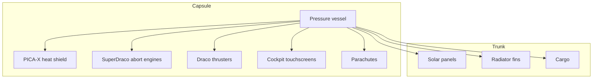

# Crew Dragon Design

> **Crew Dragon is SpaceX's human-rated Dragon 2 spacecraft, combining autonomous docking, an integrated launch escape system, and reusable capsule design in one vehicle.**

## 🎯 Intuition
**The Core Idea:** Crew Dragon is built as a modern orbital crew capsule that can launch astronauts, protect them during emergencies, dock itself to the ISS, and return them safely through reentry and splashdown.

**Analogy:** It is like a smart, reusable orbital lifeboat crossed with a space taxi: the crew cabin, escape engines, docking port, and recovery systems are all part of one tightly integrated machine.

**Why It Matters:** Crew Dragon restored American crew launch capability after the nine-year gap that followed Shuttle retirement. Its integrated abort system, autonomous docking, and reusable capsule architecture set a new standard for commercial human spaceflight. The touchscreen-centered cockpit and simplified operations also reflect a generational change in spacecraft design philosophy.

## ⚙️ Core Mechanics
### Key Specifications
- **Crew capacity**: **4** on NASA operational missions to **7** in maximum configuration.
- **Habitable volume**: approximately **9.3 m³** pressurized.
- **Height**: **8.1 m** with trunk / **3.7 m** capsule only.
- **Diameter**: **3.7 m**.
- **Launch mass**: about **12,055 kg** for the capsule only, without trunk.
- **Trunk mass**: about **1,700 kg**.
- **On-orbit endurance**: rated for **210 days** docked to ISS, later extended to about **220+ days operationally**.
- **Docking**: autonomous via the **NASA Docking System (NDS)** to **IDA** ports on ISS.

### Key Facts
The Crew Dragon capsule contains a **pressure vessel** inside an aerodynamic outer mold line, with a **nose cone** that opens to expose the docking mechanism. That pressurized section provides roughly **9.3 m³** of habitable volume and supports **four to seven crew members**, though NASA operational missions typically use **four seats**. Inside, traditional switch-heavy control panels are replaced with **minimalist touchscreen displays**, creating a modern glass-cockpit interface for navigation, environmental control, and communications.

For atmospheric return, Crew Dragon uses SpaceX's proprietary **PICA-X** heat shield, derived from NASA's **PICA**. It protects the capsule during reentry at velocities above **7.5 km/s** and temperatures above **1,900°C**. Unlike early single-use ablative systems, **PICA-X** is intended to survive **multiple reentries**, supporting reuse. The backshell also incorporates SpaceX thermal-protection tiles.

Crew Dragon's **launch escape system** is built directly into the capsule rather than mounted as a disposable tower. **Eight SuperDraco engines**, arranged in **four redundant pairs**, can pull the spacecraft away from a failing booster within milliseconds. This means escape capability can persist from pad through orbit without a separate tower-jettison event. For recovery, Dragon deploys **two drogue parachutes** for stabilization and deceleration, followed by **four main Mark 3 parachutes** for splashdown in the **Atlantic Ocean** or **Gulf of Mexico**, where SpaceX recovery vessels retrieve the crew.

### Mermaid Diagram

## 🔬 Deep Dive
### Design / Engineering Details
Crew Dragon's design reflects system integration rather than bolt-on subsystems. The capsule combines crew habitation, docking, abort, and recovery in a single reusable element, while the **trunk** carries unpressurized hardware and supports **solar panels** and **radiator fins**. The **trunk is expended**, but the **capsule is reflown**. The embedded abort engines remove the need for a traditional launch escape tower, while the reusable **PICA-X** heat shield and parachute recovery system support repeated missions. Together, these choices reduce operational complexity while preserving safety margins.

### Comparison

| Specification | Value |
|---|---|
| Capsule diameter | 3.7 m |
| Capsule height (without trunk) | 3.7 m |
| Total height (with trunk) | 8.1 m |
| Pressurized volume | ~9.3 m³ |
| Crew capacity | 4–7 |
| Launch escape thrust | ~890 kN (8 × SuperDraco) |
| Heat shield material | PICA-X ablator |
| Parachute system | 2 drogue + 4 main (Mark 3) |
| Docking mechanism | NASA Docking System (NDS) |
| On-orbit endurance | ~210 days (rated) |
| Reusability | Capsule reflown; trunk expended |

## 🏋️ Practice
### Warm-Up — 3 Conceptual Questions
1. Why is Crew Dragon's integrated launch escape system different from older tower-based systems?
2. What role does the trunk play if the crew stays inside the capsule?
3. Why is PICA-X important for spacecraft reuse?

### Core Analysis — 2 "What If" Scenarios
1. What would operationally change if Crew Dragon could dock only manually instead of autonomously?
2. What tradeoffs would appear if SpaceX used a separate abort tower instead of embedded SuperDracos?

### Challenge
Describe how Crew Dragon combines crew safety, docking, reentry protection, and reuse into one spacecraft architecture, and explain which parts are reused versus expended.

## See Also
- [[Life Support and Abort Systems]]
- [[Commercial Crew Development]]
- [[Avionics and Flight Software]]
- [[Operational Crew Missions]]

## References
→ [[SpaceX/Sources/Sources Index|Sources Index]]
