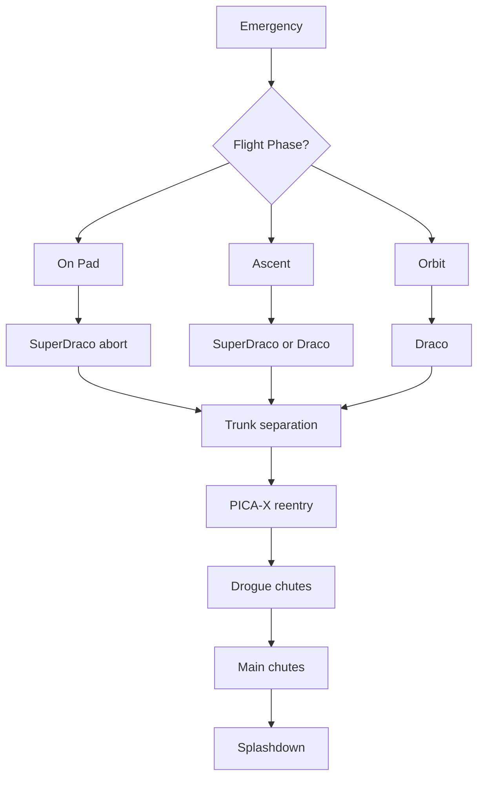

# Life Support and Abort Systems

> **Crew Dragon keeps astronauts alive by combining cabin life support, continuous abort capability, thermal protection, and fault-tolerant parachute recovery.**

## 🎯 Intuition
**The Core Idea:** Crew Dragon's survival systems are designed so the crew can breathe, stay thermally stable, escape launch failures, endure reentry, and land safely in both normal and emergency cases.

**Analogy:** Think of it as a flying emergency shelter with a built-in eject system and a layered landing kit.

**Why It Matters:** Human spaceflight depends on systems that work across the whole mission, not just during launch. Crew Dragon's ECLSS, SuperDraco escape engines, PICA-X heat shield, and parachutes define the spacecraft's safety envelope from the pad to splashdown. NASA certification depended on showing these systems could handle nominal operations plus off-nominal failures.

## ⚙️ Core Mechanics
### Key Specifications
- **CO₂ removal**: **lithium hydroxide (LiOH) canisters**; non-regenerative for transit, with ISS systems used during station stay.
- **Oxygen supply**: high-pressure gaseous oxygen tanks, with nitrogen for cabin atmosphere balance.
- **Cabin pressure**: about **14.7 psi (101.3 kPa)**, a sea-level-equivalent nitrogen-oxygen mix.
- **SuperDraco engines**: **8 total** in **4 pods × 2**, about **71 kN thrust each**, using hypergolic **NTO/MMH**.
- **Pad abort test**: **May 6, 2015**, with the capsule clearing the pad in **under 8 seconds**.
- **In-flight abort test**: **January 19, 2020**, successful at **max-Q** around **84 seconds into flight**.
- **Parachute system**: **2 drogue + 4 main (Mark 3)**.
- **PICA-X heat shield**: withstands reentry temperatures above **1,900°C** and is designed for multi-mission reuse.

### Key Facts
Crew Dragon's **environmental control and life support system (ECLSS)** supports missions lasting up to **seven months**. It removes carbon dioxide with **LiOH canisters**, supplies oxygen from pressurized tanks, and manages cabin temperature and humidity through a closed-loop thermal control system using coolant loops and heat exchangers. Cabin pressure is maintained near **14.7 psi**, and the waste-management system was upgraded after **DM-2** and **Crew-1** in response to operational feedback from longer-duration missions.

The spacecraft's most distinctive safety feature is its integrated **launch escape system**. Instead of a tower, Crew Dragon carries **eight SuperDraco engines** embedded in the sidewalls. They are arranged as **four redundant pairs** and can fire from the pad through orbit, eliminating the tower-jettison event required by Mercury, Apollo, and Soyuz-style systems. SpaceX demonstrated this capability during the **May 2015 pad abort from LC-40** and the **January 2020 in-flight abort** at **maximum dynamic pressure**, after separation from a deliberately terminated **Falcon 9**.

Recovery starts with **trunk separation** before the deorbit burn. The capsule then survives atmospheric entry under **PICA-X** protection. At about **5.5 km altitude**, **two drogue parachutes** deploy to stabilize the capsule. At about **1.8 km**, **four main Mark 3 parachutes**, each **35 m in diameter**, inflate and reduce splashdown velocity to roughly **7 m/s**. The **Mark 3** system followed **over 30 drop tests** after inconsistent **Mark 2** performance. The note's preserved mission data states the system is safe even with **one drogue and one main parachute failed**, and also lists fault tolerance as **1 drogue + 3 mains failed**.

### Mermaid Diagram

## 🔬 Deep Dive
### Design / Engineering Details
Crew Dragon's safety architecture works because the systems are layered rather than isolated. The **ECLSS** preserves a habitable environment during routine flight and long docked stays. The **integrated abort system** gives continuous escape coverage from pad through orbit, which is a major architectural change from older tower-based escape systems. During return, **PICA-X** protects the capsule at high-energy reentry conditions, and the parachute system adds fault tolerance through multiple drogues and mains. Qualification testing across abort and parachute scenarios established the reliability case for operational crew missions.

### Comparison

| Abort Scenario | Phase | System Response |
|---|---|---|
| Pad emergency | Pre-launch / T-0 | 8 SuperDracos fire; capsule clears pad in <8 s; parachute deployment; ocean splashdown |
| First-stage ascent | Launch through MECO | SuperDraco abort; trunk separation; capsule ballistic reentry; parachute splashdown |
| Max-Q abort | ~60–90 s into flight | SuperDracos fire against peak aerodynamic loads; capsule separates and deploys chutes |
| Second-stage ascent | Post-stage separation | SuperDraco or nominal separation; capsule enters coast/reentry profile |
| On-orbit emergency | Docked at ISS | Rapid undocking; deorbit burn via Draco thrusters; standard reentry and splashdown |
| Reentry anomaly | Atmospheric reentry | PICA-X thermal protection; drogue + main parachute system with fault tolerance |

## 🏋️ Practice
### Warm-Up — 3 Conceptual Questions
1. Why is continuous abort capability considered an advance over tower-based escape systems?
2. What does the ECLSS do besides simply supplying oxygen?
3. Why are both drogues and main parachutes used during recovery?

### Core Analysis — 2 "What If" Scenarios
1. What would change in Crew Dragon's emergency profile if SuperDracos were only usable on the pad?
2. How would recovery risk change if Mark 2 parachutes had been kept instead of qualifying Mark 3 through extensive drop tests?

### Challenge
Trace how Crew Dragon protects a crew during a launch emergency, starting with detection of the emergency and ending at splashdown, naming the major systems involved.

## References
→ [[Sources Index]]
