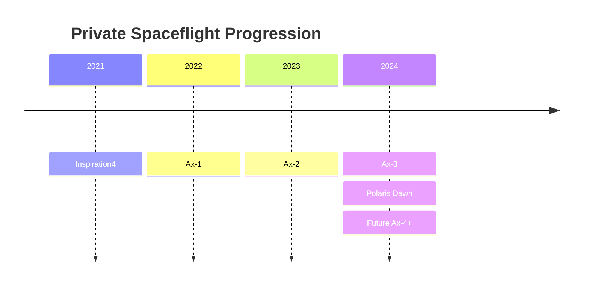

# Private Astronaut Missions

> **Crew Dragon expanded beyond government ISS transport into all-civilian orbital missions, private ISS expeditions, and the first commercial spacewalk.**

## 🎯 Intuition
**The Core Idea:** Private astronaut missions showed that Crew Dragon could support people and mission profiles outside the traditional government-astronaut model.

**Analogy:** If operational crew missions are scheduled airline service to the ISS, private astronaut missions are charter flights that test new destinations, new customers, and new business models.

**Why It Matters:** These flights opened orbital spaceflight to non-government participants in a way not seen since early Soyuz tourism. They also proved Crew Dragon could handle mission profiles beyond standard ISS rotation, including **free-flight**, **high-altitude orbit**, and **commercial EVA**. That matters for the growth of a long-term commercial human-spaceflight market.

## ⚙️ Core Mechanics
### Key Specifications
- **Inspiration4 (September 2021)**: first all-civilian orbital mission; about **585 km** orbit; **3-day** free flight.
- **Polaris Dawn (September 2024)**: about **1,400 km** apogee; first commercial EVA; used SpaceX EVA suits.
- **Ax-1 (April 2022)**: first fully private crew to the ISS; commanded by **Michael López-Alegría**.
- **Ax-2 (May 2023)**: included **Peggy Whitson** as commander and Saudi astronauts.
- **Ax-3 (January 2024)**: carried ESA-sponsored astronaut **Marcus Wandt** and Turkish astronaut **Alper Gezeravcı**.
- **Cupola dome**: custom observation window replaced the docking adapter on Inspiration4.
- **dearMoon**: **Yusaku Maezawa's** planned Starship lunar flyby concept was cancelled in **2024**.
- **Tourism economics**: private missions partially offset Dragon/Falcon 9 fixed costs for SpaceX.

### Key Facts
The first major milestone was **Inspiration4**, launched on **September 15, 2021**. It was the **first orbital mission crewed entirely by private citizens**, led by **Jared Isaacman** and joined by **Hayley Arceneaux, Chris Sembroski, and Sian Proctor**. The mission spent about **three days** in free-flight orbit at approximately **585 km**, which was **higher than the ISS** and the **highest Earth orbit since Gemini**. It raised **over $200 million** for **St. Jude Children's Research Hospital** and replaced Dragon's docking port with a **cupola observation dome**.

Isaacman's **Polaris** program pushed the concept further. **Polaris Dawn** in **September 2024** flew a **four-person civilian crew** to about **1,400 km apogee**, the **highest Earth orbit since Apollo**. It completed the **first-ever commercial EVA**, using **SpaceX-developed suits** and validating **full cabin depressurization** because Dragon has **no airlock**. The mission also tested **Starlink laser communications from orbit**.

Meanwhile, **Axiom Space** used Crew Dragon for a series of private ISS expeditions. **Ax-1** in **April 2022** was the **first fully private ISS crew**. Later missions such as **Ax-2, Ax-3, and Ax-4** carried increasingly international crews, including **Saudi**, **Turkish**, and **ESA-sponsored** astronauts, typically for **~10–14 day** station stays that mixed tourism and government-backed research. The note also preserves the related commercial-spaceflight context that **dearMoon** was cancelled in **2024** because of development timeline uncertainty.

### Mermaid Diagram

## 🔬 Deep Dive
### Design / Engineering Details
Private astronaut missions demonstrate that Crew Dragon is flexible enough for more than one market. Some missions are **free-flying** and replace the docking adapter with a **cupola**, while others use standard ISS docking to support commercial station expeditions. **Polaris Dawn** showed the platform can support higher-energy orbital operations and EVA procedures even without a dedicated airlock, though that requires cabin depressurization. This widens Dragon's role from government transport system to commercial orbital platform.

### Comparison

| Mission | Date | Crew Size | Destination | Duration | Key First |
|---|---|---|---|---|---|
| Inspiration4 | Sept 2021 | 4 | Free-flight (~585 km) | ~3 days | First all-civilian orbital flight |
| Ax-1 | Apr 2022 | 4 | ISS | ~17 days | First fully private ISS crew |
| Ax-2 | May 2023 | 4 | ISS | ~10 days | Saudi astronauts to ISS |
| Ax-3 | Jan 2024 | 4 | ISS | ~18 days | Turkish astronaut; ESA-sponsored crew |
| Polaris Dawn | Sept 2024 | 4 | Free-flight (~1,400 km) | ~5 days | First commercial EVA |
| Ax-4 | not confirmed in vault sources | 4 | ISS | ~14 days (est.) | Continued Axiom program |

## 🏋️ Practice
### Warm-Up — 3 Conceptual Questions
1. Why was Inspiration4 historically different from earlier Crew Dragon missions?
2. What made Polaris Dawn more technically demanding than a standard ISS crew-rotation flight?
3. Why are Axiom missions important for commercial space-station development?

### Core Analysis — 2 "What If" Scenarios
1. What opportunities would disappear if Crew Dragon could only fly to the ISS and not perform free-flight private missions?
2. How would Polaris Dawn's EVA concept have changed if Dragon had been designed with an airlock?

### Challenge
Compare Inspiration4, Axiom ISS missions, and Polaris Dawn as three different business and mission models enabled by the same spacecraft.

## References
→ [[Sources Index]]
