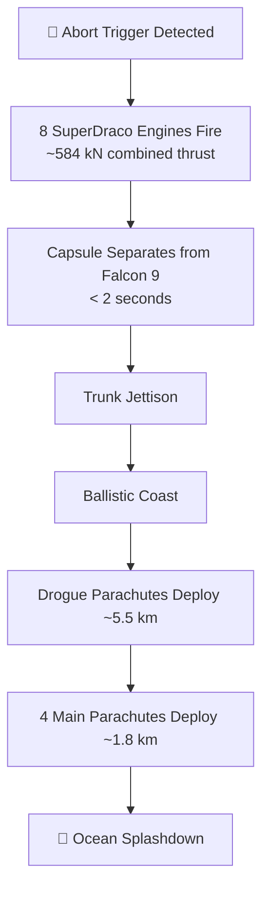

# Draco and SuperDraco Thrusters

> **Dragon uses Draco for precise orbital control and SuperDraco for rapid launch escape.**

## 🎯 Intuition
**The Core Idea:** Draco is Dragon's everyday manoeuvring thruster, while SuperDraco is the much larger abort engine kept ready for emergencies.
**Analogy:** Think of Draco as a spacecraft's steering and parking jets, and SuperDraco as a built-in ejection system for the entire capsule.
**Why It Matters:** Dragon needs extremely reliable propulsion both for routine free-flight operations and for worst-case crew escape. Using hypergolic MMH/NTO propellants means the engines ignite on contact, eliminating a separate ignition system. That simplicity, plus a pressure-fed design with no turbopumps, is especially valuable for crewed missions. SuperDraco also gives Crew Dragon one of the few integrated non-tower launch escape systems ever flown on a crewed spacecraft.

## ⚙️ Core Mechanics
### Key Specifications
- **Draco thrust:** ~400 N per thruster.
- **Draco count on Dragon 2:** 18 thrusters.
- **Draco role:** attitude control, de-orbit burns, and fine orbital adjustments.
- **Draco propellants:** monomethylhydrazine (MMH) / nitrogen tetroxide (NTO), hypergolic.
- **Draco feed system:** pressure-fed with helium pressurant; no turbopumps.
- **SuperDraco thrust:** ~73 kN per engine (~16,000 lbf).
- **SuperDraco count on Crew Dragon:** 8 engines in 4 pods × 2.
- **SuperDraco construction:** 3D-printed Inconel 718 combustion chambers via direct metal laser sintering (DMLS).
- **SuperDraco role:** launch abort system (LAS); originally planned for propulsive landing.
- **SuperDraco performance notes:** deep throttle capable; ~235 s specific impulse.

### Key Facts
- Dragon 2 mounts **18 Draco thrusters arranged in redundant pairs around the spacecraft's trunk and nose cone**.
- Draco thrusters are typically used in **on/off pulsed** operation for control authority.
- In an abort, **all eight SuperDraco engines fire simultaneously**, producing **~584 kN combined thrust**.
- The eight SuperDracos are installed in **four paired pods embedded in Crew Dragon's sidewall**.
- Crew Dragon can separate from Falcon 9 in **under 2 seconds** during an abort.
- **Pad Abort Test:** **May 6, 2015** at **Cape Canaveral LC-40**.
- **In-Flight Abort Test:** **January 19, 2020**, about **84 s after launch** in the **Max-Q regime**.
- Both abort tests were **successful**, clearing the way for crewed flights.
- The original **propulsive landing plan was cancelled around 2017**, and SuperDraco was repurposed to abort-only service.

### Mermaid Diagram

## 🔬 Deep Dive
### Engineering Details
Draco and SuperDraco share the same hypergolic MMH/NTO propellant family and pressure-fed architecture, but they solve very different engineering problems. Draco emphasises simplicity, repeatability, and fine control for orbital manoeuvring, while SuperDraco is sized for a short, violent, human-rated escape burn. The lack of turbopumps reduces mechanical complexity, and hypergolic ignition improves reliability because the engines do not need spark or pyrotechnic ignition hardware.

SuperDraco's **3D-printed Inconel 718 chambers** were one of the earliest major demonstrations that additive manufacturing could support **flight-critical propulsion hardware** and even **human-spaceflight certification**. That mattered beyond Dragon itself because it showed that advanced manufacturing could shorten iteration cycles without giving up performance or safety margins.

### Comparison

| Parameter | Draco | SuperDraco |
|-----------|-------|------------|
| Thrust | ~400 N | ~73 kN |
| Combined installed count on Dragon 2 / Crew Dragon | 18 | 8 (4 pods × 2) |
| Primary role | Attitude control, de-orbit burns, orbit adjust | Launch abort (originally propulsive landing) |
| Propellant | MMH / NTO | MMH / NTO |
| Feed system | Pressure-fed | Pressure-fed |
| Chamber construction | Conventional | 3D-printed Inconel 718 |
| Ignition | Hypergolic | Hypergolic |
| Throttle behaviour | No; on/off pulsed | Yes; deep throttle capable |
| Specific impulse | ~300 s (est.) | ~235 s |

## 🏋️ Practice
### Warm-Up — 3 Conceptual Questions
1. Why are hypergolic propellants especially attractive for a crew escape system?
2. What does a pressure-fed design avoid compared with a turbopump-fed design?
3. Why would a spacecraft need many small Draco thrusters instead of a few large ones for attitude control?

### Core Analysis — 2 "What If" Scenarios
1. If SuperDraco had to use a non-hypergolic propellant pair, what extra subsystems would be required and how might that affect abort reliability?
2. If Dragon 2 had fewer than 18 Draco thrusters, how would that reduce redundancy during orbital manoeuvring or attitude-control failures?

### Challenge
Design a short decision memo explaining why a pressure-fed hypergolic system is acceptable for Dragon despite lower performance than pump-fed alternatives. Your answer should reference thrust level, mission role, ignition reliability, and crew-safety constraints.

## References

→ [[SpaceX/Sources/Sources Index|Sources Index]]
