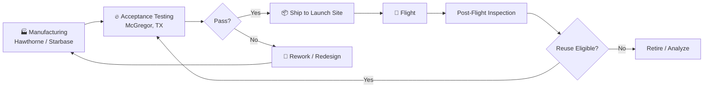

# Engine Manufacturing and Testing

> **SpaceX builds engines in-house and hot-fires every flight engine before it flies.**

## 🎯 Intuition
**The Core Idea:** SpaceX treats manufacturing and testing as one rapid loop: build hardware, fire it, learn from it, and feed improvements back into production.
**Analogy:** It is closer to a high-speed automotive race team than a traditional aerospace prime-contractor chain.
**Why It Matters:** Vertical integration lets SpaceX control cost, schedule, and design changes without waiting on dozens of outside suppliers. A hardware-rich test culture means problems are usually found at McGregor instead of during flight. That combination is central to both Falcon reuse and Starship scale-up.

## ⚙️ Core Mechanics
### Key Specifications
- **Primary Merlin production:** Hawthorne, California.
- **Raptor production:** Starbase / Central Texas.
- **Main test site:** McGregor, Texas.
- **Merlin test orientation:** horizontal stands.
- **Raptor test orientation:** vertical stands.
- **Acceptance policy:** every flight engine is hot-fire acceptance-tested to full duration before delivery.
- **Reuse policy:** post-flight engines are inspected and re-tested or re-qualified before reuse when applicable.
- **Additive manufacturing examples:** SuperDraco Inconel chambers via DMLS; Raptor components for part-count reduction.
- **Raptor production target:** multiple engines per day / multiple Raptors per day at full rate.

### Key Facts
- Hawthorne is SpaceX's **corporate HQ** and the historic centre of **Merlin and Dragon-thruster production**.
- Starbase and Central Texas support **Raptor production** and **Starship integration**.
- McGregor is one of the **most active rocket-engine test sites in the world**.
- SpaceX builds **turbopumps, injectors, combustion chambers, valves, and avionics** in-house.
- Vertical integration allows changes to move from **CAD to flight hardware in weeks**, rather than the **months or years** often seen in a traditional outsourced supply chain.
- Development campaigns at McGregor can involve **hundreds of test firings**, especially for new Raptor variants.

### Mermaid Diagram

## 🔬 Deep Dive
### Engineering Details
Traditional aerospace manufacturing often distributes major subsystems across a large vendor network. SpaceX instead internalises much of that work, including propulsion-critical items such as turbopumps, injectors, chambers, and valves. That shortens design-feedback loops and reduces vendor interface friction, but it also requires SpaceX to operate as both manufacturer and integrator at very high tempo.

McGregor closes that loop. **Every flight engine** is fired before shipment, which is a strong filter against latent manufacturing defects. **Merlin engines** use **horizontal stands**, while **Raptor engines** use **vertical stands** that better reflect their installed configuration. Returned engines are inspected after flight and can be re-tested before reuse, making the test site part of the refurbishment system rather than just the initial qualification path.

### Comparison

| Attribute | SpaceX (Vertical Integration) | Traditional Model (Outsourced) |
|-----------|------------------------------|-------------------------------|
| Turbopump supplier | In-house | Aerojet Rocketdyne / subcontractors |
| Injector fabrication | In-house (pintle / 3D-printed) | Specialist vendors |
| Design iteration cycle | Weeks | Months to years |
| Acceptance test location | McGregor (company-owned) | Often contractor or government facility |
| Production rate target | Multiple Raptors / day | Single-digit engines / month (industry norm) |
| Post-flight engine reuse | Routine (Merlin); developing (Raptor) | Rare or non-existent |
| Additive manufacturing | Extensive (SuperDraco, Raptor parts) | Limited / emerging |

## 🏋️ Practice
### Warm-Up — 3 Conceptual Questions
1. Why does vertical integration shorten the engineering feedback loop?
2. Why is full-duration acceptance testing valuable even after a manufacturing line has matured?
3. Why might Raptor use vertical stands while Merlin uses horizontal stands?

### Core Analysis — 2 "What If" Scenarios
1. If SpaceX outsourced turbopumps and injectors to separate vendors, how would that likely affect schedule, redesign speed, and cost control?
2. If a returned flight engine skipped McGregor re-testing, what kinds of reuse risks would remain hidden?

### Challenge
Write a short trade study comparing a high-rate in-house engine factory with a slower outsourced model. Include effects on production cadence, failure discovery, configuration control, and reusability.

## References

→ [[SpaceX/Sources/Sources Index|Sources Index]]
