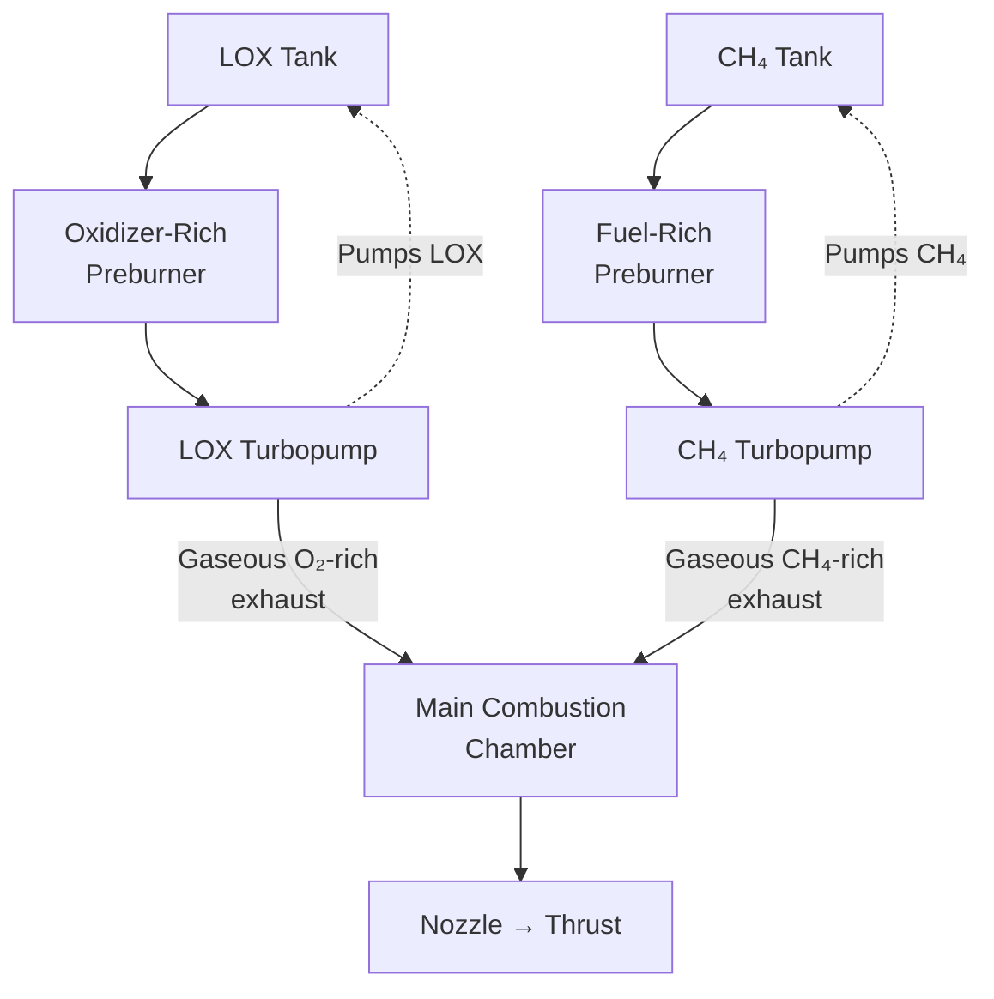

# Full-Flow Staged Combustion Cycle

> **FFSC sends all fuel and all oxidizer through separate preburners so no turbine exhaust is wasted.**

## 🎯 Intuition
**The Core Idea:** A full-flow staged combustion engine uses two preburners so that both propellants are completely gasified before entering the main chamber.
**Analogy:** Instead of throwing away some steam after spinning a turbine, FFSC routes every useful flow back into the main machine.
**Why It Matters:** Because no turbine exhaust is dumped overboard, more of the propellant contributes directly to thrust. Lower turbine temperatures at a given power level improve life and reuse potential. That is why FFSC is often seen as the highest-performance practical pump-fed cycle in chemical rocketry.

## ⚙️ Core Mechanics
### Key Specifications
- **Preburners:** two total — one fuel-rich and one oxidizer-rich.
- **Flow path:** all propellant is gasified before entering the main combustion chamber.
- **Turbine exhaust:** none dumped overboard.
- **Combustion state at chamber inlet:** gas + gas.
- **Raptor chamber pressure:** ~300 bar.
- **Historical attempt:** Soviet **RD-270** in the **1960s** using hypergolic propellants; never flew.
- **Subscale test work:** **JAXA** in the **1990s-2000s**.
- **First operational FFSC engine:** SpaceX **Raptor**.
- **First flight of operational FFSC:** **Starhopper**, **August 2019**.

### Key Facts
- The **fuel-rich preburner** drives the **fuel turbopump**.
- The **oxidizer-rich preburner** drives the **oxidizer turbopump**.
- FFSC improves efficiency relative to a **gas-generator cycle**, where turbine exhaust is discarded.
- FFSC also differs from ordinary staged combustion because **both** propellant streams, not just one, pass through preburners.
- All-gas injection into the main chamber promotes **stable combustion** and helps reduce destructive pressure oscillations.
- SpaceX's success depended not just on theory, but also on **modern metallurgy**, **computational fluid dynamics**, and a **hardware-rich development culture** with many engine tests.

### Mermaid Diagram

## 🔬 Deep Dive
### Engineering Details
In a gas-generator engine, a fraction of propellant is sacrificed to spin the pumps and then lost as relatively low-velocity exhaust. Standard staged combustion improves on that by routing preburner exhaust into the main chamber, but usually only one propellant stream is fully gasified while the other still enters mainly as liquid. FFSC closes the loop completely: one preburner handles the fuel-rich stream and one handles the oxidizer-rich stream, so the chamber receives two gaseous streams.

This architecture has several consequences. Because each turbine sees a propellant-compatible gas stream, turbine temperatures can be lower for the same power level. Because nothing is dumped overboard, specific impulse can be higher. Because the chamber receives fully gaseous propellants, mixing can be very effective. These benefits made FFSC attractive for decades, but difficult materials, preburner chemistry, and turbine durability kept it from operational service until Raptor.

### Comparison

| Cycle | Preburner(s) | Turbine Exhaust | Propellant in Main Chamber | Typical Isp | Examples |
|-------|-------------|-----------------|---------------------------|-------------|----------|
| Gas Generator | 1 (fuel-rich) | Dumped overboard | Liquid + liquid | Moderate | Merlin, F-1, RS-68 |
| Staged Combustion (fuel-rich) | 1 (fuel-rich) | Into main chamber | Gas + liquid | High | RS-25 (SSME) |
| Staged Combustion (ox-rich) | 1 (ox-rich) | Into main chamber | Liquid + gas | High | RD-180, BE-4 |
| **Full-Flow Staged Combustion** | **2 (fuel-rich + ox-rich)** | **Both into main chamber** | **Gas + gas** | **Highest** | **Raptor** |
| Expander | 0 (heat from chamber) | Into main chamber or overboard | Gas + liquid (or gas) | Moderate-High | RL-10, Vinci |

## 🏋️ Practice
### Warm-Up — 3 Conceptual Questions
1. Why does FFSC need two preburners instead of one?
2. What efficiency penalty does a gas-generator engine pay that FFSC avoids?
3. Why might lower turbine temperature improve engine life?

### Core Analysis — 2 "What If" Scenarios
1. If one FFSC turbine exhaust stream were dumped overboard instead of entering the chamber, which advantages of FFSC would be lost?
2. If the main chamber received one gaseous stream and one liquid stream, how would that move the design closer to ordinary staged combustion?

### Challenge
Explain why FFSC was historically attractive but operationally difficult. Your answer should connect cycle efficiency, materials limits, turbine environment, and test-driven iteration.

## References

→ [[Sources Index]]
