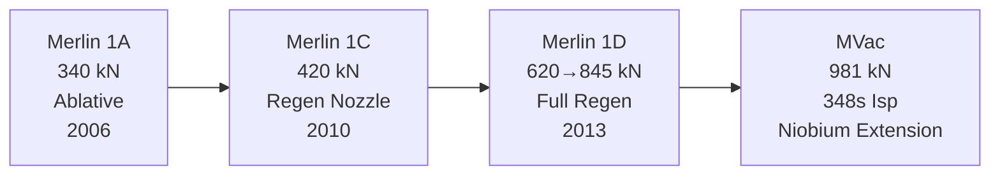

# Merlin Engine Family

> **Merlin is SpaceX's reusable LOX/RP-1 workhorse engine family built around a simple gas-generator cycle and a pintle injector.**

## 🎯 Intuition
**The Core Idea:** Merlin trades some peak thermodynamic efficiency for a simpler, cheaper, highly reusable engine architecture.
**Analogy:** It is like a tough, mass-producible truck engine rather than an exotic race engine built only for maximum theoretical efficiency.
**Why It Matters:** Falcon 9 reuse depends on engines that are powerful, manufacturable, and throttleable enough for landing burns. Merlin's gas-generator cycle and pintle injector helped SpaceX reach that balance. Its evolution from Merlin 1A to Merlin 1D and MVac shows how repeated upgrades turned an early Falcon 1 engine into the most-flown American liquid-fuel engine family in history.

## ⚙️ Core Mechanics
### Key Specifications
- **Cycle:** open gas-generator cycle.
- **Propellants:** liquid oxygen (LOX) / RP-1.
- **Turbomachinery:** single-shaft turbopump.
- **Injector heritage:** pintle injector derived from **Tom Mueller's TRW work**.
- **Merlin 1A:** **340 kN**, ablative cooling, **2006** first flight era.
- **Merlin 1C:** **420 kN**, regeneratively cooled nozzle section / regen nozzle, **2010**.
- **Merlin 1D:** **620 kN → 845 kN**, full regenerative cooling, **2013**.
- **MVac:** **981 kN**, **348 s Isp**, niobium nozzle extension.
- **Thrust-to-weight:** ~**150:1** for Merlin 1D.
- **Throttle capability:** down to about **40%** for landing operations.

### Key Facts
- The pintle injector uses a **single central element** rather than hundreds of small injector orifices.
- SpaceX **licensed and refined** the pintle-injector concept for the Merlin family.
- Merlin's gas generator burns a small portion of propellant to drive the turbopump, then dumps that exhaust overboard.
- Merlin 1A and early versions used **ablative cooling**, while later versions moved to **regenerative cooling** for higher chamber pressure, longer burn duration, and better reuse margins.
- Falcon 9 uses **nine Merlin engines** on the booster, which also provides **engine-out capability**.
- The vacuum version uses a **large niobium nozzle extension** with **radiative cooling** to raise expansion ratio and upper-stage efficiency.
- Merlin 1D+ specific impulse is **282 s at sea level** and **311 s in vacuum**.

### Mermaid Diagram

## 🔬 Deep Dive
### Engineering Details
Merlin's central trade is cycle simplicity. An open gas-generator cycle is less efficient than staged combustion because some turbine-driving exhaust never contributes to main-chamber thrust, but it is easier to manufacture, easier to operate, and easier to scale. That was a strong fit for Falcon, where cost, reliability, and repeated flight mattered more than chasing maximum theoretical specific impulse.

The other defining choice is the **pintle injector**, rooted in **Tom Mueller's TRW experience**. Pintle injectors can be robust, throttle-friendly, and comparatively simple to build. Combined with the shift from ablative to regenerative cooling, that gave SpaceX a path from early Falcon 1 hardware to a reusable booster engine family capable of landing burns and high flight cadence.

### Comparison

| Variant | Thrust (SL) | Isp (SL / Vac) | Cooling | First Flight |
|---------|-------------|-----------------|---------|--------------|
| Merlin 1A | 340 kN | 255 s / 304 s | Ablative | 2006 (Falcon 1) |
| Merlin 1C | 420 kN | 275 s / 304 s | Regen nozzle | 2010 (Falcon 9 v1.0) |
| Merlin 1D | 620 kN → 845 kN | 282 s / 311 s | Full regen | 2013 (Falcon 9 v1.1) |
| MVac (1D) | — (vacuum) | — / 348 s | Regen + radiative niobium extension | 2013 (Falcon 9 v1.1) |

## 🏋️ Practice
### Warm-Up — 3 Conceptual Questions
1. Why is a gas-generator engine usually simpler than a staged-combustion engine?
2. What makes a pintle injector attractive for throttleable rocket engines?
3. Why did regenerative cooling matter for Merlin reuse?

### Core Analysis — 2 "What If" Scenarios
1. If Merlin could only throttle shallowly instead of down to ~40%, how would Falcon 9 landing burns become harder?
2. If Merlin had kept ablative cooling into the 1D era, what reuse and chamber-pressure limitations would likely remain?

### Challenge
Compare Merlin's design philosophy with a higher-efficiency staged-combustion engine. Argue why Merlin's lower-complexity architecture was a better fit for Falcon booster reuse.

## See Also

- [[Falcon 9 Architecture]]
- [[Engine Manufacturing and Testing]]
- [[McGregor Test Facility]]
- [[Falcon Performance Specifications]]

## References

→ [[Sources Index]]
