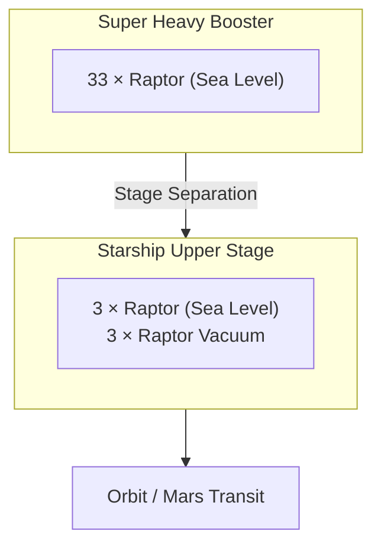

# Raptor Engine

> **Raptor is SpaceX's methane-fueled full-flow staged combustion engine for Starship and Super Heavy.**

## 🎯 Intuition
**The Core Idea:** Raptor combines a methane fuel choice with a full-flow staged combustion cycle to maximise efficiency, thrust, and reusability.
**Analogy:** It is the high-pressure turbine core that makes Starship possible in the same way Merlin made Falcon practical.
**Why It Matters:** Raptor is the first FFSC engine to fly and the first to reach operational flight service. Its methane fuel supports both rapid reuse on Earth and long-term Mars in-situ resource utilisation (ISRU). Without Raptor-class performance, Starship's fully reusable super-heavy architecture would be far harder to close economically.

## ⚙️ Core Mechanics
### Key Specifications
- **Cycle:** full-flow staged combustion (FFSC).
- **Propellants:** liquid oxygen / liquid methane (LOX / CH₄), commonly described as sub-cooled.
- **Preburners:** two total — one oxidizer-rich and one fuel-rich.
- **Raptor 2 sea-level thrust:** ~**230 tf** (~**2,256 kN**).
- **Chamber pressure:** ~**300 bar**.
- **Specific impulse:** ~**327 s** sea level / ~**350 s** vacuum.
- **First flight:** **Starhopper**, **August 2019**.
- **Role:** powers **Starship** and **Super Heavy**.

### Key Facts
- In FFSC, **all** oxidizer passes through an **oxidizer-rich preburner** and **all** fuel passes through a **fuel-rich preburner**.
- No propellant is dumped overboard, so every molecule can contribute to thrust.
- Methane was chosen because it is **clean-burning**, causes **low coking**, and is relevant to **Mars ISRU** via the **Sabatier reaction** using atmospheric **CO₂** and subsurface water ice.
- Methane also sits in a useful middle ground between hydrogen's high specific impulse and kerosene's higher density.
- Raptor 2 is a high-volume production engine intended for **thousands** of future Starship fleet engines.

### Mermaid Diagram

## 🔬 Deep Dive
### Engineering Details
Raptor's defining achievement is bringing **full-flow staged combustion** into operational flight. Each propellant stream is fully gasified before entering the chamber, which improves chamber mixing and avoids the performance penalty of dumping turbine exhaust overboard. That is a major reason the engine can sustain about **300 bar chamber pressure**, placing it among the highest-pressure operational rocket engines ever flown.

The methane choice is strategic as well as thermodynamic. Compared with RP-1, methane burns cleaner and reduces soot deposition in cooling channels and turbomachinery, making rapid reuse easier. Compared with hydrogen, methane is denser and easier to manage in a large reusable launch system. That combination is why Raptor is tied so closely to both Starship's terrestrial flight cadence and SpaceX's Mars architecture.

### Comparison

| Engine | Cycle | Propellant | Thrust (SL) | Chamber Pressure | Isp (SL / Vac) |
|--------|-------|------------|-------------|-----------------|-----------------|
| Raptor 2 | FFSC | LOX / CH₄ | ~230 tf | ~300 bar | 327 s / 350 s |
| RS-25 (SSME) | Staged combustion | LOX / LH₂ | ~181 tf (vac rated) | ~206 bar | — / 452 s |
| BE-4 | Ox-rich staged combustion | LOX / CH₄ | ~250 tf | ~134 bar | ~270 s / ~320 s |
| RD-180 | Ox-rich staged combustion | LOX / RP-1 | ~390 tf | ~267 bar | 311 s / 338 s |

## 🏋️ Practice
### Warm-Up — 3 Conceptual Questions
1. Why does methane produce less coking than RP-1 in a reusable engine?
2. What does Raptor gain by using two preburners instead of one?
3. Why is chamber pressure such a useful shorthand for engine performance ambition?

### Core Analysis — 2 "What If" Scenarios
1. If Raptor used RP-1 instead of methane, how would reuse and Mars ISRU arguments change?
2. If turbine exhaust were dumped overboard, which parts of Raptor's FFSC advantage would disappear?

### Challenge
Defend the claim that Raptor is not just a larger engine, but a different propulsion strategy from Merlin. Use cycle, propellant, chamber pressure, reuse implications, and vehicle architecture in your answer.

## See Also

- [[Starship Vehicle Architecture]]
- [[Full-Flow Staged Combustion Cycle]]
- [[Raptor Evolution and Raptor 3]]
- [[Manufacturing Innovation]]

## References

→ [[Sources Index]]
