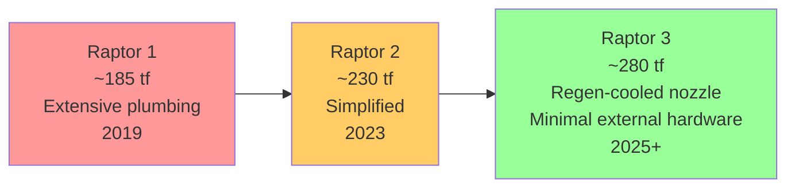

# Raptor Evolution and Raptor 3

> **Each Raptor generation increases thrust while stripping away parts, plumbing, and thermal complexity.**

## 🎯 Intuition
**The Core Idea:** Raptor evolution is mostly about simplification: fewer parts, less external hardware, higher thrust, and easier reuse.
**Analogy:** It is like redesigning a race car so that each new model is both faster and easier to service between laps.
**Why It Matters:** Early Raptor hardware proved the FFSC concept could fly, but production-scale Starship operations need engines that are cheaper, simpler, and more robust. That is why SpaceX moved from Raptor 1 to Raptor 2 and toward Raptor 3. The progression is a direct expression of the idea that the best part is no part and the best process is no process.

## ⚙️ Core Mechanics
### Key Specifications
- **Raptor 1:** ~**185 tf**, extensive external plumbing, **2019** first flight era.
- **Raptor 2:** ~**230 tf**, reduced parts, **2022-present** production era.
- **Raptor 3:** ~**280 tf** target, regeneratively cooled nozzle, minimal external hardware, **mid-2025+** target timeframe.
- **Cycle family:** all are methane-fueled FFSC Raptor derivatives.
- **Part-count trend:** each version reduces total part count by **hundreds**.
- **Vacuum variants:** **RVac** engines exist for vacuum duty with extended nozzles.

### Key Facts
- **Raptor 1** powered **Starhopper** and early **SN-series** Starship prototypes.
- Raptor 1 had **extensive external plumbing**, significant shielding, and a comparatively high part count.
- Many Raptor 1 units experienced the expected reliability issues of an early, fundamentally new cycle during static fires and flights.
- **Raptor 2** raised thrust to about **230 tf** while cutting hardware and simplifying manifolds and plumbing.
- Raptor 2 is the current production backbone for integrated Starship flight tests, including **IFT-1 through IFT-4 and beyond**, and for operational engine sets.
- **Raptor 3** aims to internalise even more hardware and use a **fully regeneratively cooled nozzle**.
- Raptor 3's nozzle approach removes the need for separate film-cooling or ablative thermal protection used in earlier versions.
- With less shielding, fewer bolted joints, and plumbing internalised into the engine structure, Raptor 3 has been described as looking almost "naked" compared with earlier versions.
- SpaceX has indicated that further thrust growth beyond **280 tf** may be possible with future materials and turbopump improvements.

### Mermaid Diagram

## 🔬 Deep Dive
### Engineering Details
Raptor 1 was the development-heavy version: technically groundbreaking, but visually busy and operationally complex. It carried much of the external plumbing, shielding, and layout conservatism typical of an engine family still proving a new cycle. Raptor 2 kept the same fundamental FFSC architecture but reworked packaging and manufacturability, reducing part count by hundreds while still increasing thrust to about **230 tf**.

Raptor 3 extends that simplification logic. A **fully regeneratively cooled nozzle** means less separate thermal-protection hardware, fewer exposed systems, and less refurbishment burden between flights. In that sense, Raptor evolution is not only about raw performance; it is about changing the maintenance and production economics of Starship operations.

### Comparison

| Parameter | Raptor 1 | Raptor 2 | Raptor 3 |
|-----------|----------|----------|----------|
| Thrust (SL, approx.) | ~185 tf | ~230 tf | ~280 tf (target) |
| Chamber pressure | ~250-270 bar | ~300 bar | ~300+ bar |
| Nozzle cooling | Film-cooled + shielding | Film-cooled, reduced shielding | Fully regeneratively cooled |
| External plumbing | Extensive | Simplified | Largely internalised / minimal external hardware |
| Part count | Baseline | Significantly reduced | Further reduced |
| Status | Development / retired | Current production | Testing / early production |
| Production era | 2019 first flight era | 2022-present | Mid-2025+ target |
| First flight | 2019 (Starhopper) | 2023 (IFT-1) | Expected mid-2025+ |
| Vacuum variant | RVac 1 | RVac 2 | RVac 3 (in development) |

## 🏋️ Practice
### Warm-Up — 3 Conceptual Questions
1. Why does reducing part count usually help both manufacturing speed and reliability?
2. What is the engineering value of moving plumbing from outside the engine to internal passages?
3. Why would a regeneratively cooled nozzle matter for high-cadence reuse?

### Core Analysis — 2 "What If" Scenarios
1. If Raptor 2 had increased thrust without reducing parts, what production or maintenance problems might still limit Starship cadence?
2. If Raptor 3 failed to eliminate much external hardware, how would that weaken the case for airline-like reuse?

### Challenge
Use Raptor 1, 2, and 3 to explain how engine development can improve performance and manufacturability at the same time. Include thrust, chamber pressure, nozzle cooling, plumbing, and part-count trends.

## References

→ [[Sources Index]]
