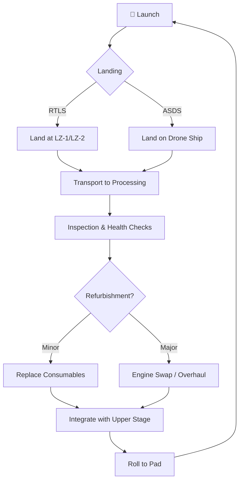

# Block 5 and Fleet Management

> **Block 5 is the final major revision of Falcon 9, purpose-built for rapid, routine reuse — and the fleet-management practices SpaceX has developed around it represent an operational revolution in rocketry.**

## 🎯 Intuition
**The Core Idea:** Block 5 turned a rocket into a reusable fleet vehicle by designing every component — from bolted engines to titanium fins — for dozens of flights with minimal refurbishment.
**Analogy:** Block 5 = the Boeing 737 of rockets — designed for routine reuse, tracked by tail number, rotated across missions, and maintained on a schedule rather than rebuilt from scratch.
**Why It Matters:** Block 5 transformed reusable rocketry from a technology demonstration into a production-scale business. The ability to fly the same booster 20+ times with turnaround measured in weeks is the single largest driver behind SpaceX's cost reductions and cadence dominance. Fleet management practices developed here directly inform the operational model for Starship.

## ⚙️ Core Mechanics
### Key Specifications

| Parameter | Value |
|---|---|
| First Block 5 flight | 11 May 2018 (Bangabandhu-1) |
| Design reuse target | 10 flights minimal refurb / up to 100 with overhaul |
| LEO capacity (reusable) | ~22,800 kg |
| LEO capacity (expendable) | ~25,000 kg (estimated) |
| GTO capacity (reusable) | ~8,300 kg |
| GTO capacity (expendable) | ~11,200 kg (estimated) |
| Cost per mission (reusable) | ~$67 M list price |
| Fastest same-booster turnaround | Under 22 days |
| Human-rating | Only Falcon 9 variant certified for NASA Commercial Crew |

### Key Facts
- **Titanium grid fins** replaced earlier aluminium ones; survive re-entry heating without replacement across dozens of flights
- **Octaweb engine mount** is bolted (not welded), allowing individual Merlin 1D engines to be inspected and swapped without cutting the thrust structure
- **Thermal protection system (TPS)** uses ablative coating on the base heat shield and high-temperature paint on the interstage, producing the distinctive sooty black appearance
- **Retractable landing legs** fold flush against the stage, simplifying post-landing transport and reducing turnaround labour
- **Notable boosters:** B1058 (20+ flights), B1060 (20+ flights), B1061 (20+ flights), B1062 among fleet leaders
- **Fairing reuse:** Both halves recovered and reflown, further cutting costs
- **Fleet assignment strategy:** Crewed/high-value missions fly on lower-flight-count or recently-inspected boosters; Starlink missions absorb the highest-flight-count boosters as a proving ground

### Booster Reuse Cycle

## 🔬 Deep Dive
### Engineering Details
Every element of Block 5 was redesigned with reuse as the primary requirement rather than an afterthought. The Octaweb engine mount's bolted construction is a critical enabler: on earlier versions, the welded thrust structure meant that accessing a single engine required destructive disassembly. The switch to titanium grid fins eliminated a major refurbishment bottleneck — aluminium fins charred and deformed during re-entry, requiring replacement after every flight. Titanium survives dozens of re-entries without degradation.

SpaceX tracks each booster by serial number (e.g., B1058, B1060, B1061), managing them as a reusable fleet much like an airline manages its aircraft. After landing — either at the launch site (RTLS) or on an autonomous drone ship downrange — the booster is transported to the processing facility for inspection, engine health checks, and any necessary refurbishment. Over successive flights, SpaceX has steadily reduced inspection scope as confidence in the hardware has grown. The fastest same-booster turnaround on record has been driven below 22 days — a figure unthinkable in the Shuttle era.

Fleet management involves strategic decisions about which boosters fly which missions. Higher-value or crewed flights (e.g., Crew Dragon for NASA) typically fly on boosters with fewer total flights or those with the most recent full inspection cycle, while Starlink deployment missions absorb the highest-flight-count boosters, providing a continuous operational proving ground for reuse longevity.

### Expendable vs. Reusable Configuration

| Attribute | Expendable Configuration | Reusable Configuration |
|---|---|---|
| Booster recovery | No — flies highest-energy profile | Yes — reserves propellant for landing |
| Grid fins | Not required | Titanium, steerable |
| Landing legs | Not installed | Retractable, flight-proven |
| LEO payload (kg) | ~25,000 (estimated) | ~22,800 |
| GTO payload (kg) | ~11,200 (estimated) | ~8,300 |
| Cost per mission | Higher (booster lost) | Lower (~$67 M list price) |
| Typical use case | High-energy GTO/interplanetary | Starlink, LEO, crew missions |

## 🏋️ Practice
### Warm-Up — 3 Conceptual Questions
1. Why does SpaceX use bolted (rather than welded) Octaweb construction on Block 5, and what operational capability does this unlock?
2. Explain why titanium grid fins were a prerequisite for achieving rapid booster turnaround, compared to the earlier aluminium design.
3. Why would SpaceX assign its highest-flight-count boosters to Starlink missions rather than to higher-value commercial payloads?

### Core Analysis — 2 "What If" Scenarios
1. **What if** SpaceX had retained the welded thrust structure and aluminium grid fins from pre-Block 5 designs — how would turnaround time, fleet size requirements, and per-launch cost be affected at 100+ launches per year?
2. **What if** a Block 5 booster suffered a landing-leg deployment failure on an ASDS landing — trace the downstream effects on fleet scheduling, pad turnaround, and manifest commitments for the next 30 days.

### Challenge
1. Design a booster fleet-management policy for a hypothetical competitor operating 8 reusable boosters across 50 annual missions (mix of crewed, commercial GEO, and LEO constellation). Define inspection tiers, maximum flight counts per tier, booster assignment rules, and retirement criteria. Justify your choices using Block 5 fleet data.

## References

→ [[Sources Index]]
