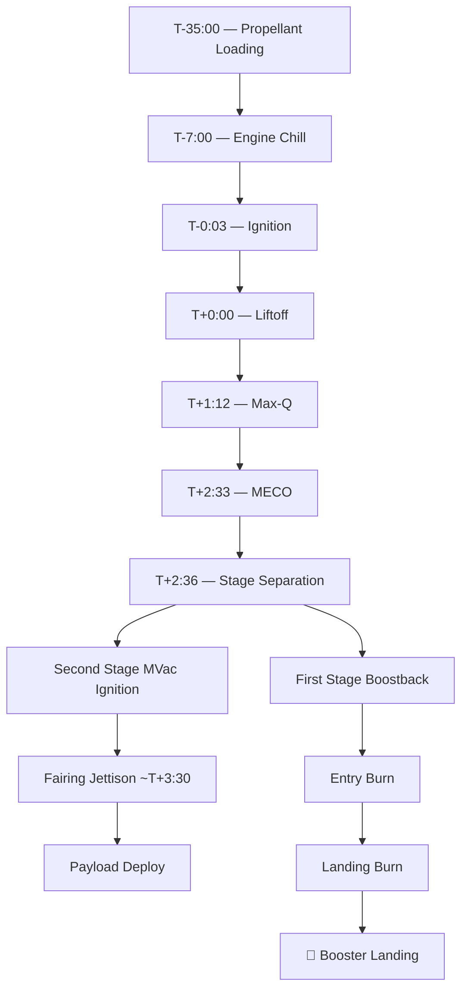

# Falcon 9 Architecture

> **Falcon 9 is SpaceX's two-stage, partially reusable orbital launch vehicle powered by liquid oxygen (LOX) and rocket-grade kerosene (RP-1), serving as the backbone of the global commercial launch market.**

## 🎯 Intuition
**The Core Idea:** Falcon 9 is a two-stage LOX/RP-1 rocket whose reusable first stage lands itself after every mission, fundamentally resetting launch economics.
**Analogy:** Think of Falcon 9 like a commercial airliner — the expensive first stage (fuselage + engines) flies back and is reused, while only the cheap upper stage (like fuel burned in flight) is expended each trip.
**Why It Matters:** Falcon 9 drove the commercial price of a launch down to ~$67 million — a fraction of legacy provider costs. Its reliability record (well above 98% mission success) and rapid production cadence have made it the world's most-flown orbital rocket, enabling everything from Starlink deployment to NASA crew missions aboard Dragon.

## ⚙️ Core Mechanics
### Key Specifications

| Parameter | Value |
|---|---|
| First flight | 4 June 2010 (Falcon 9 v1.0) |
| Height | ~70 m (229.6 ft) including fairing |
| Diameter | 3.7 m (12 ft) |
| First-stage engines | 9 × Merlin 1D (Octaweb pattern) |
| First-stage sea-level thrust | ~845 kN each / ~7,607 kN total |
| Second-stage engine | 1 × Merlin Vacuum (MVac) |
| MVac vacuum thrust | 981 kN |
| MVac specific impulse | 348 s |
| Propellants | Sub-cooled LOX (−207 °C) / chilled RP-1 (−7 °C) |
| LEO capacity (reusable) | ~22,800 kg |
| LEO capacity (expendable) | ~25,000 kg (estimated) |
| GTO capacity (reusable) | ~8,300 kg |
| GTO capacity (expendable) | ~11,200 kg (estimated) |
| Fairing diameter | 5.2 m (two-piece carbon fibre clamshell) |
| Approx. cost per launch | ~$67 M |

### Key Facts
- **First stage:** ~42.6 m tall, 3.7 m diameter, nine Merlin 1D engines in Octaweb pattern (central engine + eight outer), replacing earlier 3×3 grid for improved structural efficiency and thrust vectoring
- **Second stage:** Single Merlin Vacuum (MVac) engine optimised for near-vacuum; single restart capability enables direct GTO injection and rideshare deployments
- **Interstage:** Composite structure with pneumatic pushers for clean stage separation
- **Fairing:** 5.2 m diameter, two-piece carbon fibre clamshell; both halves recovered at sea via net-equipped ships or direct ocean splashdown
- **Stage separation:** Occurs at approximately T+2:33; first stage returns to launch site (RTLS) or lands on autonomous drone ship (ASDS)

### Flight Timeline

## 🔬 Deep Dive
### Engineering Details
Falcon 9 follows a straightforward two-stage-to-orbit architecture. The first stage stands approximately 42.6 metres tall and 3.7 metres in diameter, housing nine Merlin 1D engines arranged in the signature Octaweb pattern — a central engine ringed by eight outer engines. This layout replaced the earlier 3×3 square grid, improving structural efficiency and thrust vectoring authority. At sea level the first stage generates roughly 7,607 kN (1.71 million lbf) of thrust. After stage separation at approximately T+2:33, the first stage either returns to the launch site or lands on an autonomous drone ship downrange.

The second stage is a shorter, single-engine unit powered by the Merlin Vacuum (MVac) engine, optimised for near-vacuum conditions. The MVac produces 981 kN of thrust with a specific impulse of 348 seconds, enabling precise orbital insertion. A single restart capability allows complex mission profiles including direct GTO injection and multi-manifest rideshare deployments.

Connecting the two stages is a composite interstage equipped with pneumatic pushers for clean separation. The payload is enclosed in a 5.2-metre-diameter, two-piece clamshell fairing made of carbon fibre composite. Both fairing halves are recovered at sea using net-equipped ships or direct ocean splashdown, further reducing mission cost.

### Comparison with Competitors

| Attribute | Falcon 9 Block 5 | Atlas V 401 | Ariane 5 ECA |
|---|---|---|---|
| Stages | 2 | 2 (+ optional SRBs) | 2 (+ 2 SRBs) |
| First-stage engines | 9 × Merlin 1D | 1 × RD-180 | 1 × Vulcain 2 |
| LEO capacity (kg) | ~22,800 | ~9,800 | ~20,000 |
| GTO capacity (kg) | ~8,300 (reusable) | ~4,750 | ~10,500 |
| Reusability | First stage + fairings | Expendable | Expendable |
| Approx. cost (USD) | ~$67 M | ~$110 M | ~$180 M |

## 🏋️ Practice
### Warm-Up — 3 Conceptual Questions
1. Why does Falcon 9 use nine smaller engines (Merlin 1D) rather than a single large engine, and what redundancy advantage does this provide during ascent?
2. Explain how sub-cooled LOX (−207 °C) and chilled RP-1 (−7 °C) increase payload capacity without physically lengthening the tanks.
3. What is the purpose of the single-restart capability on the MVac engine, and name two mission profiles that require it.

### Core Analysis — 2 "What If" Scenarios
1. **What if** the Falcon 9 second stage were also recovered and reused — analyse the delta-v budget trade-offs, thermal protection requirements, and the impact on payload capacity to LEO and GTO.
2. **What if** SpaceX lost the ability to recover fairings at sea — estimate the per-launch cost increase and the downstream effect on Starlink deployment economics at 100+ launches per year.

### Challenge
1. A satellite operator needs to deliver a 7,500 kg spacecraft to GTO. Compare Falcon 9 (reusable) vs. Atlas V 401 vs. Ariane 5 ECA on payload margin, cost, and schedule availability. Recommend a vehicle and justify your choice with the specification data above.

## See Also

- [[Merlin Engine Family]]
- [[Propulsive Landing Technology]]
- [[Block 5 and Fleet Management]]
- [[Mission Control and Launch Operations]]

## References

→ [[SpaceX/Sources/Sources Index|Sources Index]]
