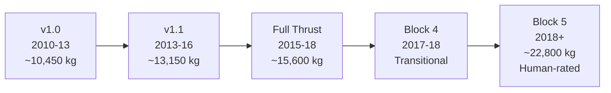

# Falcon 9 Evolution

> **Falcon 9 has progressed through five major hardware versions since 2010, each delivering step-change improvements in performance, reliability, and reusability.**

## 🎯 Intuition
**The Core Idea:** Falcon 9 evolved through five rapid hardware iterations — each version folding in lessons from the last — more than doubling LEO capacity from ~10,450 kg to ~22,800 kg in eight years.
**Analogy:** Like smartphone generations — each release looks similar but packs major internal upgrades (better engine, denser fuel, reuse hardware) that compound into a transformatively different product by v5.
**Why It Matters:** The evolutionary approach allowed SpaceX to retire risk incrementally while continuously flying revenue missions. This iterative model — rare in the launch industry — is a key reason SpaceX achieved both high reliability and rapid cadence far faster than traditional programmes that attempt a single large design-then-fly cycle.

## ⚙️ Core Mechanics
### Key Specifications

| Version | Period | Flights | Engine | LEO Capacity (kg) | Key Innovation |
|---|---|---|---|---|---|
| v1.0 | 2010–2013 | 5 | Merlin 1C | ~10,450 | Proof of concept |
| v1.1 | 2013–2016 | 15 | Merlin 1D | ~13,150 | Stretched tanks, Octaweb |
| Full Thrust | 2015–2018 | ~24 | Merlin 1D+ | ~15,600 | Densified propellants, landing legs |
| Block 4 | 2017–2018 | 5 | Merlin 1D+ | ~15,600 | Transitional to Block 5 |
| Block 5 | 2018–present | 300+ | Merlin 1D+ | ~22,800 | Designed-for-reuse, human-rated |

### Key Facts
- **v1.0:** 5 flights (Jun 2010 – Mar 2013), Merlin 1C engines in 3×3 grid, ~10,450 kg to LEO, proved ISS cargo delivery under NASA COTS, no recovery hardware
- **v1.1:** 15 flights (Sep 2013 – Jan 2016), Merlin 1D engines, Octaweb layout, tanks stretched ~60%, ~13,150 kg to LEO, first experimental sea landing attempts
- **Full Thrust (FT):** First flight Dec 2015, sub-cooled (densified) LOX/RP-1 propellants increased mass without lengthening tanks, ~15,600 kg to LEO, landing legs and grid fins became standard, first successful booster landing 22 Dec 2015 at Landing Zone 1
- **Block 4:** 5 flights (2017–2018), transitional variant bridging Full Thrust to Block 5
- **Block 5:** First flight 11 May 2018 (Bangabandhu-1), designed for 10+ reuses with minimal refurbishment / up to 100 with overhaul, TPS improvements, bolt-on Octaweb, retractable landing legs, black heat-resistant coatings, only variant human-rated for NASA Commercial Crew
- **Total Falcon 9 flights:** Over 350 (as of early 2025)
- **Performance gain v1.0 → Block 5:** LEO capacity more than doubled (~10,450 → ~22,800 kg)

### Version Progression

## 🔬 Deep Dive
### Engineering Details
The original Falcon 9 v1.0 flew five times between June 2010 and March 2013, proving the basic two-stage LOX/RP-1 architecture and qualifying the Merlin 1C engine cluster in its 3×3 grid arrangement. With a LEO capacity of roughly 10,450 kg, v1.0 demonstrated cargo delivery to the ISS under NASA's COTS programme but lacked any recovery hardware.

Falcon 9 v1.1, introduced in September 2013, was a substantial redesign rather than a simple upgrade. The first-stage tanks were stretched by roughly 60%, the engine layout changed to the now-iconic Octaweb pattern, and the more powerful Merlin 1D engine replaced the 1C. These changes boosted LEO capacity to approximately 13,150 kg and enabled the first experimental landing attempts at sea. Fifteen flights were conducted through January 2016, establishing a reliable commercial manifest.

The subsequent Full Thrust variant (first flight December 2015) introduced densified — sub-cooled — propellants, increasing propellant mass without lengthening the tanks. Landing legs and grid fins became standard, and the first successful booster landing occurred on 22 December 2015 at Landing Zone 1. LEO capacity rose to ~15,600 kg.

Block 5, the definitive production version, debuted on 11 May 2018 carrying Bangabandhu-1. Designed from the outset for at least ten flights per booster with minimal refurbishment and up to 100 flights with periodic overhaul, Block 5 introduced TPS improvements, bolt-on Octaweb construction, retractable landing legs, and black heat-resistant coatings. It is the only variant qualified for NASA crewed missions under the Commercial Crew Programme and has dominated SpaceX's manifest since mid-2018.

### Version-over-Version Gains

| Transition | Performance Δ | Key Engineering Change |
|---|---|---|
| v1.0 → v1.1 | +26% LEO capacity | 60% longer tanks, Merlin 1C → 1D, Octaweb layout |
| v1.1 → Full Thrust | +19% LEO capacity | Sub-cooled propellants, landing hardware standard |
| Full Thrust → Block 5 | +46% LEO capacity | TPS overhaul, bolt-on Octaweb, designed-for-reuse |
| v1.0 → Block 5 (total) | +118% LEO capacity | ~10,450 kg → ~22,800 kg in 8 years |

## 🏋️ Practice
### Warm-Up — 3 Conceptual Questions
1. Why was stretching the first-stage tanks by 60% on v1.1 a more impactful change than simply adding a tenth engine?
2. Explain how densified (sub-cooled) propellants increased payload capacity on Full Thrust without physically lengthening the rocket.
3. What specific Block 5 design features made it the first Falcon 9 variant suitable for NASA human-rating certification?

### Core Analysis — 2 "What If" Scenarios
1. **What if** SpaceX had skipped the v1.1 intermediate step and attempted to jump directly from v1.0 to a Full Thrust–class vehicle — analyse the technical risks and how this would have affected the commercial manifest timeline.
2. **What if** Block 5 had been designed for only 3 reuses (like early Shuttle projections) instead of 10+ — model the impact on fleet size, annual launch cadence ceiling, and per-launch cost at 2024 volumes.

### Challenge
1. Using the version progression table, calculate the compound annual growth rate (CAGR) of Falcon 9's LEO capacity from v1.0 (2010) to Block 5 (2018). Compare this to the historical performance growth rate of any other launch vehicle family (e.g., Atlas, Ariane, Soyuz) over a similar 8-year span. What does the comparison reveal about SpaceX's iteration speed?

## References

→ [[SpaceX/Sources/Sources Index|Sources Index]]
