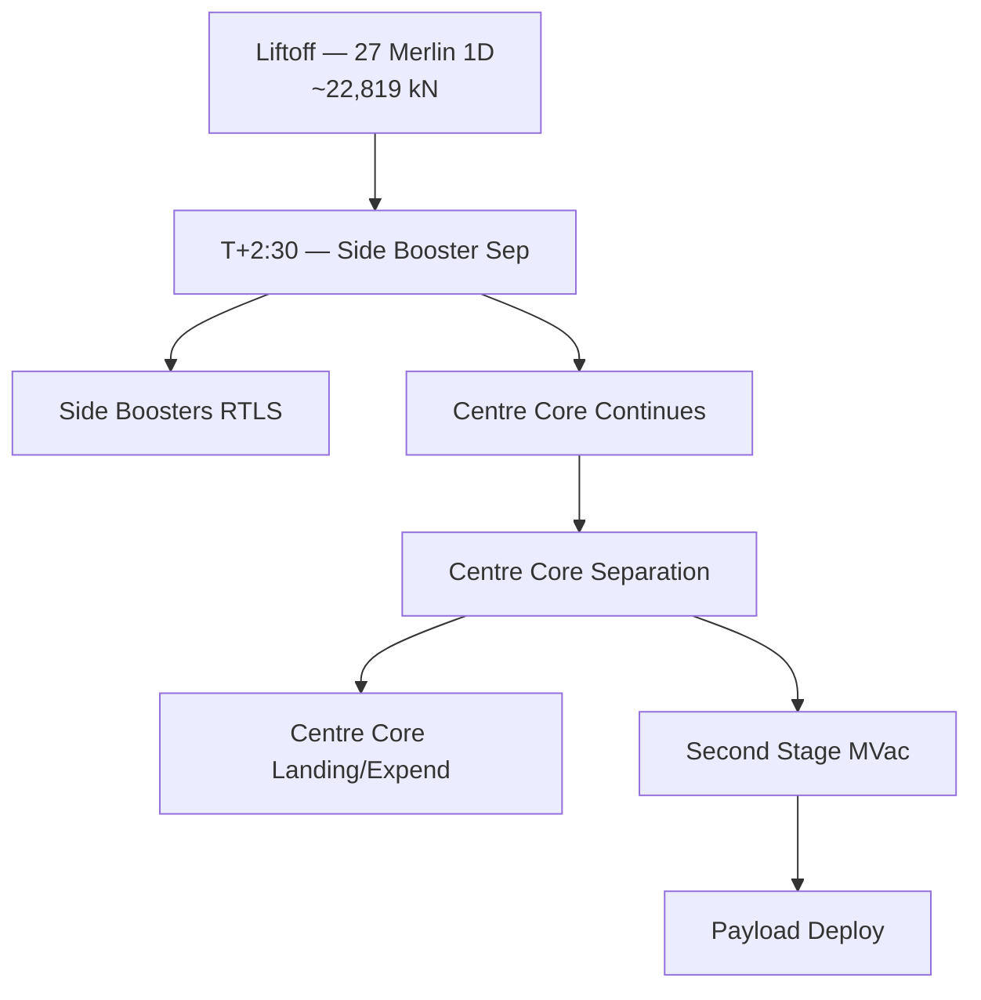

# Falcon Heavy Design and Missions

> **Falcon Heavy is the world's most powerful operational rocket, combining three Falcon 9 first-stage cores to produce roughly 22,819 kN (5.13 million lbf) of liftoff thrust — enough to send large national-security payloads to orbit or spacecraft to interplanetary destinations.**

## 🎯 Intuition
**The Core Idea:** Falcon Heavy straps three Falcon 9 first stages together, tripling liftoff thrust to open super-heavy-lift missions at a fraction of historical costs.
**Analogy:** Like coupling three locomotives to pull a freight train that one engine cannot move alone — same proven engine, multiplied force, shared parts supply.
**Why It Matters:** Before Falcon Heavy, the only comparable vehicle was ULA's Delta IV Heavy at 3–4× the cost per mission. Falcon Heavy filled a critical gap for the U.S. Space Force and NASA, carrying missions like Psyche and Europa Clipper at a fraction of historical costs. Multi-core integration and simultaneous booster recovery lessons directly inform Starship/Super Heavy development.

## ⚙️ Core Mechanics
### Key Specifications

| Parameter | Value |
|---|---|
| First flight | 6 February 2018 (demo — Elon Musk's Tesla Roadster) |
| Liftoff thrust | ~22,819 kN (5.13 Mlbf) from 27 Merlin 1D engines |
| LEO capacity (expendable) | ~63,800 kg |
| GTO capacity (expendable) | ~26,700 kg |
| GTO capacity (fully reusable) | ~8,000 kg |
| Mars transfer capacity | ~16,800 kg |
| Approx. cost (reusable) | ~$97 M |
| Height | ~70 m |
| Core stages | 3 × Falcon 9 first stage |
| Second stage | Standard Falcon 9 second stage (1 × MVac) |

### Key Facts
- **Notable missions:** Arabsat-6A (Apr 2019), STP-2 (Jun 2019), USSF-44 (Nov 2022), USSF-67 (Jan 2023), Psyche (Oct 2023), Europa Clipper (Oct 2024)
- **Cross-feed fuelling:** Studied but not implemented; throttle-down profiles used instead
- **Side booster landing:** Simultaneous RTLS demonstrated on demo and STP-2 missions
- **Centre core:** Strengthened thrust structure, custom separation hardware, reinforced stage-attach fittings to handle loads a standalone Falcon 9 never experiences
- **High-energy missions:** Centre core may be expended rather than recovered to maximise payload

### Flight Profile

## 🔬 Deep Dive
### Engineering Details
The Falcon Heavy concept is deceptively simple: take a standard Falcon 9 first stage as the center core, bolt two additional Falcon 9 boosters onto its sides, and ignite all 27 Merlin 1D engines at liftoff. In practice, realising this design took SpaceX years longer than initially projected. The centre core experiences severe aerodynamic and structural loads that a standalone Falcon 9 never sees — particularly thrust oscillation coupling between the three cores. SpaceX engineered a strengthened centre core with a unique thrust structure, custom separation hardware, and reinforced stage-attach fittings. An early cross-feed fuelling concept (transferring propellant from side boosters to the centre core in flight) was studied but ultimately dropped in favour of the simpler throttle-down profile used today.

At launch, all 27 engines fire at full thrust. Approximately two and a half minutes into flight the two side boosters separate and perform boost-back burns to return to the launch site — often landing simultaneously on adjacent pads in one of spaceflight's most visually dramatic manoeuvres. The centre core continues burning, then separates and either lands on the drone ship *Of Course I Still Love You* (or *A Shortfall of Gravitas*) or is expended on high-energy missions. The standard Falcon 9 second stage then completes orbital insertion.

Falcon Heavy can deliver approximately 63,800 kg to LEO, 26,700 kg to GTO, and 16,800 kg to Mars transfer in fully expendable mode. In the reusable configuration these figures decrease but the vehicle remains the highest-capacity commercially available launcher.

### Comparison with Competitors

| Attribute | Falcon Heavy | Delta IV Heavy | SLS Block 1 |
|---|---|---|---|
| Liftoff thrust (kN) | ~22,819 | ~9,400 | ~39,144 |
| Core stages | 3 × Falcon 9 | 3 × CBC | 1 core + 2 SRBs |
| LEO capacity (kg) | ~63,800 (exp.) | ~28,790 | ~95,000 |
| Reusability | Side boosters + centre core | Expendable | Expendable |
| Approx. cost (USD) | ~$97 M (reusable) | ~$350 M | ~$2 B+ per launch |
| First flight | 2018 | 2004 | 2022 |

## 🏋️ Practice
### Warm-Up — 3 Conceptual Questions
1. Why did SpaceX abandon the cross-feed fuelling concept in favour of throttle-down profiles, and what engineering simplification did this enable?
2. Explain why the Falcon Heavy centre core requires a unique, strengthened thrust structure compared to a standard Falcon 9 booster.
3. Under what mission conditions would SpaceX choose to expend the centre core rather than attempt drone-ship recovery?

### Core Analysis — 2 "What If" Scenarios
1. **What if** SpaceX had successfully implemented cross-feed fuelling from side boosters to the centre core — estimate how this would change GTO payload capacity in reusable mode and whether it would have been worth the added plumbing complexity and failure modes.
2. **What if** a side booster fails to separate cleanly at T+2:30 — trace the abort sequence, structural loads on the centre core, and potential outcomes for the payload and remaining vehicle.

### Challenge
1. NASA needs to send a 20,000 kg probe on a Mars transfer trajectory. Compare Falcon Heavy (expendable) vs. SLS Block 1 on payload margin, cost per kg to Mars transfer, and schedule availability. Then evaluate whether two Falcon Heavy launches with on-orbit assembly could match a single SLS launch — what additional infrastructure would be required?

## References

→ [[Sources Index]]
