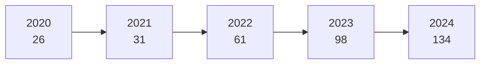

# Launch Cadence and Turnaround Records

> **SpaceX's Falcon 9 launch rate has grown from a handful of flights per year to well over a hundred, setting records that exceed the combined output of most other launch providers worldwide.**

## 🎯 Intuition
**The Core Idea:** SpaceX's launch cadence has grown exponentially — from 26 launches in 2020 to 134 in 2024 — driven by reusable boosters, captive Starlink demand, and streamlined pad operations.
**Analogy:** Like an airline scaling from a few daily departures to hundreds by reusing aircraft instead of scrapping them after each flight — except SpaceX did it with orbital rockets in five years.
**Why It Matters:** Launch cadence is the ultimate integrating metric for a launch provider — it reflects manufacturing throughput, reuse maturity, ground ops efficiency, regulatory coordination, and customer demand all at once. SpaceX's cadence now exceeds the combined orbital launch count of most spacefaring nations, giving it unmatched schedule flexibility and the revenue stream funding Starship development.

## ⚙️ Core Mechanics
### Annual Launch Counts

| Year | SpaceX Launches | Rocket Lab Launches | ULA Launches | China (All Providers) |
|---|---|---|---|---|
| 2019 | 13 | 6 | 10 | 34 |
| 2020 | 26 | 7 | 8 | 39 |
| 2021 | 31 | 6 | 7 | 55 |
| 2022 | 61 | 9 | 5 | 64 |
| 2023 | 98 | 10 | 3 | 67 |
| 2024 | 134 | 16 | 5 | 68 |

### Turnaround Records

| Record | Value |
|---|---|
| Fastest same-booster turnaround | Under 22 days |
| Fastest same-pad turnaround | Under 4 days (SLC-40) |
| Multiple launches in one day | Achieved multiple times in 2023–2024 |

### Key Facts
- **2020 launches:** 26
- **2021 launches:** 31
- **2022 launches:** 61
- **2023 launches:** 98
- **2024 launches:** 134
- **Fastest same-booster turnaround:** Under 22 days
- **Fastest same-pad turnaround:** Under 4 days (SLC-40)
- **Multiple launches in one day:** Achieved multiple times in 2023–2024
- **Active launch pads:** LC-39A (KSC), SLC-40 (CCSFS), SLC-4E (VSFB)
- **Cumulative reliability:** Above 99% over most recent several hundred missions

### Cadence Growth

## 🔬 Deep Dive
### Engineering Details
SpaceX's launch cadence story is one of exponential growth driven by three reinforcing factors: a reusable booster fleet that eliminates the need to build a new rocket for every mission, the Starlink constellation providing a captive internal manifest, and streamlined pad operations at three launch sites (LC-39A and SLC-40 at Kennedy Space Center / Cape Canaveral, plus SLC-4E at Vandenberg).

This acceleration has been matched by shrinking turnaround times at every level. Individual booster turnaround — the time between consecutive flights of the same first stage — has been driven below 22 days. Pad turnaround, the interval between successive launches from the same pad, has been reduced to under 4 days in some cases at SLC-40. SpaceX has also achieved multiple launches in a single calendar day, something no other orbital provider has matched in the modern era.

High cadence is not just a scheduling achievement; it is a reliability mechanism. Each flight generates operational data, exposes edge cases, and exercises ground systems under real conditions. The result is a continuously tightening feedback loop: more flights reveal more about the vehicle's margins, which allows more aggressive reuse, which enables more flights. This virtuous cycle is a core part of SpaceX's competitive moat and has driven Falcon 9's cumulative reliability above 99% over its most recent several hundred missions.

### Three Pillars of Cadence Growth

| Pillar | Mechanism | Impact |
|---|---|---|
| Reusable booster fleet | Same booster flies every ~3 weeks; no need to manufacture per-mission | Decoupled launch rate from production rate |
| Starlink captive demand | Internal constellation requires 40–60+ launches/year | Guaranteed base manifest fills schedule gaps |
| Multi-pad operations | LC-39A, SLC-40, SLC-4E operated in parallel | Eliminates single-pad bottleneck; enables same-day launches |

### The Virtuous Cycle
High cadence creates a self-reinforcing loop: more flights → more data → higher confidence in margins → more aggressive reuse → lower cost → more customers → more flights. For the broader industry, SpaceX's cadence has reset expectations — customers now demand launch availability measured in weeks, not years. This dominance has strategic implications: unmatched schedule flexibility for government and commercial customers, rapid Starlink constellation deployment, and the revenue stream funding Starship development.

## 🏋️ Practice
### Warm-Up — 3 Conceptual Questions
1. Identify the three reinforcing factors behind SpaceX's exponential cadence growth and explain why removing any single one would cap the launch rate.
2. Why is high launch cadence itself a reliability mechanism, rather than just a scheduling achievement?
3. Explain how a sub-22-day booster turnaround and a sub-4-day pad turnaround combine to determine the theoretical maximum annual launch rate from a single pad.

### Core Analysis — 2 "What If" Scenarios
1. **What if** SpaceX lost access to SLC-40 for 6 months due to a pad anomaly — model the impact on annual launch count, Starlink deployment schedule, and commercial customer wait times, assuming LC-39A and SLC-4E remain operational.
2. **What if** Starlink demand plateaued and SpaceX's internal manifest dropped to 20 launches/year — analyse how this would affect booster fleet utilisation, turnaround cadence learning, and the cost amortisation model that underpins the $67 M launch price.

### Challenge
1. Using the annual launch data and turnaround records, build a capacity model for SpaceX's 2025 operations. Given 3 active pads, a fleet of ~15 active boosters, a minimum 21-day booster turnaround, and a minimum 4-day pad turnaround, calculate the theoretical maximum annual launch rate. Identify which constraint (pad availability, booster availability, or upper-stage production) is the binding bottleneck, and propose one operational change to relax it.

## References

→ [[SpaceX/Sources/Sources Index|Sources Index]]
