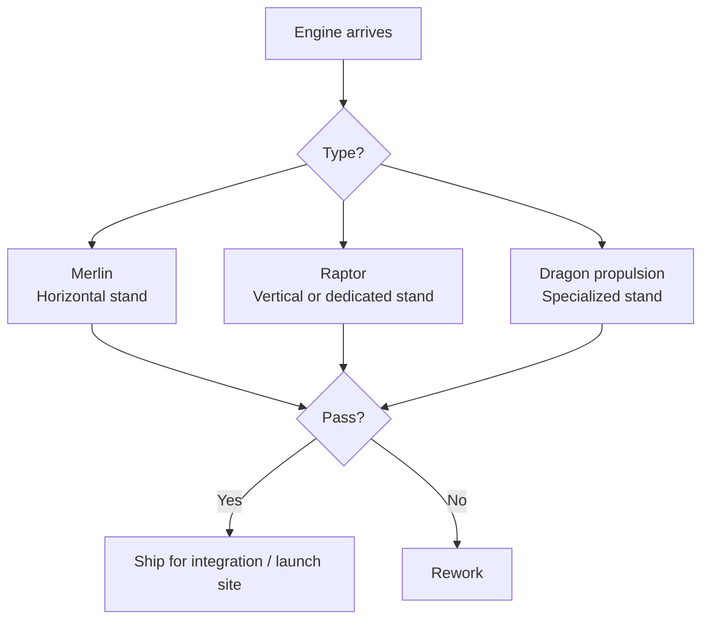

# McGregor Test Facility

> **SpaceX's quality gate where engines, stages, and Dragon propulsion systems prove readiness before flight.**

## 🎯 Intuition
**The Core Idea:** McGregor is the place where SpaceX verifies that propulsion hardware actually works before it is trusted on a mission.
**Analogy:** It is like a full-power dyno and proving ground for rockets, where every engine has to pass under realistic stress before being cleared for the track.
**Why It Matters:** Testing at McGregor moves risk from the launch pad to the ground-test environment. That helps explain Falcon 9 reliability, supports a launch cadence of 100+ flights per year, and gives SpaceX a structured way to catch defects before they become mission failures.

## ⚙️ Core Mechanics
### Facility Specifications
- **Location:** McGregor, Texas, approximately 30 km west of Waco (31.4°N, 97.5°W)
- **Site history:** Former Beal Aerospace test facility, acquired by SpaceX in 2003
- **Site area:** Over 4,000 acres
- **Operations tempo:** Continuous testing campaigns to support 100+ flights per year
- **Propellant infrastructure:** LOX, RP-1, liquid methane, helium, and nitrogen systems
- **Control infrastructure:** Hardened control room with real-time telemetry

### Key Facts
- Every flight engine is acceptance-tested at McGregor before shipment to a launch site.
- That includes **Merlin 1D**, **Merlin Vacuum**, and **Raptor** engines.
- The site has multiple test stands, including horizontal stands for individual engine qualification and acceptance burns.
- Vertical stands accommodate full **Falcon 9 first stages** for full-duration static fire tests.
- A complete Falcon 9 booster fires for roughly **~150 seconds**, matching flight-duration conditions.
- Separate infrastructure supports **Raptor sea-level** and **Raptor Vacuum** testing for the Starship program.
- McGregor also tests **Dragon Draco** and **SuperDraco** thrusters.
- Engines are installed, fired, inspected, and either cleared for flight or routed to rework.
- The facility has expanded continuously since SpaceX acquired it in **2003**, after the previous **Beal Aerospace** site shut down in **2000**.

### Mermaid Diagram

## 🔬 Deep Dive
### Operational / Historical Details
McGregor occupies a uniquely important position in SpaceX's manufacturing pipeline. The company acquired the site in **2003** and turned it into the most critical ground-test center in its network. Because the property spans **4,000+ acres**, it can maintain the safety exclusion zones needed for high-energy engine and stage tests while operating at continuous tempo.

Its most distinctive feature is the test-every-unit philosophy. Rather than relying only on sample testing or analytical qualification, SpaceX acceptance-tests every flight engine and subjects Falcon 9 first stages to full-duration static fire. That means flight hardware demonstrates performance under conditions close to real mission use before it ever reaches Florida or California.

### Comparison

| Test Stand / Area | What It Tests | Configuration |
|---|---|---|
| **Merlin horizontal stands** | Individual Merlin 1D and Merlin Vacuum engines | Horizontal mount, single-engine firing |
| **Raptor test stands** | Raptor (sea-level) and Raptor Vacuum engines | Horizontal/vertical mount, single-engine firing |
| **Falcon 9 vertical stand** | Complete Falcon 9 first stage (9 engines) | Vertical mount, full-duration burn (~150 s) |
| **Dragon thruster area** | Draco and SuperDraco thrusters | Specialized stands for hypergolic and restart testing |
| **Propellant storage** | Supports all test campaigns | LOX, RP-1, liquid methane, helium, nitrogen systems |
| **Data/control center** | Test monitoring and command | Hardened control room with real-time telemetry |

## 🏋️ Practice
### Warm-Up — 3 Conceptual Questions
1. Why does SpaceX test every Merlin and Raptor engine before flight instead of relying only on factory inspection?
2. What is the value of firing a full Falcon 9 first stage for about ~150 seconds on the ground?
3. Why does a high-energy test site benefit from having over 4,000 acres?

### Core Analysis — 2 "What If" Scenarios
1. What if McGregor only sample-tested engines instead of acceptance-testing every unit? How would that change risk at the launch pad?
2. What if Falcon 9 boosters skipped full-duration vertical static fire at McGregor and were only checked during pad operations? What failure modes might become harder to catch?

### Challenge
Explain how McGregor acts as a reliability multiplier for Falcon 9, Dragon, and Starship by linking manufacturing, test infrastructure, rework decisions, and launch readiness into one quality pipeline.

## References

→ [[SpaceX/Sources/Sources Index|Sources Index]]
