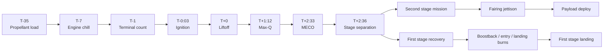

# Mission Control and Launch Operations

> **SpaceX runs launches through a tightly automated countdown and ascent architecture centered on Hawthorne mission control.**

## 🎯 Intuition
**The Core Idea:** Mission control coordinates the rocket, ground systems, weather, range, and payload so a Falcon 9 can move from fueling to orbit on a precise timeline.
**Analogy:** It works like an air traffic control tower merged with a factory operations center and an automated safety computer.
**Why It Matters:** SpaceX's software-driven launch process is a major reason it can sustain a cadence above 100 missions per year. By automating countdown steps and using AFTS, it reduces operational bottlenecks that used to limit launch frequency.

## ⚙️ Core Mechanics
### Facility Specifications
- **Mission Control location:** SpaceX headquarters, Hawthorne, California
- **Physical setup:** Integrated into the factory floor
- **Primary authority:** Launch Director holds final go/no-go responsibility and manages console polling
- **Console monitoring:** Vehicle telemetry, ground systems, range safety, weather, and payload data

### Key Facts
- Falcon 9 propellant loading begins at about **T-35 minutes** using **subcooled RP-1** and **densified LOX** loaded into both stages.
- At **T-7 minutes**, engine chill begins as LOX circulates through the **Merlin turbopumps** for thermal conditioning.
- At **T-3 seconds**, the nine **Merlin 1D** engines ignite in a staggered sequence.
- At **T-0**, hold-down clamps release after onboard computers verify adequate thrust.
- The ascent passes **Max-Q** at roughly **T+1:12**.
- **MECO** occurs at about **T+2:33**, followed by **stage separation** at about **T+2:36**.
- After separation, the mission continues through second-stage flight, **fairing jettison**, and **payload deployment**, while the first stage performs boostback, entry, and landing burns.
- The **Autonomous Flight Safety System (AFTS)** replaces the traditional human range safety officer with onboard GPS-based trajectory monitoring and autonomous destruct logic if the vehicle leaves the safe corridor.
- Important weather and scrub constraints include **upper-level winds**, **lightning risk** (triggered and natural), **cumulus cloud rules**, and **ground wind limits for landing**.
- Other hold causes include **ground equipment issues**, **range conflicts**, **boats or aircraft in the exclusion zone**, and **out-of-family telemetry**.

### Mermaid Diagram

## 🔬 Deep Dive
### Operational / Historical Details
SpaceX's mission control model places the MCC inside Hawthorne headquarters rather than isolating it from the engineering organization. That keeps controllers close to the teams building and refining the hardware, reinforcing SpaceX's feedback loop between manufacturing, software, and operations. The launch process itself is compressed and automation-heavy, with late propellant loading enabled by densified propellants and vehicle systems designed to manage many countdown tasks internally.

AFTS is one of the most consequential operational shifts. Traditional range safety depended on a human officer to monitor the trajectory and manually send a destruct command if needed. By moving that logic onboard with GPS-based autonomous monitoring, SpaceX reduced range dependence, improved scheduling flexibility, and made simultaneous high-tempo operations across multiple ranges more realistic.

### Comparison

| Timeline Event | Time | What Happens |
|---|---|---|
| **Propellant load** | T-35:00 | RP-1 and densified LOX loading begins |
| **Engine chill** | T-7:00 | LOX flows through turbopumps for thermal conditioning |
| **Terminal count** | T-1:00 | Vehicle transitions to internal power and flight mode |
| **Ignition** | T-0:03 | Nine Merlin 1D engines ignite in staggered sequence |
| **Liftoff** | T+0:00 | Hold-down clamps release after thrust verification |
| **Max-Q** | T+1:12 | Maximum aerodynamic pressure on the vehicle |
| **MECO** | T+2:33 | Main engine cutoff; first stage shuts down |
| **Stage separation** | T+2:36 | Stages separate; second stage Mvac ignites |
| **Fairing jettison** | T+3:30 | Payload fairing halves deploy (LEO missions) |
| **Payload deploy** | T+8:00–32:00 | Second engine cutoff and payload separation (varies) |
| **Booster landing** | T+8:30 | First stage lands on drone ship or landing zone |

## 🏋️ Practice
### Warm-Up — 3 Conceptual Questions
1. Why does Falcon 9 begin propellant loading relatively late at T-35 minutes instead of hours earlier?
2. What role does the Launch Director play in a highly automated countdown?
3. Why is AFTS especially important for a company trying to launch at very high cadence?

### Core Analysis — 2 "What If" Scenarios
1. What if Falcon 9 still depended on a traditional human range safety officer rather than AFTS? How would that affect launch flexibility and cadence?
2. What if weather rules for landing were violated even while ascent weather remained acceptable? How could that change the mission decision process?

### Challenge
Explain how countdown timing, onboard automation, AFTS, and first-stage recovery fit together into a single operational philosophy rather than four separate features.

## References

→ [[Sources Index]]
