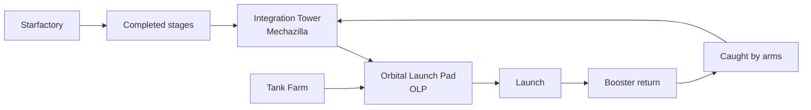

# Starbase Boca Chica

> **SpaceX's integrated Starship campus where manufacturing, stacking, testing, and launch happen in one rapidly evolving site.**

## 🎯 Intuition
**The Core Idea:** Starbase is not just a launch pad; it is a combined factory, test site, and operational base for Starship and Super Heavy.
**Analogy:** Imagine a shipyard where the vessel is built, fueled, launched, and eventually returned to the same harbor for reuse.
**Why It Matters:** By colocating manufacturing and launch operations, SpaceX can iterate hardware faster than traditional aerospace programs. Starbase is also the focal point for the company's most ambitious architecture, making every facility decision there strategically important.

## ⚙️ Core Mechanics
### Facility Specifications
- **Location:** Boca Chica, Texas, near Brownsville (25.997°N, 97.157°W)
- **Original permit:** FAA license for Falcon 9 launches (~2014), later pivoted to Starship
- **Starfactory:** Large-scale stainless-steel manufacturing building for Starship and Super Heavy
- **Integration tower (Mechazilla):** ~146 m tall, with mechanical "chopstick" arms
- **Orbital Launch Pad (OLP):** Reinforced mount with water-cooled steel plate system
- **Tank farm:** Stores subcooled liquid oxygen and liquid methane

### Key Facts
- SpaceX originally developed the Boca Chica site as a commercial **Falcon 9** launch location around **2014**.
- The site later pivoted entirely to **Starship** development, manufacturing, and launch operations.
- **Starfactory** fabricates stainless-steel **Starship** and **Super Heavy** stages.
- Completed stages move toward the **Orbital Launch Pad (OLP)** for integration and launch operations.
- The **integration tower (Mechazilla)** stacks Starship on top of Super Heavy, provides umbilical servicing, and is designed to catch returning boosters with "chopstick" arms.
- The OLP is designed to withstand the thrust of **33 Raptor engines** and about **~7,600 tonnes of thrust**.
- Supporting infrastructure includes the **tank farm**, a **suborbital test pad** used for prototype hops, and planned landing zones.
- The first orbital launch attempt was **IFT-1** on **April 20, 2023**, and the vehicle cleared the pad before being lost during ascent.
- Environmental oversight is extensive because the site borders the **Boca Chica National Wildlife Refuge** and **Lower Rio Grande Valley National Wildlife Refuge**.
- The FAA's **Programmatic Environmental Assessment (PEA)** imposed **75+ mitigating actions** that continue to influence licensing and launch scheduling.

### Mermaid Diagram

## 🔬 Deep Dive
### Operational / Historical Details
Starbase sits near Boca Chica Beach at the southern tip of Texas and has been transformed from a proposed Falcon 9 site into a sprawling industrial campus dedicated to the largest rocket ever flown. That transformation matters because Starship development relies on rapid build-test-fly iteration. Instead of transporting stages across the country, SpaceX can fabricate, stack, fuel, launch, and potentially recover major hardware within the same regional complex.

The site is also shaped by environmental and regulatory realities. Because it sits next to sensitive wildlife refuges with endangered species such as the **piping plover** and **ocelot**, FAA approval is tied to ongoing compliance rather than one-time authorization. This makes Starbase not only an engineering challenge but also a regulatory and environmental operations challenge.

### Comparison

| Facility | Purpose |
|---|---|
| **Starfactory** | Manufacturing — stainless steel fabrication of Starship and Super Heavy stages |
| **Integration tower (Mechazilla)** | Vehicle stacking, umbilical servicing, booster catch with chopstick arms |
| **Orbital Launch Pad (OLP)** | Launch mount, water-cooled steel plate, flame deflector, hold-down clamps |
| **Suborbital pad** | Legacy test pad used for Starship prototype hops (SN5, SN6, SN8–SN15) |
| **Tank farm** | Cryogenic storage for liquid oxygen and liquid methane |
| **Landing zones** | Planned areas for Starship and Super Heavy return and recovery |
| **Boca Chica Beach road** | Public road closed during launch operations per FAA license conditions |

## 🏋️ Practice
### Warm-Up — 3 Conceptual Questions
1. Why is it strategically valuable that Starbase combines manufacturing and launch operations in one place?
2. What role does Mechazilla play that goes beyond simply holding the rocket upright?
3. Why do environmental mitigations matter operationally, not just legally, at Boca Chica?

### Core Analysis — 2 "What If" Scenarios
1. What if Starbase had remained only a Falcon 9 site instead of pivoting to Starship around 2014? How would SpaceX's development model have changed?
2. What if the booster-catch concept fails to become routine? Which parts of Starbase operations would become less efficient?

### Challenge
Explain how Starbase's layout reflects SpaceX's broader strategy of rapid iteration, reusability, and tight coupling between manufacturing, launch operations, and recovery.

## See Also

- [[Starship Vehicle Architecture]]
- [[Manufacturing Innovation]]
- [[Starship Catch System]]
- [[McGregor Test Facility]]

## References

→ [[Sources Index]]
