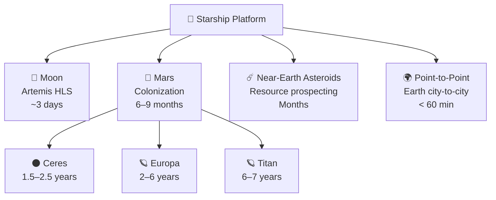

# Beyond Mars

> **Starship's broader significance is that a reusable Mars-class vehicle can also open the Moon, asteroids, outer-planet missions, rapid Earth transport, and eventually even more distant frontiers.**

## 🎯 Intuition
**The Core Idea:** Starship is not just a Mars ship; it is a general-purpose deep-space transport platform whose capabilities spill over into many other missions.
**Analogy:** Like having a pickup truck so capable you realize it can go anywhere, not just the job site.
**Why It Matters:** A fully reusable heavy-lift vehicle doesn't just enable Mars—it reshapes the economics of all spaceflight. Each additional destination that becomes accessible multiplies the scientific, commercial, and strategic return on the Starship investment. The question shifts from "can we afford to go" to "where should we go first," which is a fundamentally different posture for human civilization's relationship with space.

---

## ⚙️ Core Mechanics

Starship's value proposition extends beyond Mars because a reusable, high-capacity vehicle can serve lunar missions, asteroid expeditions, and other deep-space roles with the same core transport logic. Near-term examples like Artemis HLS and the once-planned dearMoon flight function as stepping stones that exercise the same long-duration and orbital-refilling capabilities needed for Mars.

Past Mars, the reachable map widens from near-Earth asteroids to outer solar system targets and speculative future transport concepts on Earth and beyond. Many of these destinations still demand major propulsion, regulatory, or vehicle changes, but Starship shifts them from purely conceptual to at least architecturally discussable.

### Key Details / Specifications

| Destination | Delta-v from LEO | Transit Time (Chemical) | Key Interest | Starship Role |
|---|---|---|---|---|
| Moon (surface) | ~6 km/s (round trip) | ~3 days | Artemis, science, fuel depot | HLS lander (contracted) |
| Near-Earth asteroid | ~4-6 km/s | Months to ~1 year | Resource prospecting, science | Direct mission vehicle |
| Mars (surface) | ~3.6 km/s (one-way TMI) | 6-9 months | Colonization, science | Primary architecture |
| Ceres (asteroid belt) | ~8-9 km/s | ~1.5-2.5 years | Water ice, minerals | Cargo/crew transport |
| Europa (Jupiter) | ~9-10 km/s (with assists ~6) | ~2-6 years | Subsurface ocean, astrobiology | Departure stage or modified vehicle |
| Titan (Saturn) | ~7-8 km/s (with assists) | ~6-7 years | Dense atmosphere, organics | Departure stage + entry vehicle |
| Point-to-point Earth | Suborbital (~7 km/s) | <60 minutes | Rapid global transport | Passenger variant |
| Interstellar | >>100 km/s needed | Centuries (chemical) | Far-future exploration | Precursor civilization capability |

### Key Facts
- Starship HLS: NASA-contracted variant for Artemis lunar surface missions (crew of 2-4)
- dearMoon: proposed circumlunar Starship flight (arts and civilian crew, announced 2018, later cancelled)
- Near-Earth asteroid delta-v: some targets require as little as ~4-5 km/s from LEO
- Europa orbit insertion: ~9-10 km/s total delta-v from LEO (with gravity assists, ~6 km/s)
- Titan: ~7-8 km/s from LEO with Saturn gravity assist; transit time ~6-7 years
- Point-to-point Earth transport: any two cities in <60 minutes via suborbital trajectory
- Starship payload to LEO: ~100-150 tonnes (fully reusable mode)
- Interstellar distances: nearest star (Proxima Centauri) ~4.24 light-years away

---

## 🔬 Deep Dive
### Engineering Details
While Mars colonization is SpaceX's stated primary objective, Starship's design as a high-capacity, fully reusable vehicle makes it applicable to virtually every destination in the inner solar system and potentially beyond. The near-term "beyond Mars" missions are already under contract: SpaceX won NASA's Human Landing System (HLS) award to develop a Starship variant for Artemis lunar surface missions, and the dearMoon project (proposed by Yusaku Maezawa) envisioned a circumlunar Starship flight carrying artists and civilians. These missions serve as operational stepping stones—proving deep-space life support, long-duration Raptor performance, and orbital refilling operations before Mars-class missions.

The asteroid belt, located between Mars and Jupiter, contains vast mineral and volatile resources. Near-Earth asteroids are energetically accessible (some require less delta-v than a lunar landing), and metallic asteroids could contain trillions of dollars worth of platinum-group metals, iron, and nickel. While asteroid mining remains economically speculative, a vehicle class like Starship—with 100+ tonne payload capacity and low per-launch cost—dramatically changes the feasibility calculus. SpaceX has not announced specific asteroid missions, but the vehicle capability inherently enables them.

The outer solar system presents the most ambitious targets. Jupiter's moon Europa harbors a subsurface ocean that is a prime candidate for extraterrestrial life. Saturn's moon Titan has a dense atmosphere, surface liquids, and complex organic chemistry. Reaching these destinations requires either very long transit times (years to decades with chemical propulsion) or advanced propulsion concepts (nuclear thermal, nuclear electric, or solar sails). Starship could serve as a departure stage or cruise vehicle for such missions, though significant modifications and potentially new upper stages would be required. Closer to home, Starship's point-to-point Earth transport concept proposes suborbital flights connecting any two cities in under an hour—though regulatory, safety, and noise challenges make this the most uncertain application. Looking to the far future, interstellar travel remains firmly theoretical, requiring propulsion breakthroughs (laser sails, fusion drives) that are decades or centuries away, but a civilization with routine interplanetary capability is the necessary precursor.

### Challenges and Risks
- Many beyond-Mars missions still require major propulsion advances, gravity assists, or mission-specific vehicle modifications.
- Asteroid mining is technically plausible but economically speculative.
- Point-to-point Earth transport faces major regulatory, safety, and noise barriers.
- Interstellar travel remains theoretical and depends on propulsion breakthroughs far beyond current Starship capability.

### Comparison / Context

| Mission Class | Near-Term Readiness | Main Constraint | Why Starship Still Matters |
|---|---|---|---|
| Lunar missions | High | Operational maturation | Validates deep-space systems on short missions |
| Asteroid missions | Medium | Economics and mission selection | Makes high-mass prospecting missions more feasible |
| Outer solar system missions | Low-Medium | Transit time and propulsion | Provides a plausible heavy departure or cruise platform |
| Point-to-point Earth | Low | Regulation, safety, noise | Shows Starship's flexibility beyond space exploration |
| Interstellar precursors | Very low | Physics and propulsion limits | Frames Starship as part of a longer civilization-scale progression |

---

## 🏋️ Practice
### Discussion Questions
1. Why does a reusable Mars transport system naturally expand into non-Mars mission categories?
2. How do the differences in delta-v, transit time, and mission purpose change Starship's role across the Moon, asteroids, and outer planets?
3. If Starship lowers the cost of access to deep space, how might that change humanity's long-term exploration priorities?

### Analysis Scenarios
1. If orbital refilling became routine and cheap, which beyond-Mars destination would become the most strategically attractive first target, and why?
2. Suppose Starship were adapted for an asteroid prospecting mission; what technical and economic factors would determine whether that mission should proceed?

### Challenge
- Design a phased "beyond Mars" roadmap that starts with lunar operations and logically extends to asteroid or outer-planet missions while keeping vehicle changes as small as possible.

---

*See also:* [[Mars and Beyond Overview]], [[Sources Index]]
