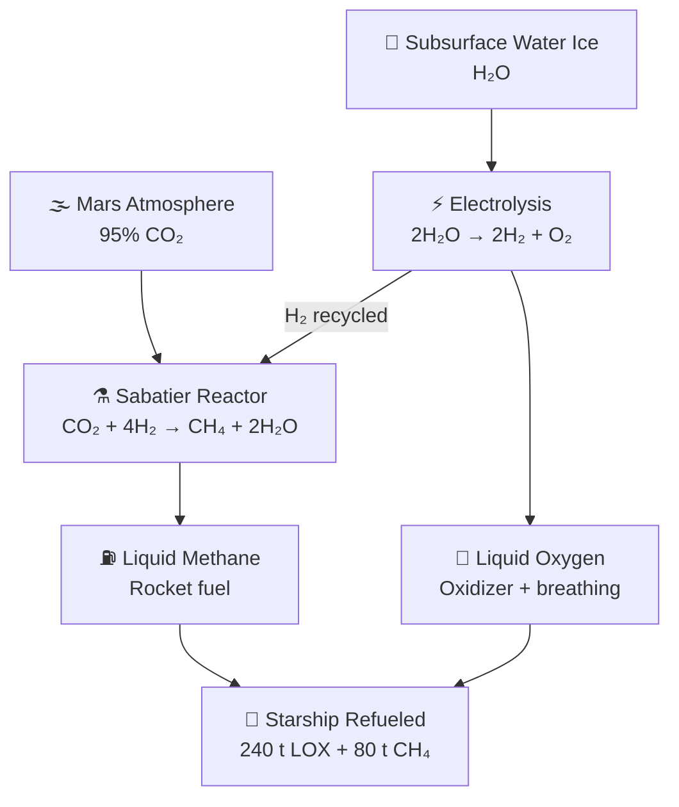

# In-Situ Resource Utilization

> **ISRU makes Mars missions practical by turning Martian air and water ice into methane, oxygen, and water instead of hauling everything from Earth.**

## 🎯 Intuition
**The Core Idea:** ISRU uses local Martian resources to manufacture the propellant and consumables needed for sustained Mars operations.
**Analogy:** Like living off the land instead of shipping groceries from another continent — making fuel from Martian air and ice.
**Why It Matters:** Without ISRU, every kilogram of return propellant must be launched from Earth—an exponential mass penalty that makes sustained Mars operations economically impossible. ISRU is the single technology that converts Mars from a one-way destination into a viable outpost with round-trip capability. It is the linchpin of SpaceX's entire colonization architecture.

---

## ⚙️ Core Mechanics

Mars offers the two feedstocks SpaceX needs most: a CO₂-rich atmosphere and accessible water ice. ISRU turns those local materials into methane, oxygen, and water through the Sabatier reaction and electrolysis, which is why methane is central to Starship's Mars architecture.

The challenge is scale and power, not basic chemistry. Refueling even one return Starship demands months of sustained industrial production, large energy supplies, and systems far larger than proof-of-concept hardware like MOXIE, making ISRU a mandatory precondition for repeatable Mars operations.

### Key Details / Specifications

| ISRU Process | Input | Output | Energy Requirement | Notes |
|---|---|---|---|---|
| Sabatier reaction | CO₂ + H₂ | CH₄ + H₂O | Exothermic (releases heat) | Core methane production step |
| Water electrolysis | H₂O | H₂ + O₂ | ~5 kWh per kg H₂O | H₂ recycled to Sabatier; O₂ stored |
| CO₂ electrolysis (MOXIE) | CO₂ | CO + O₂ | ~8 kWh per kg O₂ | Demonstrated on Perseverance |
| Ice mining & melting | H₂O ice + regolith | Liquid H₂O | ~0.3 kWh per kg ice | Drilling/heating subsurface deposits |
| Cryogenic liquefaction | CH₄ gas + O₂ gas | LCH₄ + LOX | ~1-2 kWh per kg | Required for propellant storage |

### Key Facts
- Mars atmosphere: ~95% CO₂, ~2.7% N₂, ~1.6% Ar — ideal feedstock for Sabatier reaction
- Sabatier reaction: CO₂ + 4H₂ → CH₄ + 2H₂O (exothermic, ~165 kJ/mol)
- Electrolysis of water: 2H₂O → 2H₂ + O₂ (endothermic, requires ~237 kJ/mol)
- MOXIE produced ~10 g O₂/hour; a full-scale plant needs ~2-3 kg O₂/hour continuously
- Refueling one Starship requires roughly 240 t of LOX and 80 t of CH₄
- Mars solar irradiance is ~590 W/m² (vs ~1,361 W/m² at Earth)
- Water ice confirmed at shallow depths by Mars Odyssey, Phoenix lander, and MRO radar
- Technology readiness level for full-scale Mars ISRU is estimated at TRL 4-5

---

## 🔬 Deep Dive
### Engineering Details
The Martian atmosphere is approximately 95% carbon dioxide, and significant deposits of water ice exist at and near the surface, particularly at higher latitudes and in certain equatorial regions. ISRU leverages these resources through well-understood chemical processes. The Sabatier reaction combines carbon dioxide with hydrogen to produce methane (CH₄) and water (CO₂ + 4H₂ → CH₄ + 2H₂O). This is precisely why SpaceX chose methane as Starship's fuel: it is the only practical rocket propellant that can be manufactured on Mars from locally available feedstocks. The water byproduct can be split via electrolysis into hydrogen (recycled back into the Sabatier reactor) and oxygen, which serves as both the oxidizer for rocket propellant and breathable air for crew.

The energy requirements for ISRU are substantial. Producing enough methane and liquid oxygen to refuel a single Starship for the return trip to Earth requires hundreds of kilowatts of continuous power sustained over months. The power source is an open design question: large solar arrays are simpler to deploy but are hampered by Mars's greater distance from the Sun (~43% of Earth's solar flux) and dust storms that can last weeks. Nuclear fission reactors (such as NASA's Kilopower/KRUSTY concept) offer consistent output regardless of conditions but add mass and regulatory complexity.

NASA's MOXIE (Mars Oxygen In-Situ Resource Utilization Experiment) aboard the Perseverance rover demonstrated the core oxygen-extraction step at small scale, producing about 10 grams of O₂ per hour from Martian CO₂. While MOXIE validated the chemistry, scaling to propellant-production levels requires reactors thousands of times larger, operating continuously for 18-24 months between transfer windows. ISRU moves from "nice to have" to "mission-critical" once return trips and sustained presence are the goal.

### Challenges and Risks
- Full-scale ISRU demands hundreds of kilowatts of continuous power for months.
- Solar power is weakened by Mars's lower sunlight levels and vulnerable to dust storms.
- Nuclear power offers steady output but adds mass, complexity, and regulatory burden.
- MOXIE proved the chemistry, but scaling to return-propellant quantities requires systems orders of magnitude larger.

### Comparison / Context

| Power or Production Issue | Why It Matters on Mars | Strategic Implication |
|---|---|---|
| CO₂-rich atmosphere | Makes Sabatier chemistry locally viable | Supports methane-based architecture |
| Accessible water ice | Supplies hydrogen, oxygen, and water | Enables closed industrial loops |
| Low solar flux | Reduces solar array output | Pushes designs toward larger arrays or nuclear systems |
| Long production timelines | Requires highly reliable equipment | ISRU plant likely must arrive before crew |
| Low current TRL | Means large integration risk remains | ISRU is still a major architecture gamble |

---

## 🏋️ Practice
### Discussion Questions
1. Why is methane a more practical Mars-made propellant than alternatives that would need Earth-supplied feedstocks?
2. How do power constraints shape the design of an ISRU plant more than the underlying chemistry does?
3. If ISRU becomes reliable, how does that change the long-term economics of Mars settlement?

### Analysis Scenarios
1. If a dust storm cuts solar output for several weeks, what operational changes would an ISRU system need to keep propellant production on track?
2. Suppose early crews can produce oxygen successfully but methane output lags; how would that affect return planning and mission risk?

### Challenge
- Design an initial Mars ISRU deployment sequence that balances power generation, ice access, propellant production, and pre-crew reliability.

---

*See also:* [[Autogenous Pressurization]], [[Mars Base Design Concepts]], [[Raptor Engine]], [[Mars Transit and Entry]], [[Mars and Beyond Overview]], [[Sources Index]]

## References
- [[SpaceX/Sources/Sources Index|SpaceX Sources Index]]
