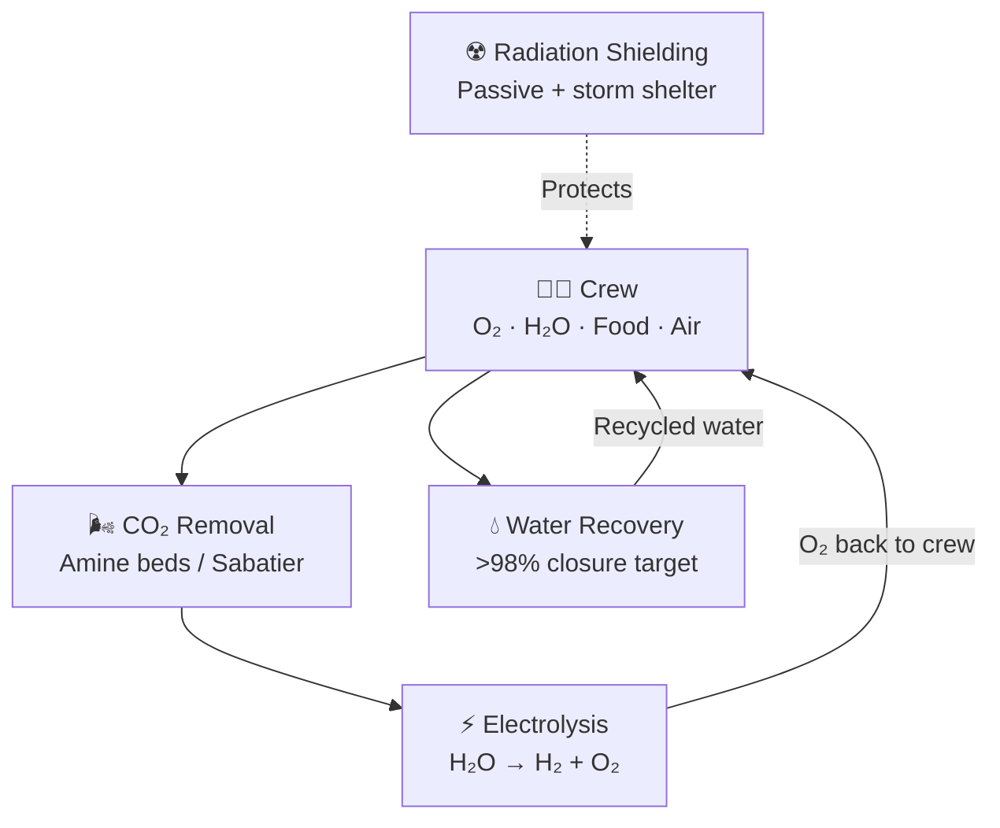

# Life Support for Mars

> **Mars life support must function as a highly closed, highly reliable survival system that keeps crews alive through long transit, surface operations, radiation exposure, and isolation without routine resupply.**

## 🎯 Intuition
**The Core Idea:** A Mars mission needs life support that continuously recycles air and water, protects the crew, and keeps them functioning for years with minimal outside help.
**Analogy:** Like a submarine life support system, but for years instead of months, with no port to return to.
**Why It Matters:** Life support is the human-rated certification of every other Mars technology. The most powerful rocket and the best ISRU plant are irrelevant if the crew cannot survive the journey and surface stay. Closing the life-support loop is what transforms a Mars mission from a theoretical trajectory into a survivable expedition—and closing it reliably enough for settlement is what separates a visit from colonization.

---

## ⚙️ Core Mechanics

Mars life support has to operate much closer to a closed loop than ISS systems because crews cannot count on routine resupply. Water recovery, oxygen regeneration, and CO₂ removal all need higher closure, lower consumable use, and stronger fault tolerance than current low Earth orbit systems.

The challenge also extends beyond air and water. Radiation exposure, long communication delays, confinement, and the need for partial food production make Mars life support a combined engineering, medical, and human-factors problem rather than a single spacecraft subsystem.

### Key Details / Specifications

| Parameter | Mars Mission Requirement | ISS ECLSS (Current) |
|---|---|---|
| Mission duration | 6-9 months transit + 18-24 months surface | Continuous (with resupply every ~2-3 months) |
| Water recovery rate | >98% | ~90% |
| Resupply capability | None (next window ~26 months away) | Regular cargo vehicles (Progress, Dragon, Cygnus) |
| Radiation environment | GCR + SPE (no magnetosphere) | LEO (partial magnetosphere protection) |
| Communication delay | 3-22 minutes one-way | <1 second |
| Crew autonomy | Near-total (real-time support impossible) | High ground support with real-time comm |
| Food strategy | Carried + partial bioregenerative | Fully pre-packaged and resupplied |
| CO₂ partial pressure target | <0.5 kPa | <0.5 kPa (same standard) |

### Key Facts
- ISS ECLSS recovers ~90% of water; Mars systems must target >98% to be viable
- CO₂ removal methods: amine swing beds, Sabatier reactor (converts CO₂ + H₂ → CH₄ + H₂O)
- Oxygen generation via electrolysis: 2H₂O → 2H₂ + O₂ (ISS OGS baseline)
- Galactic cosmic ray dose in interplanetary space: ~0.5-1.0 mSv/day
- Solar particle events can deliver >100 mSv in hours without shielding
- NASA's current career dose guideline: ~600 mSv (varies by age/sex, under revision)
- Earth-Mars communication delay: 3-22 minutes one-way, depending on orbital geometry
- Crew metabolic requirements: ~0.84 kg O₂, ~2.5 kg water, ~1.8 kg food per person per day

---

## 🔬 Deep Dive
### Engineering Details
A Mars life support system must far exceed the capabilities of the International Space Station's ECLSS (Environmental Control and Life Support System), which still relies on regular resupply from Earth. For Mars, the system must approach full closure: nearly 100% recovery of water, efficient CO₂ removal and oxygen regeneration, and robust failure tolerance with no possibility of an emergency resupply. Air revitalization combines CO₂ scrubbing (via processes like the Sabatier reactor or amine-based swing beds) with oxygen generation through water electrolysis. On the ISS, the Oxygen Generation System (OGS) electrolyzes water to produce O₂, while the Carbon Dioxide Removal Assembly (CDRA) captures CO₂. Mars systems must improve closure rates from the ISS's ~90% water recovery to >98% while reducing consumable mass.

Radiation is one of the most significant health risks. In deep space, crews face continuous exposure to galactic cosmic rays (GCRs)—high-energy particles that no practical amount of shielding can fully block—and sporadic solar particle events (SPEs) that can deliver dangerous doses within hours. Effective strategies combine passive shielding (water walls, polyethylene, regolith on Mars), active monitoring, and storm shelters for SPE protection. Cumulative GCR exposure over a ~2.5-year round trip approaches or exceeds current NASA career dose limits.

Beyond the physical systems, Mars missions impose extraordinary psychological demands. Communication delays of 3 to 22 minutes one-way eliminate real-time conversation with Earth. Crews must operate with high autonomy in confined spaces for years. Research from Antarctic stations, submarine deployments, and ISS long-duration missions informs crew selection and support protocols, but no analog fully replicates the isolation of a Mars mission. Food production—whether carried supplies or bioregenerative greenhouse systems—adds a further life-support dimension, with mass budgets pushing toward at least partial on-site agriculture for extended stays.

### Challenges and Risks
- Mars crews cannot rely on emergency resupply, so failure tolerance must be much higher than on ISS.
- Galactic cosmic rays and solar particle events create major health and shielding challenges.
- Communication delays force crews to solve problems with high autonomy.
- Long confinement and isolation create persistent psychological and operational strain.
- Extended surface stays may require at least partial local food production.

### Comparison / Context

| Life Support Dimension | ISS Baseline | Mars Escalation |
|---|---|---|
| Water loop closure | High but not complete | Must approach near-total closure |
| Oxygen regeneration | Proven in LEO | Must run longer with less maintenance support |
| Radiation protection | Partial magnetosphere helps | Deep-space and surface exposure are much harsher |
| Crew support model | Ground-assisted | Autonomous and delay-tolerant |
| Food logistics | Resupplied packages | Long-duration storage plus possible bioregenerative systems |

---

## 🏋️ Practice
### Discussion Questions
1. Why is Mars life support fundamentally a system-of-systems problem rather than just an air-recycling problem?
2. How do radiation risk, communication delay, and food strategy change life-support design compared with ISS operations?
3. If Mars settlements become larger, which parts of life support are most likely to shift from spacecraft-style systems to habitat-scale infrastructure?

### Analysis Scenarios
1. If a Mars transit crew loses part of its water-recovery capability halfway through the journey, what immediate operational priorities would matter most?
2. Suppose a surface habitat can recycle air and water reliably but cannot grow food locally; how does that constrain mission duration and settlement plans?

### Challenge
- Design a Mars life-support architecture that balances closure rate, redundancy, crew autonomy, radiation protection, and psychological sustainability.

---

*See also:* [[Mars and Beyond Overview]], [[Sources Index]]

## References
- [[SpaceX/Sources/Sources Index|SpaceX Sources Index]]
