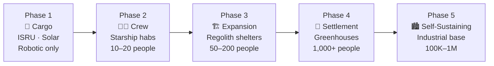

# Mars Base Design Concepts

> **Mars base design starts by using landed Starships as early shelters, then expands toward purpose-built, shielded, locally built infrastructure that can grow into a self-sustaining settlement.**

## 🎯 Intuition
**The Core Idea:** Early Mars bases use what arrives first as shelter, then gradually add local construction, power, and shielding until the outpost becomes a real settlement.
**Analogy:** Like building a frontier town — starting with the wagon (Starship) as shelter, then building real structures.
**Why It Matters:** Base design determines whether Mars habitation remains a fragile outpost dependent on Earth or grows into a resilient, self-expanding settlement. Every architectural choice—from the first landed Starship repurposed as a shelter to the regolith-shielded halls of a future city—compounds across decades. Getting the growth trajectory right in the earliest phases defines the ceiling for everything that follows.

---

## ⚙️ Core Mechanics

The first Mars base is expected to arrive largely prebuilt inside landed Starships, with early crews using those vehicles as pressurized shelters while later cargo missions expand the site with power systems, ISRU hardware, and dedicated habitat modules. This minimizes early surface construction demands and accelerates initial occupancy.

As the base grows, design pivots around power, shielding, and local construction. Solar and nuclear systems likely form a hybrid grid, while regolith shielding and in-situ building methods become essential for radiation protection and long-term expansion at water-accessible, low-elevation landing sites.

### Key Details / Specifications

| Phase | Description | Infrastructure | Population | Timeline (Notional) |
|---|---|---|---|---|
| Phase 1: Cargo | Uncrewed Starships deliver ISRU, power, supplies | Solar arrays, ISRU pilot plant, rovers | 0 (robotic only) | Windows 1-2 |
| Phase 2: Crew | First crewed missions, Starships as habitats | Expanded power grid, initial agriculture, science labs | 10-20 | Windows 3-5 |
| Phase 3: Expansion | Dedicated hab modules, in-situ construction begins | Regolith-shielded structures, nuclear power, workshops | 50-200 | Windows 6-12 |
| Phase 4: Settlement | Local manufacturing, partial food self-sufficiency | Greenhouses, foundries, transport network | 1,000+ | Windows 13-25 |
| Phase 5: Self-Sustaining | Full industrial base, population growth | City-scale infrastructure, independent governance | 100,000-1,000,000 | Decades beyond |

### Key Facts
- Initial habitats: landed Starships (~1,000 m³ pressurized volume each)
- Mars solar irradiance: ~590 W/m² average (vs. ~1,361 W/m² at Earth)
- NASA Kilopower reactor concept: 1-10 kW per unit, designed for Mars surface use
- Regolith shielding: ~2-3 meters of loose regolith reduces GCR exposure by ~50%
- Mars atmospheric pressure: ~610 Pa (requires all habitats to be fully pressurized)
- Candidate landing sites: Arcadia Planitia, Amazonis Planitia, Deuteronilus Mensae
- Low elevation preferred: Hellas Basin floor is ~7 km below datum (thickest atmosphere)
- In-situ construction methods under study: regolith 3D printing, sintered bricks, ice composites

---

## 🔬 Deep Dive
### Engineering Details
The earliest Mars base will not be built from scratch—it will be landed. SpaceX's architecture envisions the first Starships on Mars serving as ready-made habitats: pressurized, climate-controlled volumes with power and storage already integrated. This "ship as shelter" approach eliminates the need to deploy separate habitat modules before crews arrive and provides immediate protection from the Martian environment. Over successive transfer windows, additional Starships and dedicated cargo deliver construction equipment, ISRU plants, and expandable habitat modules to grow beyond the initial footprint.

Power generation is a foundational constraint. Large deployable solar arrays are the near-term baseline, taking advantage of their low mass and mechanical simplicity, though Mars receives only ~43% of Earth's solar irradiance and global dust storms can reduce output for weeks. Nuclear fission surface power—building on concepts like NASA's Kilopower (1-10 kW per unit)—offers weather-independent, continuous output and becomes increasingly attractive as base power demands scale into the hundreds of kilowatts for ISRU and habitat operations. A hybrid solar-nuclear grid provides both redundancy and scalability.

Radiation protection shapes every structural decision. Mars lacks a global magnetic field, and its thin atmosphere provides only modest shielding against galactic cosmic rays and solar particle events. The primary mitigation for permanent structures is regolith shielding: piling or sintering Martian soil atop habitats to provide several meters of mass equivalent. In-situ construction techniques—including 3D printing with regolith-based concrete, sintered bricks, and ice composites at higher latitudes—offer paths to building radiation-shielded structures from local materials at scale. Landing site selection integrates multiple constraints: access to confirmed subsurface water ice, low elevation (thicker atmosphere aids aerobraking and provides slightly more radiation shielding), and equatorial-to-mid-latitude positioning for solar energy and thermal management. Candidate regions include Arcadia Planitia, Deuteronilus Mensae, and Amazonis Planitia.

### Challenges and Risks
- Early habitats depend heavily on landed Starships, so initial redundancy may be limited.
- Solar power is simple to deploy but vulnerable to Mars dust storms and weak sunlight.
- Nuclear systems improve reliability but add complexity and deployment burden.
- Radiation shielding requires large-scale regolith handling or local construction capability.
- Site selection must balance ice access, landing safety, solar conditions, and atmospheric advantages.

### Comparison / Context

| Base Design Driver | Early Outpost Approach | Mature Settlement Approach |
|---|---|---|
| Habitation | Reused Starships | Dedicated shielded habitats and city-scale structures |
| Power | Mostly solar with initial backups | Hybrid solar-nuclear grid |
| Radiation protection | Internal sheltering and limited berming | Thick regolith-shielded permanent structures |
| Construction | Minimal early assembly | Extensive in-situ fabrication and expansion |
| Settlement logic | Survive and bootstrap | Scale into industry and self-sufficiency |

---

## 🏋️ Practice
### Discussion Questions
1. Why is "ship as shelter" a logical starting point for the first Mars base?
2. How do power generation, radiation shielding, and site selection interact when choosing a Mars base architecture?
3. At what point does a Mars base stop behaving like an expedition camp and start behaving like a settlement?

### Analysis Scenarios
1. If an early Mars base loses one of its primary power sources, how should the architecture prioritize habitat safety, ISRU, and future expansion?
2. Suppose a candidate site has excellent ice access but poor solar conditions; how would that affect the base design concept?

### Challenge
- Design a phased Mars base plan that starts with landed Starships and transitions to regolith-shielded, locally built infrastructure without creating a fragile mid-growth bottleneck.

---

*See also:* [[Mars and Beyond Overview]], [[Sources Index]]

## References
- [[SpaceX/Sources/Sources Index|SpaceX Sources Index]]
