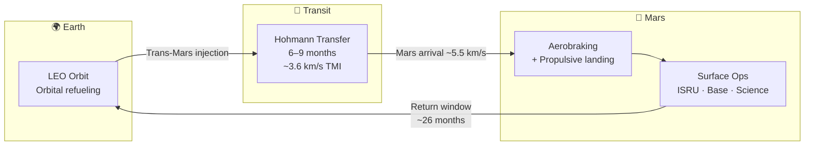

# Mars Colonization Architecture

> **SpaceX's Mars architecture treats colonization as a repeatable logistics system built around reusable Starships, orbital refueling, and recurring launch windows until a permanent settlement can grow.**

## 🎯 Intuition
**The Core Idea:** Mars colonization works only if sending cargo and people becomes a repeated, scalable transportation cycle rather than a one-off expedition.
**Analogy:** Like planning a backup drive for civilization — redundant copy of humanity on another planet.
**Why It Matters:** Mars colonization architecture defines whether humanity becomes a multi-planetary species or remains confined to Earth. SpaceX's approach—massive reusability driving down cost-per-tonne—is the first credible commercial framework that could achieve settlement-scale transport. If successful, it fundamentally changes the economics of deep-space exploration and serves as a template for reaching destinations beyond Mars.

---

## ⚙️ Core Mechanics

SpaceX frames Mars settlement as a planetary logistics problem. The architecture centers on a fully reusable Starship system that can deliver more than 100 tonnes to the Martian surface, with fleets launched during transfer windows that open about every 26 months. Early missions are cargo-first, pre-positioning propellant plants, power systems, and habitats before crews arrive.

The concept matured from Mars Oasis to ITS, then BFR, and finally Starship/Super Heavy as engineering and funding realities pushed the design toward a still-massive but more manufacturable system. The end state is not a short science campaign but a self-sustaining city of roughly one million people, sharply diverging from NASA's smaller exploration-focused reference architectures.

### Key Details / Specifications

| Aspect | SpaceX Starship Plan | NASA DRA 5.0 |
|---|---|---|
| Goal | Permanent settlement (~1M people) | Science exploration (4-6 crew) |
| Vehicle | Starship (fully reusable) | SLS + Orion + landers (expendable) |
| Payload to surface | >100 t per Starship | ~20-40 t across mission elements |
| Mission cadence | Fleets every 26-month window | Single missions per window |
| Propellant strategy | ISRU methane/LOX on Mars | Propellant carried from Earth |
| Architecture evolution | Mars Oasis → ITS (2016) → BFR (2017) → Starship | DRA 1.0 (1993) → DRA 5.0 (2009) |

### Key Facts
- Transfer windows between Earth and Mars open approximately every 26 months (synodic period ~780 days)
- Starship targets >100 tonnes of payload to the Martian surface per vehicle
- The ITS concept (2016) featured a 12-meter ship; Starship settled on 9 meters for manufacturability
- Initial cargo flights would deliver ISRU equipment, solar arrays, and habitat supplies before any crew arrives
- SpaceX's stated goal is a self-sustaining Mars city of ~1 million people
- NASA's DRA 5.0 baseline involves crews of 4-6 for ~500-day surface stays with no permanence goal
- Orbital refilling in LEO is essential—each Mars-bound Starship requires multiple tanker launches
- Estimated timeline: first cargo missions in the late 2020s, crewed missions potentially in the early 2030s

---

## 🔬 Deep Dive
### Engineering Details
SpaceX envisions Mars colonization as a logistics problem at planetary scale. The core strategy is to build a fully reusable launch system—Starship—capable of delivering over 100 tonnes to the Martian surface, then launch fleets of these vehicles during each Earth-Mars transfer window that opens roughly every 26 months. Initial waves would be cargo-only missions to pre-position supplies, propellant production equipment, and habitat infrastructure. Crewed missions follow once a baseline of resources is confirmed on the surface.

The plan has evolved significantly since its earliest conception. Elon Musk's original "Mars Oasis" idea (early 2000s) was a small greenhouse on Mars to reignite public interest in space exploration. This evolved into the Interplanetary Transport System (ITS) unveiled at the 2016 IAC in Guadalajara—a colossal 12-meter-diameter vehicle. Practical and funding constraints led to a scaled-down but still enormous design called BFR (Big Falcon Rocket), presented at the 2017 IAC in Adelaide. BFR ultimately became Starship/Super Heavy, the 9-meter-diameter, fully reusable system now in active flight testing.

The long-term target is a self-sustaining city of approximately one million people on Mars, achieved through exponential fleet growth over decades. This contrasts sharply with NASA's Design Reference Architecture 5.0 (DRA 5.0), which envisions small crews of 4-6 astronauts on short-stay or long-stay missions with no permanent settlement goal. SpaceX's approach prioritizes scale, reusability, and in-situ resource utilization over the flags-and-footprints model.

### Challenges and Risks
- The entire architecture depends on routine orbital refilling, which remains operationally demanding.
- Cargo-first sequencing means early failures in power, ISRU, or habitat deployment could delay crewed missions.
- Settlement-scale growth requires massive fleet expansion over decades, not just initial technical success.
- Long timelines and funding realities can force architecture changes, as seen from ITS to BFR to Starship.
- The goal of a self-sustaining city is far more ambitious than current government Mars reference plans.

### Comparison / Context

| Architecture Lens | SpaceX Approach | Traditional Exploration Approach |
|---|---|---|
| Strategic model | Settlement logistics | Exploration campaign |
| Cost logic | Reusability lowers marginal transport cost | High-cost bespoke missions |
| Scale target | Large population growth over time | Small crews and discrete missions |
| Surface dependency | Strong reliance on ISRU and pre-positioning | Greater Earth dependence |
| Historical posture | Commercially driven expansion | Government-led exploration |

---

## 🏋️ Practice
### Discussion Questions
1. Why does SpaceX frame Mars colonization primarily as a logistics problem rather than a single mission-design problem?
2. How does the contrast with NASA DRA 5.0 reveal the biggest architectural differences between settlement and exploration models?
3. If reusable heavy transport becomes routine, how might that change the long-term political and economic meaning of Mars settlement?

### Analysis Scenarios
1. If orbital refilling proves slower or more expensive than expected, which parts of the Mars architecture would feel the pressure first?
2. Suppose early cargo missions land successfully but full-scale ISRU is delayed by one transfer window; how should the broader colonization architecture adjust?

### Challenge
- Build a phased Mars colonization roadmap that preserves SpaceX's settlement-scale ambition while identifying the minimum capabilities needed to avoid overcommitting too early.

---

*See also:* [[In-Situ Resource Utilization]], [[Starship Variants and Applications]], [[Elon Musk's Mars Vision]], [[Mars Transit and Entry]], [[Mars and Beyond Overview]], [[Sources Index]]

## References
- [[SpaceX/Sources/Sources Index|SpaceX Sources Index]]
