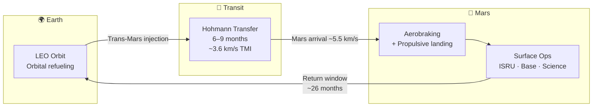

# Mars Transit and Entry

> **Mars missions hinge on two linked challenges: surviving a months-long interplanetary cruise and then slowing a massive vehicle through Mars's thin atmosphere into a precise landing.**

## 🎯 Intuition
**The Core Idea:** Getting to Mars is an orbital-timing problem, but landing there safely is an extreme guidance, thermal, and propulsion problem.
**Analogy:** Like a 9-month ocean crossing followed by the most extreme skydive in the solar system.
**Why It Matters:** Transit and entry define the mission's risk envelope. The months-long cruise demands reliable life support and radiation shielding, while Mars EDL (Entry, Descent, and Landing) for a 100+ tonne vehicle is an unsolved engineering challenge at this scale—far beyond anything attempted by NASA's rover missions (~1 tonne landed mass). Success here is the gate to everything that follows on the surface.

---

## ⚙️ Core Mechanics

The energetically efficient route to Mars is a Hohmann-like transfer from low Earth orbit, producing a 6- to 9-month cruise and tying launch opportunities to the roughly 26-month Earth-Mars cycle. In SpaceX's concept, this depends on orbital refilling in LEO before Starship performs trans-Mars injection.

Transit is only half the problem. Starship must support crews for months in deep space with power, thermal control, and closed-loop life support, then survive Mars arrival in a thin but still punishing atmosphere before transitioning from belly-first drag to a propulsive landing close to pre-deployed surface assets.

### Key Details / Specifications

| Parameter | Mars Mission | Lunar Mission | LEO Mission |
|---|---|---|---|
| Transit time | 6-9 months | ~3 days | Minutes (from launch) |
| Delta-v (from LEO) | ~3.6 km/s (TMI) | ~3.1 km/s (TLI) | N/A (already there) |
| Entry velocity | ~5.5 km/s | ~1.7 km/s (no atmosphere) | ~7.8 km/s (re-entry) |
| Atmosphere for braking | Thin CO₂ (~0.6% Earth) | None | Dense N₂/O₂ |
| Communication delay | 3-22 min one-way | ~1.3 s one-way | <1 s |
| Launch windows | Every ~26 months | Continuous (minor variation) | Continuous |
| Landing method | Aerobrake + propulsive | Propulsive only | Aerobrake + parachute/propulsive |

### Key Facts
- Hohmann transfer to Mars: ~6-9 months transit, depending on the specific opposition
- Launch windows recur every ~26 months (Earth-Mars synodic period: ~780 days)
- Trans-Mars injection delta-v from LEO: ~3.6 km/s
- Mars entry velocity: ~5.5 km/s (vs ~7.8 km/s for Earth LEO re-entry)
- Mars atmospheric surface pressure: ~610 Pa (~0.6% of Earth sea level)
- Starship heat shield: thousands of ceramic tiles designed for both Earth and Mars atmospheres
- Propulsive landing on Mars uses Raptor vacuum engines for final deceleration
- Communication delay Earth-Mars: 3 to 22 minutes one-way depending on orbital positions

---

## 🔬 Deep Dive
### Engineering Details
The most energy-efficient path from Earth to Mars is a Hohmann transfer orbit—an elliptical trajectory tangent to both planets' orbits. This yields a transit time of roughly 6 to 9 months depending on the specific window, with launch opportunities opening every ~26 months when Earth and Mars reach favorable alignment. The total delta-v budget for a Mars mission is approximately 3.6 km/s for trans-Mars injection from LEO, plus corrections en route. SpaceX's architecture relies on orbital refilling: Starship reaches LEO on its own, is refueled by tanker flights, then performs the trans-Mars injection burn.

For deep-space cruise, Starship requires modifications beyond its Earth-orbital configuration. Deployable solar arrays provide electrical power far from the Sun. A closed-loop environmental control and life support system (ECLSS) must sustain crew for the full transit duration. Thermal management shifts from the LEO regime—where the vehicle cycles between sunlight and shadow every 90 minutes—to a steady deep-space environment managed by slow rotational "barbecue roll" maneuvers to distribute solar heating evenly.

Mars entry is among the most demanding phases. The vehicle arrives at approximately 5.5 km/s relative to Mars and must shed nearly all of that velocity. Mars's atmosphere is only about 1% the density of Earth's at the surface, providing far less aerodynamic braking than Earth re-entry yet enough to generate extreme heating. Starship's heat shield must perform in a CO₂-dominant atmosphere, where radiative heating profiles differ from Earth's nitrogen-oxygen mix. The landing sequence mirrors the Earth-return profile: a high-angle-of-attack belly-first descent to maximize drag, followed by a flip maneuver to vertical orientation and a propulsive landing burn using Raptor engines. Precision landing is critical for targeting pre-positioned cargo and ISRU infrastructure.

### Challenges and Risks
- Launch opportunities only open every ~26 months, so mission slips are expensive.
- Months-long transit requires highly reliable power, thermal control, and closed-loop life support.
- Mars's thin atmosphere is too thick to ignore but too thin to make landing easy.
- Heat-shield performance in Mars's CO₂ atmosphere remains a demanding design problem.
- Precision landing near pre-positioned infrastructure is essential for surface operations.

### Comparison / Context

| Mission Segment | Main Difficulty | Why Mars Is Distinct |
|---|---|---|
| Earth departure | Orbital refilling and TMI setup | Requires repeated tanker support before departure |
| Deep-space cruise | Sustained autonomy and systems reliability | Mission duration is far longer than lunar flight |
| Mars entry | Hypersonic deceleration in thin air | Atmosphere gives limited braking but severe heating |
| Final landing | Flip and propulsive touchdown | Must land accurately near cargo and base assets |
| Surface integration | Immediate dependency on landed systems | Transit success is meaningless without usable arrival state |

---

## 🏋️ Practice
### Discussion Questions
1. Why does Mars transit depend so strongly on orbital timing and refilling strategy?
2. How is Mars entry fundamentally different from both lunar landing and Earth re-entry?
3. If large-scale Mars EDL is solved, what wider implications would that have for future deep-space missions?

### Analysis Scenarios
1. If a Mars-bound Starship loses some thermal-control margin during cruise, what operational trade-offs would the crew and mission planners face before arrival?
2. Suppose a vehicle reaches Mars successfully but lands several kilometers from pre-positioned cargo; how does that change mission risk and surface architecture?

### Challenge
- Design a Mars transit-and-entry concept of operations that links launch-window timing, orbital refilling, cruise support, and precision EDL into one coherent mission chain.

---

*See also:* [[Mars and Beyond Overview]], [[Sources Index]]
