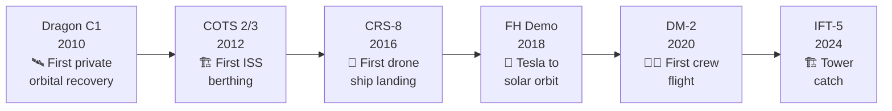

# Demonstration and Test Flights

> **SpaceX's demonstration and test flights served as inflection points, each proving a new capability that unlocked subsequent commercial, NASA, or national security contracts.**

## 🎯 Intuition
**The Core Idea:** SpaceX uses demonstration flights to prove new capabilities before turning them into operational services and contracts.
**Analogy:** Like a driving test before getting your license — each demo proved a new capability that unlocked real contracts.
**Why It Matters:** Demonstration flights carry outsized programmatic risk because they fly unproven hardware where failure is expected and accepted as a learning mechanism. SpaceX's iterative "test, fail, fix, fly" philosophy compresses development timelines compared to the traditional aerospace approach of exhaustive ground testing before any flight. Each successful demo unlocked billions in subsequent contracts, and the IFT series is now paving the way for Starship's role in Artemis lunar landings and point-to-point transport.

---

## ⚙️ Core Mechanics

Every major SpaceX program — Dragon, Crew Dragon, Falcon Heavy, and Starship — has been validated through dedicated demonstration flights before entering operational service. Dragon C1 proved that a privately developed spacecraft could orbit Earth and be successfully recovered, and the combined COTS Demo 2/3 flight proved a commercial vehicle could berth with the International Space Station for the first time.

Later demonstration flights extended that pattern to reusability, heavy lift, crewed launch, and Starship development. CRS-8 proved ocean-based booster recovery on an autonomous drone ship, the Falcon Heavy demonstration paired a Tesla Roadster payload with simultaneous side-booster landings, Crew Dragon's DM-1, In-Flight Abort Test, and DM-2 validated human spaceflight readiness, and IFT-5 demonstrated the mechazilla tower catch.

### Key Details / Specifications

| Flight | Date | Capability Proven | Outcome |
|---|---|---|---|
| Dragon C1 | December 2010 | Private orbital spacecraft recovery | First private orbital spacecraft recovered from orbit |
| COTS Demo 2/3 | May 2012 | Commercial ISS berthing | First commercial vehicle to berth with ISS |
| CRS-8 | April 2016 | Autonomous drone-ship booster recovery | First successful ASDS landing of an orbital-class booster |
| Falcon Heavy demo | February 2018 | Heavy-lift launch and dual booster recovery | Maiden flight with dual side-booster landing and Tesla Roadster payload |
| DM-1 / In-Flight Abort / DM-2 | 2019-2020 | Crew Dragon docking, escape, and crew transport | Validated Crew Dragon from uncrewed to crewed flight |
| IFT-5 | October 2024 | Starship booster return and tower catch | First successful mechazilla booster catch |

### Key Facts
- **Dragon C1** (December 2010): first private orbital spacecraft recovered from orbit, under the COTS program
- **COTS Demo 2/3** (May 2012): first commercial vehicle to berth with ISS; carried ~520 kg of cargo
- **CRS-8** (April 2016): first successful drone-ship (ASDS) landing of an orbital-class booster
- **Falcon Heavy demo** (February 2018): maiden flight; dual side-booster landing; Tesla Roadster payload to heliocentric orbit
- **DM-1** (March 2019): uncrewed Crew Dragon to ISS, validating life-support and docking systems
- **In-Flight Abort** (January 2020): SuperDraco escape system tested at max-Q; capsule recovered successfully
- **DM-2** (May 2020): first crewed SpaceX mission; restored U.S. human launch capability
- **IFT-5** (October 2024): first successful booster catch by the launch tower ("mechazilla")

---

## 🔬 Deep Dive
### Engineering Details
Every major SpaceX program — Dragon, Crew Dragon, Falcon Heavy, and Starship — has been validated through dedicated demonstration flights before entering operational service. **Dragon C1** (December 2010) was the first privately developed spacecraft to orbit Earth and be successfully recovered, proving that a commercial company could match what only governments had achieved. The combined **COTS Demo 2/3** flight (May 2012) took the next step, with Dragon berthing at the International Space Station for the first time — directly leading to the CRS cargo contract that became SpaceX's financial backbone.

Landing demonstrations were woven into operational missions. **CRS-8** (April 2016) achieved the first successful landing on an autonomous drone ship (ASDS *Of Course I Still Love You*), proving that ocean-based booster recovery was viable for missions where return-to-launch-site was energetically infeasible. The **Falcon Heavy demonstration** (February 2018) captured worldwide attention by launching Elon Musk's Tesla Roadster toward solar orbit while simultaneously landing two side boosters at Cape Canaveral — the most powerful operational rocket in the world at that moment.

**Crew Dragon** required its own demonstration arc: **DM-1** (March 2019) flew an uncrewed Dragon to ISS and back, followed by the **In-Flight Abort Test** (January 2020) that validated the SuperDraco escape system at max aerodynamic pressure. **DM-2** (May 2020) then carried astronauts Doug Hurley and Bob Behnken to ISS, ending a nine-year gap in American crewed launch capability. Most recently, the **Starship Integrated Flight Test (IFT)** series — beginning with IFT-1 (April 2023) — has been iterating toward full orbital capability, with each flight testing stage separation, booster return, upper-stage reentry, and the revolutionary mechazilla tower catch demonstrated in IFT-5 (October 2024).

### Challenges and Risks
- Demonstration flights carry outsized risk because they fly unproven hardware where failure is expected as part of the learning cycle.
- Ocean-based recovery was necessary for missions where return-to-launch-site was energetically infeasible, making booster recovery more operationally complex.
- Crew Dragon's path required separate validation of docking, life support, and abort performance before astronauts could fly.
- Starship IFT missions must progressively solve stage separation, booster return, upper-stage reentry, and catch operations before operational service begins.

### Comparison / Context

| Distinction | Explanation |
|---|---|
| COTS vs CRS | COTS = development demonstration program (NASA co-funded); CRS = operational cargo service contract |
| DM-1 vs DM-2 | DM-1 was uncrewed; DM-2 was the first crewed flight with NASA astronauts |
| RTLS vs ASDS landing | Return to Launch Site lands at the cape; ASDS lands on a drone ship downrange |
| IFT vs operational Starship | IFT flights are test campaigns; operational Starship missions have not yet begun |
| In-flight abort vs pad abort | In-flight abort tests escape at max-Q during ascent; pad abort tests escape from the launch pad |
| Demo payload vs customer payload | Demos often carry mass simulators or novelty payloads (e.g., Tesla Roadster) |

---

## 🏋️ Practice
### Discussion Questions
1. Why are demonstration flights especially important for new launch and spacecraft programs?
2. How did Dragon C1, COTS 2/3, and DM-2 each represent different kinds of capability validation?
3. What future capabilities must Starship prove before it can transition from IFTs to operational missions?

### Analysis Scenarios
1. If CRS-8 had failed to land on the drone ship, how might that have affected confidence in downrange booster recovery?
2. Compare the programmatic value of the Falcon Heavy demo and DM-2: which one changed SpaceX's business position more, and why?

### Challenge
- Trace one demonstration-to-contract pathway from this page and explain exactly what technical milestone enabled the next operational award.

---

*See also:* [[Missions and Payloads Overview]]
