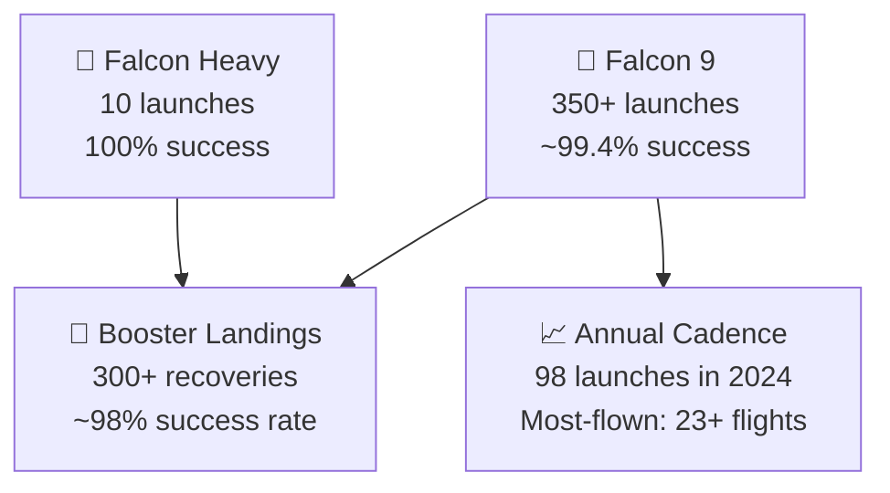

# Mission Success Rate and Statistics

> **SpaceX has achieved one of the highest launch success rates in the industry, with Falcon 9 establishing a reliability record that rivals or exceeds decades-old legacy vehicles.**

## 🎯 Intuition
**The Core Idea:** SpaceX's launch record shows that high reliability and rapid reuse can coexist at unprecedented scale.
**Analogy:** Like a batting average that keeps climbing — 300+ consecutive successes is an unmatched reliability record.
**Why It Matters:** Launch reliability is the single most important metric in the space industry because it drives insurance rates, customer confidence, crew certification, and national security trust. Falcon 9's consecutive success streak is the empirical foundation of SpaceX's commercial dominance. The landing and reuse statistics show that its low-price model is supported by operational performance, not just aggressive pricing.

---

## ⚙️ Core Mechanics

As of early 2025, **Falcon 9** has completed over **350 launches** with only two mission failures — **CRS-7** in June 2015 and **AMOS-6** in September 2016. Since returning to flight after AMOS-6, Falcon 9 has sustained a **mission success rate above 99%** across more than 300 consecutive successful flights, establishing SpaceX as the world's most-flown launch provider.

Recovery and cadence statistics reinforce that record. SpaceX has recovered Falcon 9 and Falcon Heavy boosters over **300 times** with a landing success rate above **98%** since 2017, reflown individual boosters **23+ times**, achieved turnaround in under **22 days**, completed **98 launches in 2024**, and kept **Falcon Heavy** perfect at 10-for-10 through early 2025.

### Key Details / Specifications

| Metric | Figure | Context |
|---|---|---|
| Falcon 9 launches | 350+ | Through early 2025 |
| Falcon 9 failures | 2 | CRS-7 and AMOS-6 |
| Falcon 9 mission success rate | ~99.4% overall | 300+ consecutive successes since September 2016 |
| Falcon Heavy mission success rate | 100% | 10 launches, 10 successes |
| Booster recoveries | 300+ | Falcon 9 and Falcon Heavy combined |
| Landing success rate | ~98% | Since the recovery system matured in 2017 |
| Most-flown booster | 23+ flights | B1058/B1060 class boosters |
| Annual cadence record | 98 launches | Calendar year 2024 |

### Key Facts
- **Falcon 9 mission success rate**: ~99.4% overall; 100% since September 2016 (300+ consecutive successes)
- **Total Falcon 9 launches**: 350+ through early 2025
- **Falcon Heavy**: 10 launches, 10 successes (100% mission success rate)
- **Booster landings**: 300+ successful recoveries; landing success rate ~98% since 2017
- **Most-flown booster**: 23+ flights on a single first stage (B1058 or B1060 class)
- **2024 annual record**: 98 launches in a single calendar year
- **Fastest booster turnaround**: approximately 21 days between flights
- **Two Falcon 9 failures**: CRS-7 (June 2015, in-flight breakup) and AMOS-6 (September 2016, pad explosion)
- SpaceX delivers more mass to orbit annually than all other global providers combined

---

## 🔬 Deep Dive
### Engineering Details
As of early 2025, **Falcon 9** has completed over **350 launches** with only two mission failures — CRS-7 (June 2015, second-stage strut failure) and AMOS-6 (September 2016, pad anomaly during fueling). Since the return to flight after AMOS-6, Falcon 9 has achieved a **mission success rate above 99%** across more than 300 consecutive successful flights, a streak unmatched in modern rocketry. This reliability transformed SpaceX from a scrappy startup into the world's most-flown launch provider.

**Landing statistics** tell a parallel success story. SpaceX has recovered Falcon 9 and Falcon Heavy boosters over **300 times**, with a landing success rate exceeding **98%** since the technique matured in 2017. Individual boosters have been reflown as many as **23+ times** (booster B1058 and B1060 among the leaders), proving that orbital-class reuse is not just feasible but routine. The fastest turnaround for a single booster — from landing to relaunch — has been achieved in under **22 days**, with the operational target continuing to shrink.

Annual launch cadence has grown exponentially. SpaceX completed **98 launches in 2024**, shattering its own record of 96 in 2023, and approached or exceeded **100 launches per year** — a pace not seen since the height of the Cold War-era space race. Total mass delivered to orbit by SpaceX now exceeds that of all other launch providers combined in recent years, driven largely by Starlink deployment missions but also reflecting a broad customer base. **Falcon Heavy** adds to the portfolio with a perfect 10-for-10 mission record through early 2025, while the **Starship IFT** series is in its test phase with incremental progress across each flight.

### Challenges and Risks
- Reliability statistics are hard-won because launch failure analysis must address both ascent failures and pad anomalies.
- Landing success and mission success are separate metrics, so reuse progress can still involve booster losses even when payload delivery succeeds.
- High launch cadence creates operational pressure on turnaround, refurbishment, and range logistics.
- Starship remains in a test phase, so Falcon-family statistics cannot simply be projected onto future vehicles.

### Comparison / Context

| Distinction | Explanation |
|---|---|
| Mission success vs landing success | Mission success = payload delivered to correct orbit; landing success = booster recovered intact |
| Full success vs partial failure | A mission may deliver the payload but lose the booster, or reach a suboptimal orbit |
| CRS-7 vs AMOS-6 | CRS-7 was an in-flight failure during ascent; AMOS-6 was a pre-launch pad anomaly during fueling |
| Launches vs missions | One launch may deploy multiple payloads (e.g., Transporter missions count as one launch) |
| Falcon 9 vs Falcon Heavy stats | Typically tracked separately; Falcon Heavy has its own 100% success record |
| Reliability growth curve | Early Falcon 9 flights had lower reliability; post-2016 the vehicle matured to near-perfect performance |

---

## 🏋️ Practice
### Discussion Questions
1. Why is mission success rate more important to customers than launch cadence alone?
2. How should Falcon 9 mission success and booster landing success be compared without confusing the two?
3. What would SpaceX need to prove for Starship to earn a reliability reputation similar to Falcon 9?

### Analysis Scenarios
1. If Falcon 9's landing success rate dropped sharply while mission success stayed high, how would that affect the business case for reuse?
2. Suppose a competitor matched Falcon 9's sticker price but not its cadence or reliability; which metric would matter most to commercial customers?

### Challenge
- Use the statistics on this page to explain why reliability plus reuse is a stronger competitive advantage than launch price alone.

---

*See also:* [[Missions and Payloads Overview]]

## References
- [[SpaceX/Sources/Sources Index|SpaceX Sources Index]]
