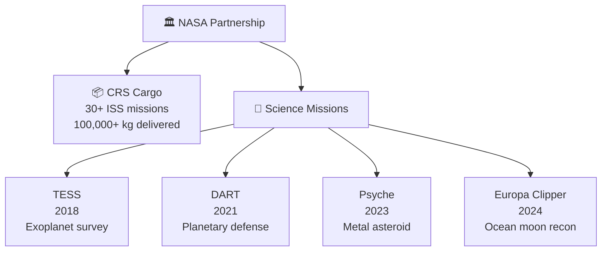

# NASA Science and Cargo Missions

> **SpaceX became NASA's primary launch partner for both routine ISS resupply and flagship science missions, with Falcon 9's low cost enabling a new era of affordable deep-space exploration.**

## 🎯 Intuition
**The Core Idea:** SpaceX turned a cargo-services partnership with NASA into a broader role launching some of the agency's most important science missions.
**Analogy:** Like a reliable freight and science express service to the space station and beyond.
**Why It Matters:** NASA science missions represent some of humanity's most ambitious explorations, and lower launch costs let the agency afford more missions within fixed budgets. Falcon 9's strong reliability also reduces programmatic risk for both station logistics and high-value science payloads. Cargo Dragon keeps ISS research going while deep-space launches extend SpaceX's role far beyond low Earth orbit.

---

## ⚙️ Core Mechanics

The **Commercial Resupply Services (CRS)** program anchored SpaceX's relationship with NASA. Beginning with **CRS-1** in October 2012, Dragon cargo spacecraft delivered supplies, experiments, and hardware to the International Space Station, and by 2025 SpaceX had completed **30+ CRS missions**, making Dragon the most prolific ISS cargo vehicle in history after Russia's Progress.

That cargo partnership expanded into flagship science launches. **TESS**, **DART**, **Psyche**, **PACE**, and **Europa Clipper** show how Falcon 9 and Falcon Heavy became NASA's preferred launch vehicles for both Earth-science and deep-space missions, while SpaceX's pricing — roughly one-third to one-half the cost of legacy vehicles — freed budget for more science and instruments.

### Key Details / Specifications

| Mission / Program | Role | Vehicle | Notable Outcome |
|---|---|---|---|
| CRS | ISS cargo resupply | Dragon / Cargo Dragon on Falcon 9 | 30+ missions and 100,000+ kg delivered |
| TESS | Exoplanet survey | Falcon 9 | Inserted into a unique lunar-resonant orbit |
| DART | Planetary defense test | Falcon 9 | Demonstrated asteroid deflection by altering Dimorphos's orbit |
| Psyche | Deep-space science | Falcon Heavy | Sent spacecraft toward a metal-rich asteroid |
| PACE | Earth-science observation | Falcon 9 | Studies ocean color, aerosols, and clouds |
| Europa Clipper | Outer-planet science | Falcon Heavy | Began mission to study Europa's subsurface ocean |

### Key Facts
- **CRS program**: 30+ cargo missions to ISS since 2012, delivering over 100,000 kg of supplies and experiments
- **TESS** (April 2018): surveys 85% of the sky for exoplanets; launched on Falcon 9 to a unique lunar-resonant orbit
- **DART** (November 2021): first planetary-defense test, successfully altered Dimorphos's orbit by 33 minutes
- **Europa Clipper** (October 2024): launched on Falcon Heavy; will perform ~50 flybys of Europa to study its subsurface ocean
- **Psyche** (October 2023): Falcon Heavy mission to a metal-rich asteroid between Mars and Jupiter
- **PACE** (February 2024): Earth-science mission studying ocean color, aerosols, and clouds from L1-adjacent orbit
- SpaceX launch costs enabled NASA to reallocate roughly $150 million on Europa Clipper alone versus the originally planned SLS launch

---

## 🔬 Deep Dive
### Engineering Details
The **Commercial Resupply Services (CRS)** program anchored SpaceX's relationship with NASA. Beginning with CRS-1 in October 2012, Dragon cargo spacecraft have delivered thousands of kilograms of supplies, experiments, and hardware to the International Space Station. The original CRS-1 contract covered 12 missions through 2016; the follow-on CRS-2 contract extended service with the upgraded Dragon 2 (Cargo Dragon) spacecraft, featuring autonomous docking instead of robotic arm berthing. By 2025, SpaceX had completed over 30 CRS missions, making Dragon the most prolific ISS cargo vehicle in history after Russia's Progress.

Beyond cargo, SpaceX became the launcher of choice for major NASA science missions. **TESS** (Transiting Exoplanet Survey Satellite, April 2018) surveys nearly the entire sky for exoplanets orbiting nearby bright stars. **DART** (Double Asteroid Redirection Test, November 2021) successfully impacted the moonlet Dimorphos, demonstrating humanity's first planetary-defense technique. **Psyche** (October 2023) is en route to a metal-rich asteroid to study planetary core formation. The crown jewel is **Europa Clipper** (October 2024), launched on Falcon Heavy to conduct detailed reconnaissance of Jupiter's ocean moon Europa — a mission critical to astrobiology.

SpaceX's pricing — roughly one-third to one-half the cost of legacy launch vehicles — directly enabled NASA to fly more science per dollar. Missions like **PACE** (Plankton, Aerosol, Cloud, ocean Ecosystem, February 2024) that might have faced budget pressure under older cost models secured affordable rides. The competitive pricing also freed budget for instrument development, increasing the scientific return of each mission.

### Challenges and Risks
- ISS cargo service demands repeatable operational reliability because station logistics depend on timely delivery of supplies and experiments.
- Deep-space missions such as Psyche and Europa Clipper require higher-energy launches and place more mission value on a single departure event.
- NASA missions must balance launch cost savings against strict scientific schedule, integration, and assurance requirements.
- Cargo Dragon and science-launch roles are related but operationally distinct, so SpaceX must support both routine logistics and one-off flagship payloads.

### Comparison / Context

| Distinction | Explanation |
|---|---|
| CRS-1 vs CRS-2 contract | CRS-1 used Dragon 1 (berthing); CRS-2 uses Dragon 2 Cargo (autonomous docking) |
| LEO science vs deep-space | LEO missions (TESS, PACE) use Falcon 9; deep-space (Europa Clipper, Psyche) may require Falcon Heavy |
| Cargo Dragon vs Crew Dragon | Same Dragon 2 platform; cargo variant lacks life-support and crew seats |
| Directed mission vs competed launch | Some NASA missions are directed to SpaceX; others are competitively awarded via LSP |
| Planetary defense vs pure science | DART was an applied-technology demonstration; Psyche and Europa Clipper are science-driven |

---

## 🏋️ Practice
### Discussion Questions
1. Why did a cargo resupply contract become such an important gateway for SpaceX's broader NASA partnership?
2. How do cargo missions and flagship science missions differ in what NASA needs from its launch provider?
3. What kinds of future NASA missions might benefit most if SpaceX continues lowering launch costs?

### Analysis Scenarios
1. If Falcon Heavy had not been available, how might that have changed launch planning for Europa Clipper or Psyche?
2. Suppose NASA had to choose between a higher-cost legacy launcher and a lower-cost Falcon mission with similar reliability; where would the saved budget create the most scientific value?

### Challenge
- Pick one mission from this page and explain how launch cost, vehicle capability, and mission goals all shaped NASA's choice of SpaceX.

---

*See also:* [[Missions and Payloads Overview]]

## References
- [[SpaceX/Sources/Sources Index|SpaceX Sources Index]]
