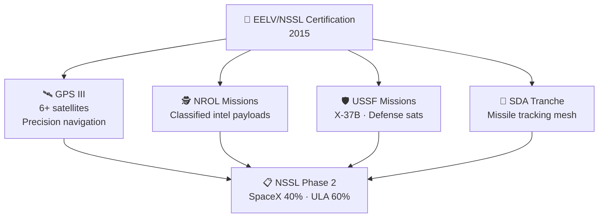

# National Security Launches

> **SpaceX broke United Launch Alliance's decade-long monopoly on U.S. national security launches, earning certification and winning a growing share of the military and intelligence community's most critical missions.**

## 🎯 Intuition
**The Core Idea:** SpaceX had to prove it could meet the strictest mission-assurance standards before it could win sensitive U.S. defense and intelligence launches.
**Analogy:** Like breaking into an exclusive private security contract — earning trust for the most sensitive government missions.
**Why It Matters:** National security launches are among the U.S. government's most mission-critical space operations because failures can compromise intelligence capabilities or GPS coverage. SpaceX's entry validated Falcon 9 at the highest assurance level and broke a long-standing monopoly that had kept costs high. SDA work also positions SpaceX as both a launcher and a defense-space manufacturer.

---

## ⚙️ Core Mechanics

For over a decade, U.S. national security launches were effectively monopolized by **ULA** under the **EELV** program. SpaceX challenged that arrangement in court and through certification, then won entry in 2015 when Falcon 9 achieved **EELV certification** after successful reference flights, design reviews, and mission-assurance verification; the first competitive win was **GPS III SV01** in December 2018.

That certification opened a broad mission set. SpaceX went on to launch **GPS III** satellites, classified **NROL** payloads, **USSF** missions including the **X-37B** launch on **USSF-52**, and **SDA** missions tied to the Proliferated Warfighter Space Architecture, before winning a **40% share** in **NSSL Phase 2** in 2020.

### Key Details / Specifications

| Milestone / Program | Purpose | Result |
|---|---|---|
| EELV certification | Qualify Falcon 9 for national security launches | Granted in 2015 after reference flights and mission-assurance review |
| GPS III launches | Deploy next-generation navigation satellites | SpaceX's first recurring national security mission set |
| NROL missions | Launch classified reconnaissance payloads | Expanded SpaceX into intelligence-community work |
| USSF-52 | Launch X-37B on Falcon Heavy | First non-ULA X-37B mission |
| SDA Tranche work | Support proliferated defense constellation | SpaceX involved in both launch and satellite production |
| NSSL Phase 2 | Allocate future national security launches | SpaceX won ~40% share; ULA ~60% |

### Key Facts
- **EELV certification** granted in 2015 after multi-year evaluation and three reference flights
- **GPS III SV01** (December 2018): first competitively awarded national security launch for SpaceX
- SpaceX has launched **6+ GPS III** satellites, each weighing approximately 3,880 kg to MEO
- **NROL missions**: multiple classified NRO payloads flown, details typically not publicly disclosed
- **USSF-52** (December 2023): launched X-37B spaceplane on Falcon Heavy for the first time
- **SDA Tranche 0/1**: SpaceX awarded contracts for both satellite manufacturing (via Starlink heritage) and launch
- **NSSL Phase 2** (2020): SpaceX won ~40% of awarded missions; ULA won ~60%
- National security launches command premium pricing but require extensive mission assurance processes

---

## 🔬 Deep Dive
### Engineering Details
For over a decade, the **Evolved Expendable Launch Vehicle (EELV)** program awarded virtually all national security launches to **United Launch Alliance (ULA)**, the Boeing-Lockheed joint venture operating Atlas V and Delta IV. SpaceX challenged this monopoly legally and technically, filing a lawsuit in 2014 against the U.S. Air Force's sole-source block-buy contract with ULA. In 2015, SpaceX achieved **EELV certification** for Falcon 9, completing a rigorous process involving three successful reference flights, detailed design reviews, and independent verification of mission assurance standards. The first competitive national security win followed quickly: **GPS III SV01** was launched in December 2018.

The **GPS III** constellation became SpaceX's gateway to national security work. Beginning with SV01, SpaceX launched multiple next-generation GPS satellites, each a critical component of the U.S. military's precision-navigation infrastructure. Beyond GPS, SpaceX has flown classified payloads for the **National Reconnaissance Office (NRO)** under the NROL designation, missions for the **U.S. Space Force (USSF)**, and satellites for the **Space Development Agency (SDA)**, which is building the Proliferated Warfighter Space Architecture — a mesh constellation providing missile tracking and data transport. SpaceX also launched the **X-37B** orbital test vehicle (USSF-52, December 2023) on Falcon Heavy, the spaceplane's first non-ULA launch.

Under the **National Security Space Launch (NSSL) Phase 2** competition in 2020, SpaceX won a 40% share of launches (Lane 1), with ULA receiving 60%. Phase 3 contracts, currently in procurement, are expected to further expand SpaceX's role and potentially certify new vehicles including Falcon Heavy and eventually Starship for national security missions.

### Challenges and Risks
- National security missions require extensive mission assurance, making certification far more demanding than ordinary commercial launch work.
- Classified payloads limit public transparency, so much of SpaceX's performance in this market is only indirectly visible.
- GPS, NRO, USSF, and SDA missions each impose different orbit, security, and integration demands.
- Winning a minority share in NSSL still requires sustained performance to expand future awards against entrenched competitors.

### Comparison / Context

| Distinction | Explanation |
|---|---|
| EELV vs NSSL | EELV was the original program name; rebranded to NSSL (National Security Space Launch) in 2019 |
| Phase 2 vs Phase 3 | Phase 2 awarded in 2020 (SpaceX + ULA); Phase 3 is the current procurement cycle |
| GPS III vs GPS IIIF | GPS III (SV01–SV10) is the current generation; GPS IIIF (Follow On) adds enhanced capabilities |
| NROL vs USSF designation | NROL = NRO classified payloads; USSF = Space Force missions (may be unclassified) |
| Classified vs unclassified | NRO missions are typically classified; GPS and some USSF missions are unclassified |
| Lane 1 vs Lane 2 | NSSL Phase 2 split missions into two procurement lanes awarded to different providers |

---

## 🏋️ Practice
### Discussion Questions
1. Why was certification just as important as launch price in breaking into national security missions?
2. How do GPS III, NROL, and SDA missions illustrate different kinds of defense-space requirements?
3. What additional proof might SpaceX need before Starship could win major national security launches?

### Analysis Scenarios
1. If Falcon 9 had not achieved EELV certification in 2015, how might the national security launch market have evolved differently?
2. Suppose SpaceX increases its NSSL share in a future phase; what factors besides price would most likely drive that shift?

### Challenge
- Explain how one certification milestone on this page translated into a broader strategic change in the U.S. launch market.

---

*See also:* [[Missions and Payloads Overview]]

## References

- [[SpaceX/Sources/Sources Index]]
- [[SpaceX/SpaceX Book Reading Spine]]
- [[SpaceX/SpaceX]]
